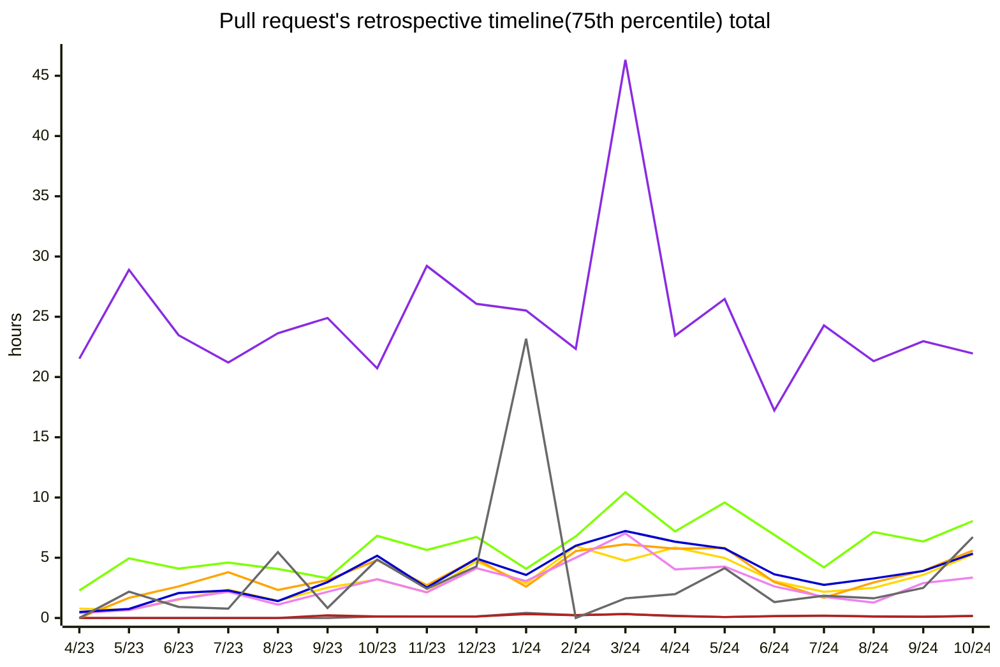
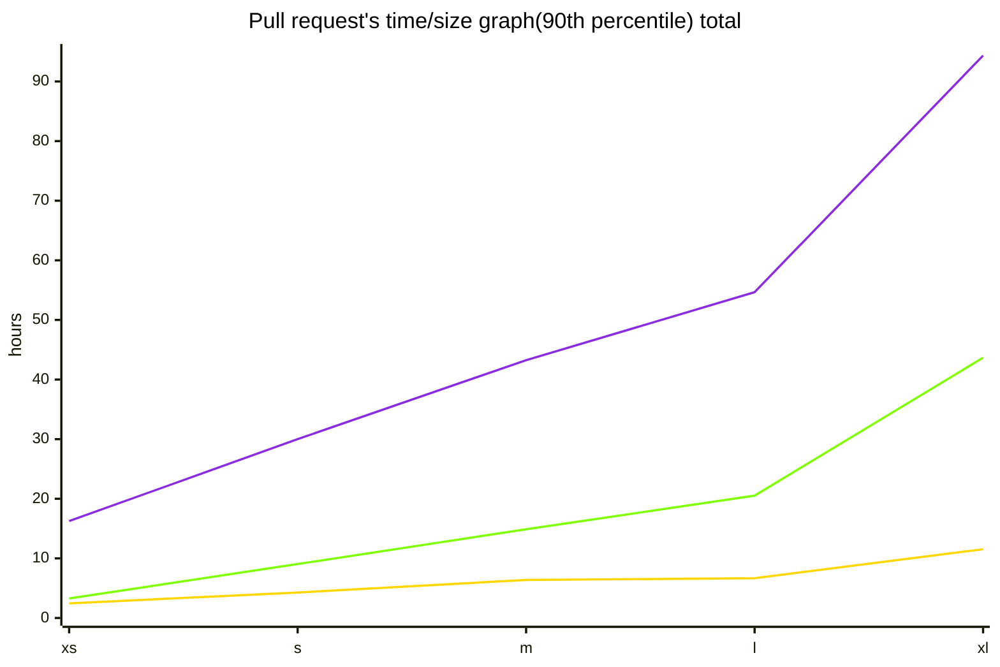
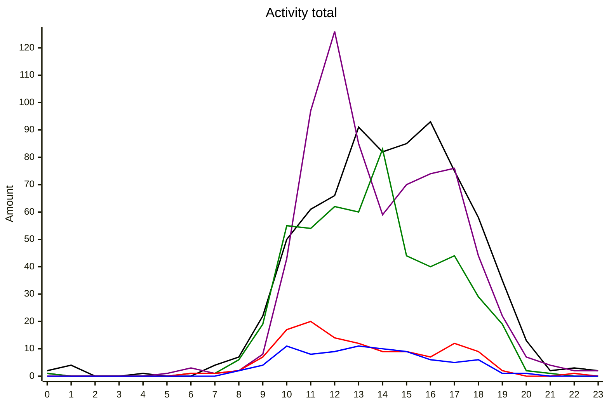

# Pull request analytics action

This GitHub Action measures metrics for developers and/or teams. Reports are generated in issues based on user actions such as opening/closing pull requests, requesting/conducting reviews, opening discussions, and more. The action is designed to provide better insights into team strengths and identify bottlenecks.

## Table of Contents

- [Motivation](#motivation)
- [Metrics](#metrics)
- [Getting started](#getting-started)
- [Using GitHub Enterprise Server](#using-github-enterprise-server)
- [Configuration Parameters Overview](#configuration-parameters-overview)
- [Outputs](#outputs)
- [Recommendations and Tips](#recommendations-and-tips)
- [Troubleshooting](#troubleshooting)
- [Privacy and Data Handling](#privacy-and-data-handling)
- [Usage Limitations](#usage-limitations)
- [How You Can Help](#how-you-can-help)

## Motivation

**pull-request-analytics-action** addresses several key challenges:

1. **Identifying Bottlenecks in Code Review Processes**: Easily generate summaries showing where delays occur in the review stages.
2. **Tracking Trends in Code Review Processes**: Analyze how review dynamics change over time to identify positive or negative trends.
3. **Detecting Significant Deviations**: Identify metrics that vary significantly among teams and developers, revealing potential areas of concern.
4. **Simplifying Analysis of Notable PRs**: Provides a list of standout pull requests, helping you focus on the most critical cases.

Overall, this action enables faster and more accurate assessments, leading to better decision-making.

## Metrics

All metrics are presented in the form of tables, charts, and lists ([Report example](https://github.com/AlexSim93/pull-request-analytics-action/issues/16)). Below, you can see an example of such data.

### Lead Time

Displays the time from PR creation to each displayed status. Helps identify bottlenecks in the code review process. Use the `timeline` value in the `SHOW_STATS_TYPES` parameter.

|   user    | Time in draft | Time to review request |   Time to review   | Time to Review After Re-request |  Time to approve   |    Time to merge    | Total merged PRs |
| :-------: | :-----------: | :--------------------: | :----------------: | :-----------------------------: | :----------------: | :-----------------: | :--------------: |
| **dev1**  |   6 minutes   |       6 minutes        | 3 hours 27 minutes |       5 hours 17 minutes        | 4 hours 26 minutes | 17 hours 50 minutes |        29        |
| **dev2**  |   9 minutes   |       9 minutes        | 4 hours 53 minutes |       7 hours 10 minutes        | 6 hours 36 minutes | 13 hours 21 minutes |        54        |
| **dev3**  |  13 minutes   |       13 minutes       | 4 hours 12 minutes |       2 hours 21 minutes        | 4 hours 48 minutes | 22 hours 8 minutes  |        54        |
| **total** |  10 minutes   |       10 minutes       | 4 hours 15 minutes |       4 hours 43 minutes        | 7 hours 21 minutes | 22 hours 36 minutes |       232        |

### Contribution

Shows the total volume of code merged, reviews conducted, and comments in PRs. Helps to understand the context in which other metrics apply. Use the `workload` value in the `SHOW_STATS_TYPES` parameter.

|   user    | Total opened PRs | Total merged PRs | Total reverted PRs | PRs w/o review | PRs w/o approval | Additions / Deletions | PR size: xs/s/m/l/xl |
| :-------: | :--------------: | :--------------: | :----------------: | :------------: | :--------------: | :-------------------: | :------------------: |
| **dev1**  |        17        |        17        |         0          |       0        |        1         |      +2324/-922       |      8/6/1/1/1       |
| **dev2**  |        20        |        20        |         0          |       1        |        1         |      +1914/-1067      |      13/4/1/1/1      |
| **dev3**  |        17        |        17        |         0          |       1        |        1         |      +1305/-310       |      14/1/1/0/1      |
| **total** |        78        |        77        |         0          |       3        |        4         |      +8395/-3479      |     51/15/5/3/4      |

### Discussion Intensity (Author's Perspective)

Measures how discussion-heavy PRs are from the author's perspective, based on open discussions, review statuses, and the number of comments. Additionally, you can track discussion topics and user agreement by adding discussion topics in `[[]]` and using thumbs up/down ( :+1: / :-1: ) reactions on the opening comment. Use the `pr-quality` value in the `SHOW_STATS_TYPES` parameter.

|   user    | Total merged PRs | Changes requested received | Agreed / Disagreed / Total discussions received | Comments received |
| :-------: | :--------------: | :------------------------: | :---------------------------------------------: | :---------------: |
| **dev1**  |        22        |             3              |                   0 / 0 / 10                    |        20         |
| **dev2**  |        13        |             1              |                    0 / 0 / 2                    |         3         |
| **dev3**  |        2         |             0              |                    0 / 0 / 1                    |         1         |
| **total** |        47        |             6              |                   3 / 2 / 25                    |        37         |

### Discussion Intensity (Reviewer's Perspective)

Measures how discussion-heavy PRs are from the reviewer's perspective, based on discussions, comments, and PR statuses. Helps understand reviewer engagement and decision-making. Use the `code-review-engagement` value in the `SHOW_STATS_TYPES` parameter and add thumbs up/down ( :+1: / :-1: ) reactions on opening comments.

|   user    | Reviews conducted | Agreed / Disagreed / Total discussions conducted | Comments conducted | PR size: xs/s/m/l/xl | Changes requested / Commented / Approved |
| :-------: | :---------------: | :----------------------------------------------: | :----------------: | :------------------: | :--------------------------------------: |
| **dev1**  |         8         |                    0 / 0 / 0                     |         0          |      5/2/0/1/0       |                0 / 0 / 8                 |
| **dev2**  |        20         |                    3 / 2 / 22                    |         33         |      10/3/4/0/3      |                5 / 8 / 20                |
| **dev3**  |        10         |                    0 / 0 / 2                     |         3          |      4/2/1/2/1       |                1 / 1 / 10                |
| **total** |        46         |                    3 / 2 / 25                    |         37         |      30/9/6/2/3      |               6 / 12 / 46                |

### Reviewer Response Time

Shows how quickly reviewers respond to review requests. Helps better understand lead time metrics and reviewer engagement. Use the `response-time` value in the `SHOW_STATS_TYPES` parameter.

|   user    | Review requests conducted | Reviews conducted | Time from opening to response | Time from initial request to response | Time from re-request to response |
| :-------: | :-----------------------: | :---------------: | :---------------------------: | :-----------------------------------: | :------------------------------: |
| **dev1**  |            259            |        88         |      10 hours 13 minutes      |          6 hours 37 minutes           |        2 hours 2 minutes         |
| **dev2**  |            271            |        56         |      10 hours 48 minutes      |          9 hours 42 minutes           |                                  |
| **dev3**  |            218            |        66         |      6 hours 59 minutes       |          6 hours 55 minutes           |        3 hours 2 minutes         |
| **total** |           1219            |        282        |      7 hours 15 minutes       |          6 hours 41 minutes           |        1 hour 57 minutes         |

### Metric Trends Over Time

This section displays metric changes over time using graphs, helping to understand how metrics have evolved over extended periods. To enable these graphs, ensure that `PERIOD_SPLIT_UNIT` is set and that the collected data covers at least two time periods (e.g., quarters or months).

`#FFA500`Time From Initial Request To Response,`#EE82EE`Time From Opening To Response,`#0000CD`Time From Rerequest To Response,`#696969`Time In Draft,`#B22222`Time To Review Request,`#FFD700`Time To Review,`#40E0D0`Time To Review After Rerequest,`#7FFF00`Time To Approve,`#8A2BE2`Time To Merge



### Correlation Between Lead Time and Pull Request Size

This graphs allow you to observe how pull request size impacts lead time. It can be especially useful for assessing the actual influence of PR size on lead time. For more accurate results, it's recommended to analyze a sufficiently large dataset to minimize error margins. To view the graphs, set the `SHOW_CORRELATION_GRAPHS` parameter to `true`.

`#FFD700`Time To Review, `#7FFF00`Time To Approve, `#8A2BE2`Time To Merge



### Peak Activity Time

The graph shows when users perform key actions such as opening, closing, and reviewing PRs. To view the graphs, set the `SHOW_ACTIVITY_TIME_GRAPHS` parameter to `true`.

`#000000`Opened, `#800080`Merged, `#008000`Approved, `#FF0000`Changes Requested, `#0000FF`Commented



### List of Notable PRs

Identifies standout pull requests, helping quickly locate the most pending PRs at various stages, the largest and the most commented ones. This facilitates analysis by focusing on the most significant cases. Here is an example of the most commented PRs.

1. [Feature: PR Title 1(example)(31)(Author: AlexSim93)](https://github.com/AlexSim93/pull-request-analytics-action/pull/15)
2. [Feature: PR Title 2(example)(27)(Author: AlexSim93)](https://github.com/AlexSim93/pull-request-analytics-action/pull/15)
3. [Feature: PR Title 3(example)(25)(Author: AlexSim93)](https://github.com/AlexSim93/pull-request-analytics-action/pull/15)

## Getting started

To integrate **pull-request-analytics-action** into your GitHub repository, use the following steps. The provided code is a template and can be adjusted to fit your specific requirements:

1. Navigate to the `.github/workflows` directory in your repository.
2. Create a YAML file, for example, `pull-request-analytics.yml`.
3. Open your new YAML file and paste the following example workflow. This is a starting template and you can modify it as needed:

   ```yaml
   name: "PR Analytics"
   on:
     workflow_dispatch:
       inputs:
         report_date_start:
           description: "Report date start(d/MM/yyyy)"
         report_date_end:
           description: "Report date end(d/MM/yyyy)"
   jobs:
     create-report:
       name: "Create report"
       runs-on: ubuntu-latest
       steps:
         - name: "Run script for analytics"
           uses: AlexSim93/pull-request-analytics-action@v4
           with:
             GITHUB_TOKEN: ${{ secrets.GITHUB_TOKEN }} # In the case of a personal access token, it needs to be added to the repository's secrets and used in this field.
             GITHUB_REPO_FOR_ISSUE: # Make sure to specify the name of the repository where the issue will be created
             GITHUB_OWNER_FOR_ISSUE: # Make sure to specify the owner of the repository where the issue will be created
             GITHUB_OWNERS_REPOS: # Be sure to list the owner and repository name in the format owner/repo
             CORE_HOURS_START: "9:00"
             CORE_HOURS_END: "19:00"
             TIMEZONE: "Europe/Berlin"
             REPORT_DATE_START: ${{ inputs.report_date_start }}
             REPORT_DATE_END: ${{ inputs.report_date_end }}
   ```

4. Check your repository settings if you want to publish reports in issues. Go to the repository's **Settings**, and under the **Features** section, make sure the **Issues** checkbox is selected. Additionally, if you are collecting statistics for an organization's repository using a **personal access token**, ensure that the token has the necessary permissions. To do this, go to the organization's **Settings** and navigate to the **Personal access token** tab. Verify that the tokens (classic) have permission to access the repository.
5. Decide on which GitHub event you want to trigger the report generation. You can refer to the [GitHub Events Documentation](https://docs.github.com/en/actions/using-workflows/events-that-trigger-workflows) for a detailed understanding of different events. In this example, the `workflow_dispatch` event is selected to allow the action to be manually triggered multiple times with different parameters. `report_date_start` and `report_date_end` can be set before running the action without modifying the code.
6. Depending on your needs, you can use either the `GITHUB_TOKEN` or a generated **Personal Access Token (classic)**. In this example, we are using the `GITHUB_TOKEN`, but keep in mind that it won't allow you to collect data from multiple repositories or organizations, nor will it provide data segmented by GitHub teams. If these features are critical for you, create a token with the **repo** and **read:org** scopes selected on [tokens page](https://github.com/settings/tokens). You can read more about tokens in the [GitHub Documentation](https://docs.github.com/en/rest/authentication/authenticating-to-the-rest-api?apiVersion=2022-11-28).
7. Configure the parameters to suit your needs according to the [Parameters Overview section](#configuration-parameters-overview).
8. Merge the code into the main branch of the repository.
9. Open the **Actions** tab and select the created action from the left sidebar. In our case, it's `PR Analytics`.
10. In your repository, go to the **Actions** tab. Select **PR analytics** and start it via "Run workflow". Fill in any necessary parameters and execute the action. Depending on the number of PRs, it may take from 1 to several minutes to complete.
11. Open the **Issues** tab, where you'll find the generated report.

## Using GitHub Enterprise Server

**pull-request-analytics-action** supports integration with GitHub Enterprise Server. To use this feature, you need to set the `GITHUB_API_URL` environment variable:

1. In your workflow file, define the `GITHUB_API_URL` under the `env` key.
2. Set the value to your GitHub Enterprise Server API endpoint.

Example:

```yaml
env:
  GITHUB_API_URL: http(s)://HOSTNAME/api/v3
```

This configuration allows **pull-request-analytics-action** to interface with your GitHub Enterprise instance, enabling you to leverage the full capabilities of the action within your enterprise environment.

## Configuration Parameters Overview

Below is a table outlining the various configuration parameters available for **pull-request-analytics-action**. These parameters allow you to customize the behavior of the action to fit your specific needs. Each parameter's name, description, requirement status, and default value (if applicable) are listed for your reference:

| Parameter Name              | Description                                                                                                                                                                                                                                                                                                                                                                                           | Default Value                                                           |
| --------------------------- | ----------------------------------------------------------------------------------------------------------------------------------------------------------------------------------------------------------------------------------------------------------------------------------------------------------------------------------------------------------------------------------------------------- | ----------------------------------------------------------------------- |
| `GITHUB_TOKEN`              | `GITHUB_TOKEN` or personal access token. **repo** and **read:org** scopes required for **personal access token(classic)**. For scenarios involving data collection from multiple repositories or handling a large number of pull requests, it's recommended to use a **personal access token (classic)**. This parameter is **required**                                                              | -                                                                       |
| `GITHUB_OWNER_FOR_ISSUE`    | Owner of the repository where an issue with the report needs to be created. This parameter is **required** if `EXECUTION_OUTCOME` includes `new-issue` or `existing-issue` values.                                                                                                                                                                                                                    | -                                                                       |
| `GITHUB_REPO_FOR_ISSUE`     | The repository where an issue with the report needs to be created. This parameter is **required** if `EXECUTION_OUTCOME` includes `new-issue` or `existing-issue` values.                                                                                                                                                                                                                             | -                                                                       |
| `GITHUB_OWNERS_REPOS`       | Repositories to collect data from. Enter values in the format `owner/repo`, separated by commas. Either `GITHUB_OWNERS_REPOS` or `ORGANIZATIONS` must be set. Example: `owner/repo, owner/another-repo`                                                                                                                                                                                               | -                                                                       |
| `ORGANIZATIONS`             | Organizations from whose repositories data needs to be collected., separated by commas. Repositories from these organizations will be added to the `GITHUB_OWNERS_REPOS` list to create an array with unique repositories. Either `GITHUB_OWNERS_REPOS` or `ORGANIZATIONS` must be set.                                                                                                               | -                                                                       |
| `SHOW_STATS_TYPES`          | Stats types that should be displayed in report. Values must be separated by commas. Can take values: `timeline`, `workload`, `pr-quality`, `code-review-engagement`, `response-time`. Example: `timeline, workload, pr-quality, code-review-engagement, response-time`                                                                                                                                | `timeline, workload, pr-quality, code-review-engagement, response-time` |
| `AGGREGATE_VALUE_METHODS`   | Aggregate value methods for timelines that should be displayed in report. Values must be separated by commas. Can take values: `percentile`, `average`, `median`. Example: `percentile, average`                                                                                                                                                                                                      | `percentile`                                                            |
| `AMOUNT`                    | The number of closed pull requests to generate the report for. Ignored if `REPORT_DATE_START` or `REPORT_PERIOD` are specified.                                                                                                                                                                                                                                                                       | `100`                                                                   |
| `REVIEW_TIME_INTERVALS`     | Enables viewing the percentage distribution among specified values for the time from opening to review, given in hours. Example: `4, 8, 12`                                                                                                                                                                                                                                                           | -                                                                       |
| `APPROVAL_TIME_INTERVALS`   | Enables viewing the percentage distribution among specified values for the time from opening to approve, given in hours. Example: `4, 8, 12`                                                                                                                                                                                                                                                          | -                                                                       |
| `MERGE_TIME_INTERVALS`      | Enables viewing the percentage distribution among specified values for the time from opening to merge, given in hours. Example: `4, 8, 12`                                                                                                                                                                                                                                                            | -                                                                       |
| `TOP_LIST_AMOUNT`           | The number of pull request links to display in the lists for longest-pending reviews, longest-pending approvals, longest-pending merges, the largest and the most commented PRs. Lists will be sorted in descending order, showing the PR title and its value.                                                                                                                                        | `5`                                                                     |
| `REPORT_DATE_START`         | Sets the start of the period for generating the report. Use the format **d/MM/yyyy**. The end of the period can be specified with the `REPORT_DATE_END` input. `REPORT_PERIOD` takes precedence over `REPORT_DATE_START`. Example: `20/10/2023`                                                                                                                                                       | -                                                                       |
| `REPORT_DATE_END`           | Sets the end of the period for generating the report. Use the format **d/MM/yyyy**. The start of the period can be specified with the `REPORT_DATE_START` input. Example: `25/10/2023`                                                                                                                                                                                                                | -                                                                       |
| `REPORT_PERIOD`             | Allows generating a report for a specified time period starting from the action's execution time. If `REPORT_DATE_END` is specified, the period will be limited to this end date. Values format `[unit]:value` separated by commas. Supported units: `years`, `months`, `weeks`, `days`, `hours`, `minutes`, `seconds`. Example: `weeks:2`                                                            | -                                                                       |
| `PERIOD_SPLIT_UNIT`         | Allows for the additional display of reports with data broken down by years, quarters, or months for the reporting period. This extra analysis will be added as comments in the issue. This breakdown can be removed by using the value `none`. Can take values: `years`, `quarters`, `months`, `none`                                                                                                | `months`                                                                |
| `CORE_HOURS_START`          | Start of core hours. Excludes non-working hours from the calculations of time-related metrics. By default, a full day is counted. Time should be entered in the format **HH:mm**. The timezone corresponds to that specified in the `TIMEZONE` input (default is UTC). For correct operation, `CORE_HOURS_END` must also be specified and must be later than `CORE_HOURS_START`. Example: `10:00`     | -                                                                       |
| `CORE_HOURS_END`            | End of core hours. Excludes non-working hours from the calculations of time-related metrics. By default, a full day is counted. Time should be entered in the format **HH:mm**. The timezone corresponds to that specified in the `TIMEZONE` input (default is UTC). For correct operation, `CORE_HOURS_END` must also be specified and must be later than `CORE_HOURS_START`. Example: `19:00`       | -                                                                       |
| `HOLIDAYS`                  | Dates to be excluded from the calculations of time-related metrics. Saturday and Sunday are already excluded by default. Dates should be entered in the format **d/MM/yyyy**, separated by commas. Example: `01/01/2024, 08/03/2024`                                                                                                                                                                  | -                                                                       |
| `WEEKENDS`                  | Specifies the days of the week considered as weekends. Values are represented as numbers, where 0 corresponds to Sunday                                                                                                                                                                                                                                                                               | `0,6`                                                                   |
| `TIMEZONE`                  | Timezone that will be used in action. Examples: `Europe/Berlin` or `America/New_York`. See the full list of time zones [here](https://en.wikipedia.org/wiki/List_of_tz_database_time_zones)                                                                                                                                                                                                           | `UTC`                                                                   |
| `PERCENTILE`                | Percentile value for timeline. This parameter is mandatory if `percentile` is specified in the `SHOW_STATS_TYPES` input.                                                                                                                                                                                                                                                                              | `75`                                                                    |
| `REQUIRED_APPROVALS`        | Amount of approvals required for PR to be approved. This parameter is **required**                                                                                                                                                                                                                                                                                                                    | `1`                                                                     |
| `ISSUE_TITLE`               | Title for the created/updated issue with report                                                                                                                                                                                                                                                                                                                                                       | `Pull requests report(d/MM/yyyy HH:mm)`                                 |
| `LABELS`                    | Labels for the created/updated issue with report separated by commas. Example: `Report`                                                                                                                                                                                                                                                                                                               | -                                                                       |
| `ASSIGNEES`                 | Assignees for the created/updated issue with report separated by commas. Example: `AlexSim93`                                                                                                                                                                                                                                                                                                         | -                                                                       |
| `USE_CHARTS`                | Primarily uses charts and diagrams instead of tables to display data. Set the value to `true` to use charts instead of tables                                                                                                                                                                                                                                                                         | `false`                                                                 |
| `SHOW_CORRELATION_GRAPHS`   | Displays graphs showing the dependency of time to review, approval, and merge on pull request size. Set to `true` if this graph is needed.                                                                                                                                                                                                                                                            | `false`                                                                 |
| `SHOW_ACTIVITY_TIME_GRAPHS` | Displays graphs of user activity throughout the day for opening, merging, and reviewing PRs. Set to `true` if these graphs are required.                                                                                                                                                                                                                                                              | `false`                                                                 |
| `HIDE_USERS`                | Hides selected users from reports, while still including their data in the analytics. Use `total` to hide total stats. Users should be separated by commas.                                                                                                                                                                                                                                           | -                                                                       |
| `SHOW_USERS`                | Displays only specified users in reports, but includes all users in the background analytics. Use `total` to show total stats. Users should be separated by commas.                                                                                                                                                                                                                                   | -                                                                       |
| `EXCLUDE_LABELS`            | PRs with mentioned labels will be excluded from the report . Values should be separated by commas. Example: `bugfix, enhancement`                                                                                                                                                                                                                                                                     | -                                                                       |
| `INCLUDE_LABELS`            | Only PRs with mentioned labels will be included in the report. Values should be separated by commas. Example: `bugfix, enhancement`                                                                                                                                                                                                                                                                   | -                                                                       |
| `INCLUDE_USERS`             | Only data for the specified users will be included in the report. Multiple values should be separated by commas. Example: `dev1, dev2`                                                                                                                                                                                                                                                                | -                                                                       |
| `EXCLUDE_USERS`             | Data for the specified users will be excluded from the report. Multiple values should be separated by commas. Example: `dev1, dev2`                                                                                                                                                                                                                                                                   | -                                                                       |
| `EXECUTION_OUTCOME`         | This parameter allows you to specify the format in which you wish to receive the report. Options include creating a new issue, updating an existing one, obtaining markdown, or JSON. Markdown and JSON will be available in outputs. Can take mulitple values separated by commas: `new-issue`, `markdown`, `collection`, `existing-issue`. This parameter is **required** Example: `existing-issue` | `new-issue`                                                             |
| `ISSUE_NUMBER`              | Issue number to update. Add `existing-issue` to `EXECUTION_OUTCOME` for updating existing issue. The specified issue must already exist at the time the action is executed. This parameter is mandatory if the `EXECUTION_OUTCOME` input includes `existing-issue` value                                                                                                                              | -                                                                       |
| `ALLOW_ANALYTICS`           | Allows sending non-sensitive inputs to mixpanel for better understanding user's needs. Set the value to `false` to disable sending action parameter data                                                                                                                                                                                                                                              | `true`                                                                  |

Use these parameters to tailor the **pull-request-analytics-action** to your project's specific requirements.

## Outputs

Below is a table describing the possible outputs of **pull-request-analytics-action**:

| Output Option     | Description                                                                                                                                          |
| ----------------- | ---------------------------------------------------------------------------------------------------------------------------------------------------- |
| `JSON_COLLECTION` | A string output containing a JSON object with all the data collected by the action. To receive this output, add `collection` to `EXECUTION_OUTCOME`. |
| `MARKDOWN`        | An output containing the report as a markdown string. To receive this output, add `markdown` to `EXECUTION_OUTCOME`.                                 |

## Recommendations and Tips

- Use a **Personal Access Token (classic)** to generate reports for multiple repositories or to support teams.
- Avoid running multiple actions simultaneously that use the same token. This will help prevent hitting secondary rate limits.
- Utilize the `schedule` event for optimal report updates. You can refresh the report every few hours or days to avoid exceeding rate limits and to keep the report up to date. You can find an example configuration [here](https://github.com/AlexSim93/pull-request-analytics-action/blob/master/configs/yearReportWithoutDevelopers.yml).
- To hide individual metrics, specify users in the `HIDE_USERS` parameter or leave `total` and GitHub team names in the `SHOW_USERS` parameter.
- To avoid a long list of title changes when updating an existing issue, it is recommended to set the title yourself using the `ISSUE_TITLE` parameter.
- You can filter pull requests using labels with the `EXCLUDE_LABELS` and `INCLUDE_LABELS` parameters.

## Troubleshooting

If you encounter a `Not Found` error:

- Check the scopes of your **personal access token** if you're using one.
- Verify that you have correctly specified the owner and repository.
- Ensure that you have access to the specified repository.
- If you're using `GITHUB_TOKEN`, remember that it only provides access to the repository where the action is running.

You can read more about this in the [GitHub documentation](https://docs.github.com/en/rest/using-the-rest-api/troubleshooting-the-rest-api?apiVersion=2022-11-28#404-not-found-for-an-existing-resource).

## Privacy and Data Handling

**pull-request-analytics-action** is stateless; it does not send or store any of the collected data. However, to better understand user needs, fix bugs, and efficiently develop the project, some non-sensitive input parameters are sent to Mixpanel. These data are anonymous and do not provide any information that could identify the project or its data. If you wish to disable parameter data transmission, set `ALLOW_ANALYTICS` to `false`.

## Usage Limitations

**pull-request-analytics-action** operates within GitHub's API rate limits and message size constraints, which are generally sufficient for detailed, long-term reporting. However, in rare cases of extremely large datasets, some adjustments might be necessary. For more information, refer to GitHub's documentation on [rate limiting](https://docs.github.com/en/rest/overview/rate-limits-for-the-rest-api). The length of the report generated by **pull-request-analytics-action** is limited to 65,536 characters due to GitHub Issue size constraints.

## How You Can Help

Contributions to **pull-request-analytics-action** are always welcome, no matter how large or small. Here are some ways you can help:

- **Star the Project**: If you find **pull-request-analytics-action** useful, consider giving it a star :star: on GitHub. This helps increase its visibility and shows support for our work.
- **Spread the Word**: Mention **pull-request-analytics-action** in your articles, blog posts, and social media. The more people know about it, the better it gets.
- **Contribute to the Code**: Follow our contribution guidelines to make code contributions. Every pull request helps!
- **Report Bugs**: Encountered an issue? Please let us know by opening an issue on GitHub. This is crucial for continuous improvement.
- **Share Ideas**: Have ideas on how to improve **pull-request-analytics-action**? Open an issue and tell us about your suggestions.

I appreciate any contributions to the project. Your help makes this action better!
