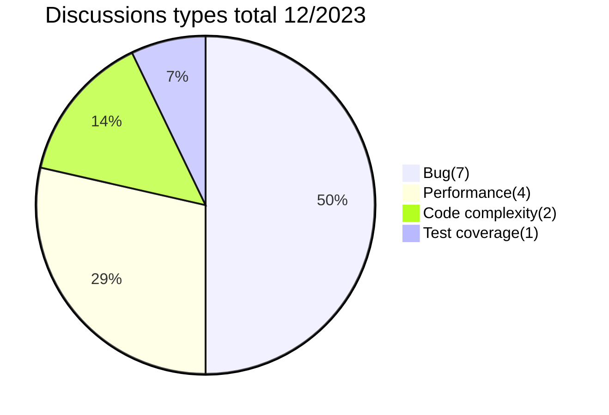

# Pull request analytics action

**pull-request-analytics-action**: A powerful tool designed for generating detailed code review reports. This action creates tables and graphs focused on key metrics derived from closed pull requests and reviews. These metrics are instrumental in identifying bottlenecks in the review process and measuring the productivity of both individual developers and the team as a whole. A significant advantage of **pull-request-analytics-action** is that all data processing is conducted within the GitHub environment, ensuring data privacy and security. This tool is completely free and open source, making it an attractive choice for a wide range of users.

## Table of Contents

- [Key Features](#key-features)
- [Getting started](#getting-started)
- [Report examples](#report-examples)
- [Detailed Report on Discussion Types](#detailed-report-on-discussion-types)
- [Report Data Grouping, AMOUNT Parameter, and Time Calculation Logic](#detailed-report-on-discussion-types)
- [Configuration Parameters Overview](#configuration-parameters-overview)
- [Privacy and Data Handling](#privacy-and-data-handling)
- [Usage Limitations](#usage-limitations)
- [How You Can Help](#how-you-can-help)
- [License](#license)

## Key Features:

- **Customizable Tables and Graphs for Review Timelines**: Generates user-friendly tables and graphs that mark critical milestones from PR opening to review, approval, and merge. Users can select the calculation method best suited for them, choosing from median, mean (average), or a selected percentile. This feature helps to identify bottlenecks in the code review process.
  | user | Time to review | Time to approve | Time to merge | Total merged PRs |
  | :------: | :------: | :------: | :------: | :------: |
  | **dev1** | 1 hour 39 minutes | 1 hour 39 minutes | 17 hours 10 minutes | 7 |
  | **dev2** | 4 hours 20 minutes | 5 hours 48 minutes | 20 hours 33 minutes | 9 |
  | **dev3** | 5 hours 25 minutes | 26 hours 40 minutes | 48 hours 30 minutes | 2 |
  | **dev4** | 1 hour | 3 hours 27 minutes | 14 hours 14 minutes | 4 |
  | **total** | 2 hours 39 minutes | 4 hours 14 minutes | 20 hours 33 minutes | 22 |

  ```mermaid
  gantt
  title Pull requests timeline(percentile75) 12/2023 / minutes
  dateFormat X
  axisFormat %s
  section dev1
  Time to review :  0, 99
  Time to approve :  0, 99
  Time to merge :  0, 1030

  section dev2
  Time to review :  0, 260
  Time to approve :  0, 348
  Time to merge :  0, 1233

  section dev3
  Time to review :  0, 325
  Time to approve :  0, 1600
  Time to merge :  0, 2910

  section dev4
  Time to review :  0, 60
  Time to approve :  0, 207
  Time to merge :  0, 854

  section total
  Time to review :  0, 159
  Time to approve :  0, 254
  Time to merge :  0, 1233

  ```

- **Comprehensive Report on Merged PRs, Code Changes, and Reviews**: This feature compiles a report detailing the number of merged PRs, lines of code modified, and reviews conducted. It provides an approximate measure of the workload, both for individual developers and the team as a whole, offering a clear view of productivity and contribution.
  | user | Total opened PRs | Total merged PRs | Additions/Deletions | Total comments | Reviews conducted |
  | :-------------: | :--------------: | :--------------: | :-----------------: | :------------: | :---------------: |
  | **dev1** | 7 | 7 | +158/-113 | 0 | 9 |
  | **dev2** | 10 | 9 | +1010/-3690 | 3 | 5 |
  | **dev3** | 2 | 2 | +138/-108 | 15 | 3 |
  | **dev4** | 4 | 4 | +326/-142 | 12 | 3 |
  | **dev5** | 0 | 0 | +0/-0 | 0 | 3 |
  | **total** | 23 | 22 | +1632/-4053 | 30 | 21 |

- **Quality Report on devInitiated PRs**: This feature generates a report analyzing the quality of PRs opened by developers. It collates data on the number of comments received, discussions held, and reasons for these discussions, along with the quantity of requested changes in open PRs, all presented in both tabular and graphical formats. This functionality aids in identifying the most problematic areas detected during code reviews and quantifying their extent.

  |   user    | Total merged PRs | Changes requested received | Discussions received | Comments received |
  | :-------: | :--------------: | :------------------------: | :------------------: | :---------------: |
  | **dev1**  |        7         |             0              |          0           |         0         |
  | **dev2**  |        9         |             2              |          2           |         2         |
  | **dev3**  |        2         |             1              |          6           |         8         |
  | **dev4**  |        4         |             0              |          7           |         7         |
  | **total** |        22        |             3              |          15          |        17         |



- **Developer Engagement in Code Review Process**: This feature assesses the level of developer participation in code reviews. It provides a table showing the discussions initiated, comments made, along with a breakdown of the number of code reviews conducted and the decisions made. This enables you to gauge the involvement of developers in the review process effectively.
  | user | Total merged PRs | Discussions conducted | Comments conducted | Changes requested / Comments / Approvals |
  | :-------------: | :--------------: | :-------------------: | :----------------: | :--------------------------------------: |
  | **dev1** | 7 | 9 | 11 | 3 / 2 / 9 |
  | **dev2** | 9 | 4 | 4 | 0 / 1 / 5 |
  | **dev3** | 2 | 0 | 0 | 0 / 0 / 3 |
  | **dev4** | 4 | 0 | 0 | 0 / 0 / 3 |
  | **dev5** | 0 | 2 | 2 | 0 / 0 / 3 |
  | **total** | 22 | 15 | 17 | 3 / 5 / 21 |

- **Highly Customizable for Specific Project Needs**: This action is designed with flexibility in mind, allowing for extensive customization of display parameters, statistics collection, and report generation. Users can tailor the tool to precisely fit the requirements of their specific projects, ensuring that the reports and analytics are as relevant and useful as possible.

- **GitHub-Integrated, Secure, and Open Source**: As a GitHub Action, **pull-request-analytics-action** operates entirely within the GitHub environment. It neither shares nor stores any data on external services, ensuring complete data security and privacy. Additionally, it is an open-source tool, providing full transparency in its operation, and is available to use at no cost, making it accessible for all GitHub users.

This GitHub Action, **pull-request-analytics-action**, is an essential tool for any team seeking to optimize their software development process, ensuring more efficient and effective project management.

## Getting started

To integrate **pull-request-analytics-action** into your GitHub repository, use the following steps. The provided code is a template and can be adjusted to fit your specific requirements:

1. **Create a Workflow File**:

   - Navigate to the `.github/workflows` directory in your repository.
   - Create a YAML file, for example, `pull-request-analytics.yml`.

2. **Choose the Trigger Event**: Decide on which GitHub event you want to trigger the report generation. You can refer to the [GitHub Events Documentation](https://docs.github.com/en/actions/using-workflows/events-that-trigger-workflows) for a detailed understanding of different events. I recommend using one of the `pull_request`, `workflow_dispatch`, or `schedule` events, depending on your specific needs. For this setup, we will configure the `workflow_dispatch` event.

3. **Insert and Customize the Workflow Code**:

   - Open your new YAML file and paste the following example workflow. This is a starting template and you can modify it as needed:

     ```yaml
     name: "PR Analytics"
     on:
       workflow_dispatch:
         inputs:
           amount:
             description: "Amount of PRs"
             required: false
             default: "100"
           report_date_start:
             description: "Report date start(d/MM/yyyy)"
             required: false
           report_date_end:
             description: "Report date end(d/MM/yyyy)"
             required: false
           aggregate_value_methods:
             description: "Aggregate value methods for timelines separated by comma. Can take values average, percentile, medianÏ"
             default: "percentile"
           percentile:
             description: "Percentile"
             required: false
             default: "75"
           issue_title:
             description: "Issue custom title"
             required: false
           labels:
             description: "Issue labels"
             required: false
           hide_users:
             description: "Hidden users"
             required: false
           show_users:
             description: "Shown users"
             required: false
           exclude_labels:
             description: "Labels to exclude"
             required: false
     jobs:
       create-report:
         name: "Create report"
         runs-on: ubuntu-latest
         steps:
           - name: "Run script for analytics"
             uses: AlexSim93/pull-request-analytics-action@v1.4.1
             with:
               GITHUB_TOKEN: ${{ secrets.KEY }}
               ISSUE_TITLE: ${{ inputs.issue_title }}
               ASSIGNEES: "user-1, user-2, user-3"
               LABELS: ${{ inputs.labels }}
               GITHUB_REPO_FOR_ISSUE: "repo"
               GITHUB_OWNER_FOR_ISSUE: "owner"
               GITHUB_OWNERS_REPOS: "owner-1/repo-1"
               CORE_HOURS_START: "9:00"
               CORE_HOURS_END: "19:00"
               TIMEZONE: "Europe/Berlin"
               AGGREGATE_VALUE_METHODS: ${{inputs.aggregate_value_methods}}
               PERCENTILE: ${{ inputs.percentile }}
               AMOUNT: ${{ inputs.amount }}
               REPORT_DATE_START: ${{ inputs.report_date_start }}
               REPORT_DATE_END: ${{ inputs.report_date_end }}
               HIDE_USERS: ${{ inputs.hide_users }}
     ```

   - In the `workflow_dispatch` section of the yml file, I have specified various inputs that can be adjusted each time the action is triggered. By utilizing the `required` and `default` fields, I've designated whether each input is mandatory and set predetermined values for ease of use. In the `with` section, I've included parameters that remain constant for each action run. For a detailed understanding of which parameters the action accepts and their functions, please refer to the [Parameters Overview section](#configuration-parameters-overview).
   - Adjust parameters to match your project's needs.

4. **Commit and Push the Workflow File**:

   - Save your changes and commit the file to your repository.
   - Push it to enable the GitHub Action workflow.

5. **Run the Workflow**:

   - In your repository, go to the 'Actions' tab.
   - Select **PR analytics** and start it via "Run workflow".
   - Fill in any necessary parameters and execute the action.

6. **Review the Generated Report**:
   - Once the action completes, your detailed PR report will be available.
   - If configured, check for a new issue in the specified repository containing the report.

This setup allows you to fully leverage **pull-request-analytics-action** for comprehensive PR analysis, tailored to your project’s needs.

## Report Examples

Explore how **pull-request-analytics-action** works with these report examples in the project:

1. **Multi-Month Report**: Analysis over several months. [View Example](https://github.com/AlexSim93/pull-request-analytics-action/blob/master/examples/periodReport.md).

2. **Last N PRs Report**: Insights into the most recent pull requests. [View Example](https://github.com/AlexSim93/pull-request-analytics-action/blob/master/examples/nPRsReport.md).

Click the links for detailed report formats and insights.

## Detailed Report on Discussion Types

To obtain a detailed report on the types of open discussions, it is necessary to include a specific label in the first message of each discussion, enclosed in double square brackets (`[[ ]]`). For example, use `[[Performance issue]]` to categorize a discussion as related to performance issues. The action will then provide a breakdown of discussions based on these labels, allowing for a more targeted and categorized analysis of discussion topics.

**Example Usage**:

- In the first comment of a pull request discussion, include a label like `[[Bug]]`, `[[Feature Request]]`, or any custom label of your choice.
- **pull-request-analytics-action** will recognize these labels and include them in the report, providing a categorized overview of discussions.

This feature enhances the analytical capabilities of **pull-request-analytics-action**, offering a deeper insight into the nature and distribution of discussions in your pull requests.

## Report Data Grouping, AMOUNT Parameter, and Time Calculation Logic

- **Data Grouping**: The report data is organized based on the closure date of each pull request.
- **Using AMOUNT Parameter**: When `AMOUNT` is specified without `REPORT_DATE_START`, the report includes the specified number of most recently modified pull requests. However, the report count may be less than the `AMOUNT` specified, as it only includes merged pull requests.

- **Excluding Weekends and Non-Working Hours**: The calculations for the report exclude weekends. Furthermore, when `CORE_HOURS_START` and `CORE_HOURS_END` are set, time outside of these core working hours is not considered in the time-related metrics.

## Configuration Parameters Overview

Below is a table outlining the various configuration parameters available for **pull-request-analytics-action**. These parameters allow you to customize the behavior of the action to fit your specific needs. Each parameter's name, description, requirement status, and default value (if applicable) are listed for your reference:

| Parameter Name            | Description                                                                                                                                                        | Required | Default Value                                            |
| ------------------------- | ------------------------------------------------------------------------------------------------------------------------------------------------------------------ | -------- | -------------------------------------------------------- |
| `GITHUB_TOKEN`            | Github token                                                                                                                                                       | Yes      | -                                                        |
| `GITHUB_OWNERS_REPOS`     | Github owner/repository list separated by comma                                                                                                                    | Yes      | -                                                        |
| `GITHUB_REPO_FOR_ISSUE`   | GitHub repository for issue creation                                                                                                                               | Yes      | -                                                        |
| `GITHUB_OWNER_FOR_ISSUE`  | Owner of the repository for issue                                                                                                                                  | Yes      | -                                                        |
| `SHOW_STATS_TYPES`        | Stats types that should be displayed in report. Values must be separated by comma. Can take values: `timeline`, `workload`, `pr-quality`, `code-review-engagement` | No       | `timeline, workload, pr-quality, code-review-engagement` |
| `AGGREGATE_VALUE_METHODS` | Aggregate value methods for timelines separated by comma. Can take values: `percentile`, `average`, `median`                                                       | No       | `percentile`                                             |
| `AMOUNT`                  | Number of pull requests in the report. Ignored if the `REPORT_DATE_START` is set                                                                                   | No       | `100`                                                    |
| `REPORT_DATE_START`       | Start date for the report (d/MM/yyyy)                                                                                                                              | No       | -                                                        |
| `REPORT_DATE_END`         | End date for the report (d/MM/yyyy)                                                                                                                                | No       | -                                                        |
| `CORE_HOURS_START`        | Start of core hours (HH:mm). By default in UTC                                                                                                                     | No       | -                                                        |
| `CORE_HOURS_END`          | End of core hours (HH:mm). By default in UTC                                                                                                                       | No       | -                                                        |
| `TIMEZONE`                | Timezone that will be used in action                                                                                                                               | No       | `UTC`                                                    |
| `PERCENTILE`              | Percentile value for timeline                                                                                                                                      | No       | `75`                                                     |
| `ISSUE_TITLE`             | Title for the created issue                                                                                                                                        | No       | `Pull requests report(d/MM/yyyy HH:mm)`                  |
| `LABELS`                  | Labels for the created issue separated by comma                                                                                                                    | No       | -                                                        |
| `ASSIGNEES`               | Assignees for the issue separated by comma                                                                                                                         | No       | -                                                        |
| `HIDE_USERS`              | Hides selected users from reports, while still including their data in the analytics. Users should be separated by comma                                           | No       | -                                                        |
| `SHOW_USERS`              | Displays only specified users in reports, but includes all users in the background analytics. Users should be separated by comma                                   | No       | -                                                        |
| `EXCLUDE_LABELS`          | Excludes PRs with mentioned labels. Values should be separated by comma                                                                                            | No       | -                                                        |
| `INCLUDE_LABELS`          | Includes only PRs with mentioned labels. Values should be separated by comma                                                                                       | No       | -                                                        |

Use these parameters to tailor the **pull-request-analytics-action** to your project's specific requirements.

## Privacy and Data Handling

**pull-request-analytics-action** is designed with privacy and security in mind. It operates as a stateless application, ensuring it does not retain or store any user data externally. All processing is performed within your GitHub environment, maintaining strict data confidentiality. We prioritize the security of your information, ensuring no external data collection or storage, thereby safeguarding the integrity and privacy of your workflow.

## Usage Limitations

**pull-request-analytics-action** operates within GitHub's API rate limits and message size constraints, which are generally sufficient for detailed, long-term reporting. However, in rare cases of extremely large datasets, some adjustments might be necessary. For more information, refer to GitHub's documentation on [rate limiting](https://docs.github.com/en/rest/overview/rate-limits-for-the-rest-api). The length of the report generated by **pull-request-analytics-action** is limited to 65,536 characters due to GitHub Issue size constraints.

## How You Can Help

Contributions to **pull-request-analytics-action** are always welcome, no matter how large or small. Here are some ways you can help:

- **Contribute to the Code**: Follow our contribution guidelines to make code contributions. Every pull request helps!
- **Report Bugs**: Encountered an issue? Please let us know by opening an issue on GitHub. This is crucial for continuous improvement.
- **Share Ideas**: Have ideas on how to improve **pull-request-analytics-action**? Open an issue and tell us about your suggestions.
- **Participate in Surveys**: Occasionally, we conduct surveys to gather feedback. Your participation would be invaluable in shaping the future of **pull-request-analytics-action**.
- **Spread the Word**: Mention **pull-request-analytics-action** in your articles, blog posts, and social media. The more people know about it, the better it gets.
- **Get Featured**: If your company or project uses **pull-request-analytics-action**, let us know! We'd be proud to mention your name in our list of users. It's a great way for you to showcase your commitment to quality in software development, and it helps us demonstrate the real-world effectiveness of our tool.

Your support and contributions greatly enhance this project. Together, we can make it the best tool for analyzing pull requests!

## License

**pull-request-analytics-action** is licensed under the [MIT License](https://opensource.org/licenses/MIT). This permits free use, modification, and distribution of the software, with the requirement of including the original copyright notice. For full license terms, see the [MIT License details](https://opensource.org/licenses/MIT).
