# Pull request analytics action

 

**pull-request-analytics-action**: A powerful tool for analyzing the effectiveness of both teams and individual developers. This action generates reports based on data from pull requests, code reviews, and comments, enabling you to identify your team's strengths as well as areas needing improvement. The statistics collected by this GitHub Action can be displayed in the form of tables and graphs or passed on for further operations as markdown or a data collection. No information is transferred to external services; all operations are conducted exclusively within the GitHub environment. The tool offers numerous configuration parameters and can be customized to suit specific project needs.

## Table of Contents

- [Key Features](#key-features)
- [Getting started](#getting-started)
- [Configuration Examples](#configuration-examples)
- [Report examples](#report-examples)
- [Using GitHub Enterprise Server](#using-github-enterprise-server)
- [Detailed Report on Discussion Types](#detailed-report-on-discussion-types)
- [Pull Request Sizes](#pull-request-sizes)
- [Report Data Grouping, AMOUNT Parameter, and Time Calculation Logic](#detailed-report-on-discussion-types)
- [Configuration Parameters Overview](#configuration-parameters-overview)
- [Outputs](#outputs)
- [Privacy and Data Handling](#privacy-and-data-handling)
- [Usage Limitations](#usage-limitations)
- [How You Can Help](#how-you-can-help)

## Key Features:

- **Customizable Tables and Graphs for Review Timelines**: Generates user-friendly tables and graphs that mark critical milestones from PR opening to review, approval, and merge. Users can select the calculation method best suited for them, choosing from median, mean (average), or a selected percentile. This feature helps to identify bottlenecks in the code review process.

|   user    |   Time to review    |   Time to approve   |    Time to merge    | Total merged PRs |
| :-------: | :-----------------: | :-----------------: | :-----------------: | :--------------: |
| **dev1**  | 3 hours 34 minutes  | 7 hours 32 minutes  | 14 hours 9 minutes  |        22        |
| **dev2**  |       4 hours       |       4 hours       |  23 hours 1 minute  |        13        |
| **dev3**  | 15 hours 16 minutes | 24 hours 7 minutes  | 53 hours 43 minutes |        2         |
| **dev4**  | 2 hours 41 minutes  | 9 hours 15 minutes  | 47 hours 41 minutes |        8         |
| **dev5**  | 5 hours 59 minutes  | 18 hours 55 minutes | 40 hours 7 minutes  |        2         |
| **total** | 4 hours 21 minutes  | 7 hours 36 minutes  | 26 hours 14 minutes |        47        |

```mermaid
gantt
title Pull requests timeline(percentile75) 12/2023 / minutes
dateFormat X
axisFormat %s
section dev1
Time to review(3 hours 34 minutes) :  0, 214
Time to approve(7 hours 32 minutes) :  0, 452
Time to merge(14 hours 9 minutes) :  0, 849

section dev2
Time to review(4 hours) :  0, 240
Time to approve(4 hours) :  0, 240
Time to merge(23 hours 1 minute) :  0, 1381

section dev3
Time to review(15 hours 16 minutes) :  0, 916
Time to approve(24 hours 7 minutes) :  0, 1447
Time to merge(53 hours 43 minutes) :  0, 3223

section dev4
Time to review(2 hours 41 minutes) :  0, 161
Time to approve(9 hours 15 minutes) :  0, 555
Time to merge(47 hours 41 minutes) :  0, 2861

section dev5
Time to review(5 hours 59 minutes) :  0, 359
Time to approve(18 hours 55 minutes) :  0, 1135
Time to merge(40 hours 7 minutes) :  0, 2407

section total
Time to review(4 hours 21 minutes) :  0, 261
Time to approve(7 hours 36 minutes) :  0, 456
Time to merge(26 hours 14 minutes) :  0, 1574

```



- **Comprehensive Report on Merged PRs, Code Changes, and Reviews**: This feature compiles a report detailing the number of merged PRs, lines of code modified, and reviews conducted. It provides an approximate measure of the workload, both for individual developers and the team as a whole, offering a clear view of productivity and contribution.

|   user    | Total opened PRs | Total merged PRs | Additions/Deletions | PR size: xs/s/m/l/xl | Total comments | Reviews conducted |
| :-------: | :--------------: | :--------------: | :-----------------: | :------------------: | :------------: | :---------------: |
| **dev1**  |        24        |        22        |     +1448/-3110     |      14/5/4/0/1      |       41       |         8         |
| **dev2**  |        14        |        13        |     +813/-2062      |      7/4/1/2/0       |       6        |        20         |
| **dev3**  |        2         |        2         |       +15/-3        |      2/0/0/0/0       |       1        |        10         |
| **dev4**  |        8         |        8         |     +5416/-4600     |      6/0/1/0/1       |       7        |         9         |
| **dev5**  |        2         |        2         |      +838/-362      |      1/0/0/0/1       |       16       |         2         |
| **total** |        50        |        47        |    +8530/-10137     |      30/9/6/2/3      |       71       |        46         |

- **Quality Report on devInitiated PRs**: This feature generates a report analyzing the quality of PRs opened by developers. It collates data on the number of comments received, discussions held, and reasons for these discussions, along with the quantity of requested changes in open PRs, all presented in both tabular and graphical formats. This functionality aids in identifying the most problematic areas detected during code reviews and quantifying their extent.

|   user    | Total merged PRs | Changes requested received | Agreed / Disagreed / Total discussions received | Comments received |
| :-------: | :--------------: | :------------------------: | :---------------------------------------------: | :---------------: |
| **dev1**  |        22        |             3              |                   0 / 0 / 10                    |        20         |
| **dev2**  |        13        |             1              |                    0 / 0 / 2                    |         3         |
| **dev3**  |        2         |             0              |                    0 / 0 / 1                    |         1         |
| **dev4**  |        8         |             1              |                    0 / 0 / 4                    |         4         |
| **dev5**  |        2         |             1              |                    3 / 2 / 8                    |         9         |
| **total** |        47        |             6              |                   3 / 2 / 25                    |        37         |


- **Developer Engagement in Code Review Process**: This feature assesses the level of developer participation in code reviews. It provides a table showing the discussions initiated, comments made, along with a breakdown of the number of code reviews conducted and the decisions made. This enables you to gauge the involvement of developers in the review process effectively.

|   user    | Total merged PRs | Agreed / Disagreed / Total discussions conducted | Comments conducted | PR size: xs/s/m/l/xl | Changes requested / Commented / Approved |
| :-------: | :--------------: | :----------------------------------------------: | :----------------: | :------------------: | :--------------------------------------: |
| **dev1**  |        22        |                    0 / 0 / 0                     |         0          |      5/2/0/1/0       |                0 / 0 / 8                 |
| **dev2**  |        13        |                    3 / 2 / 22                    |         33         |      10/3/4/0/3      |                5 / 8 / 20                |
| **dev3**  |        2         |                    0 / 0 / 2                     |         3          |      4/2/1/2/1       |                1 / 1 / 10                |
| **dev4**  |        8         |                    0 / 0 / 0                     |         0          |      6/2/1/0/0       |                0 / 0 / 9                 |
| **dev5**  |        2         |                    0 / 0 / 1                     |         1          |      2/0/0/0/0       |                0 / 1 / 2                 |
| **total** |        47        |                    3 / 2 / 25                    |         37         |      30/9/6/2/3      |               6 / 12 / 46                |

- **Highlighted PRs List by Key Metrics**: One of the standout features of **pull-request-analytics-action** is the ability to generate a list of the most notable pull requests based on four key metrics: time from opening to review, time from review to approval, time from approval to merge, and the number of comments. This feature provides a list of links directly to these exceptional PRs, allowing for quick access and detailed analysis.

- **Highly Customizable for Specific Project Needs**: This action is designed with flexibility in mind, allowing for extensive customization of display parameters, statistics collection, and report generation. Users can tailor the tool to precisely fit the requirements of their specific projects, ensuring that the reports and analytics are as relevant and useful as possible.

- **GitHub-Integrated, Secure, and Open Source**: As a GitHub Action, **pull-request-analytics-action** operates entirely within the GitHub environment. It neither shares nor stores any data on external services, ensuring complete data security and privacy. Additionally, it is an open-source tool, providing full transparency in its operation, and is available to use at no cost, making it accessible for all GitHub users.

This GitHub Action, **pull-request-analytics-action**, is an essential tool for any team seeking to optimize their software development process, ensuring more efficient and effective project management.

## Getting started

To integrate **pull-request-analytics-action** into your GitHub repository, use the following steps. The provided code is a template and can be adjusted to fit your specific requirements:

1. **Create a Workflow File**:

   - Navigate to the `.github/workflows` directory in your repository.
   - Create a YAML file, for example, `pull-request-analytics.yml`.

2. **Choose the Trigger Event**: Decide on which GitHub event you want to trigger the report generation. You can refer to the [GitHub Events Documentation](https://docs.github.com/en/actions/using-workflows/events-that-trigger-workflows) for a detailed understanding of different events. I recommend using one of the `pull_request`, `workflow_dispatch`, or `schedule` events, depending on your specific needs. For this setup, we will configure the `workflow_dispatch` event.

3. **Insert and Customize the Workflow Code**:

   - Open your new YAML file and paste the following example workflow. This is a starting template and you can modify it as needed:

     ```yaml
     name: "PR Analytics"
     on:
       workflow_dispatch:
         inputs:
           report_date_start:
             description: "Report date start(d/MM/yyyy)"
             required: false
           report_date_end:
             description: "Report date end(d/MM/yyyy)"
             required: false
     jobs:
       create-report:
         name: "Create report"
         runs-on: ubuntu-latest
         steps:
           - name: "Run script for analytics"
             uses: AlexSim93/pull-request-analytics-action@master
             with:
               GITHUB_TOKEN: ${{ secrets.TOKEN }}
               GITHUB_REPO_FOR_ISSUE: "repo"
               GITHUB_OWNER_FOR_ISSUE: "owner"
               GITHUB_OWNERS_REPOS: "owner-1/repo-1"
               CORE_HOURS_START: "9:00"
               CORE_HOURS_END: "19:00"
               TIMEZONE: "Europe/Berlin"
               REPORT_DATE_START: ${{ inputs.report_date_start }}
               REPORT_DATE_END: ${{ inputs.report_date_end }}
     ```

   - In the `workflow_dispatch` section of the yml file, I have specified various inputs that can be adjusted each time the action is triggered. By utilizing the `required` and `default` fields, I've designated whether each input is mandatory and set predetermined values for ease of use. In the `with` section, I've included parameters that remain constant for each action run. For a detailed understanding of which parameters the action accepts and their functions, please refer to the [Parameters Overview section](#configuration-parameters-overview).
   - **GitHub Token:** The `GITHUB_TOKEN` is a special token used by the GitHub Actions runner to interact with your repository. You can generate this token as per the [GitHub Documentation on Authentication](https://docs.github.com/en/rest/authentication/authenticating-to-the-rest-api?apiVersion=2022-11-28). When setting up the token, ensure you configure the necessary permissions. For **pull-request-analytics-action** to function correctly, the token requires read and write repository permissions for **Administration**, **Issues**, and **Pull Requests**. Insert the token in your workflow file under the secrets context.
   - Adjust parameters to match your project's needs.

4. **Commit and Push the Workflow File**:

   - Save your changes and commit the file to your repository.
   - Push it to enable the GitHub Action workflow.

5. **Run the Workflow**:

   - In your repository, go to the 'Actions' tab.
   - Select **PR analytics** and start it via "Run workflow".
   - Fill in any necessary parameters and execute the action.

6. **Review the Generated Report**:

   - Once the action completes, your detailed PR report will be available.
   - If configured, check for a new issue in the specified repository containing the report.

This setup allows you to fully leverage **pull-request-analytics-action** for comprehensive PR analysis, tailored to your project’s needs.

## Configuration Examples

1. **Manual Execution for All Organization Repositories**: Includes options to set start and end dates for the statistics period and to customize the report title. [View config](https://github.com/AlexSim93/pull-request-analytics-action/blob/master/configs/manualTriggerForAllReposOfOrg.yml)

2. **Up-to-Date Statistics for Latest 200 Closed PRs**: Automatically updates the report with every PR closure, maintaining current statistics for the last 200 updated closed PRs.[View config](https://github.com/AlexSim93/pull-request-analytics-action/blob/master/configs/updateReportOnPRClose.yml)

3. **Yearly Statistics Update Every Monday**: Configured to update yearly statistics every Monday, with assignees set and excluding individual developer statistics. [View config](https://github.com/AlexSim93/pull-request-analytics-action/blob/master/configs/yearReportWithoutDevelopers.yml)

4. **Quarterly Report Update on the 1st of Each Month**: Updates the report for the last three months on the first day of each month, displaying only the average values for timelines and specifying assignees. [View config](https://github.com/AlexSim93/pull-request-analytics-action/blob/master/configs/lastMonthsReport.yml)

## Report Examples

Explore how **pull-request-analytics-action** works with these report examples in the project:

1. **Issue Creation with Comments**: Demonstrates the generation of a new issue with detailed comments for each report. [View Issue Example](https://github.com/AlexSim93/pull-request-analytics-action/issues/16#).

2. **Multi-Month Report**: Analysis over several months. [View Markdown Example](https://github.com/AlexSim93/pull-request-analytics-action/blob/master/examples/periodReport.md).

3. **Last N PRs Report**: Insights into the most recent pull requests. [View Markdown Example](https://github.com/AlexSim93/pull-request-analytics-action/blob/master/examples/nPRsReport.md).

4. **JSON Data Report**: Example of JSON data collected by the action, showcasing detailed analytics. [View JSON Example](https://github.com/AlexSim93/pull-request-analytics-action/blob/master/examples/collectionExample.json).

Click the links for detailed report formats and insights.

## Using GitHub Enterprise Server

**pull-request-analytics-action** supports integration with GitHub Enterprise Server. To use this feature, you need to set the `GITHUB_API_URL` environment variable:

1. In your workflow file, define the `GITHUB_API_URL` under the `env` key.
2. Set the value to your GitHub Enterprise Server API endpoint.

Example:

```yaml
env:
  GITHUB_API_URL: http(s)://HOSTNAME/api/v3
```

This configuration allows **pull-request-analytics-action** to interface with your GitHub Enterprise instance, enabling you to leverage the full capabilities of the action within your enterprise environment.

## Detailed Report on Discussion Types

To obtain a detailed report on the types of open discussions, it is necessary to include a specific label in the first message of each discussion, enclosed in double square brackets (`[[ ]]`). For example, use `[[Performance issue]]` to categorize a discussion as related to performance issues. The action will then provide a breakdown of discussions based on these labels, allowing for a more targeted and categorized analysis of discussion topics.

In addition, reactions of :+1: and :-1: on the initial message of a discussion will be collected and displayed in the columns for "discussions received" and "discussions conducted." These reactions help to more accurately gauge the usefulness and reception of the discussions initiated.

**Example Usage**:

- In the first comment of a pull request discussion, include a label like `[[Bug]]`, `[[Feature Request]]`, or any custom label of your choice.
- **pull-request-analytics-action** will recognize these labels and include them in the report, providing a categorized overview of discussions.

This feature enhances the analytical capabilities of **pull-request-analytics-action**, offering a deeper insight into the nature and distribution of discussions in your pull requests.

## Pull Request Sizes

**Calculating PR Size**: The size of a pull request is determined using the formula: `additions + deletions * 0.5`. This calculation considers both the lines of code added and a weighted count of deletions to assess the overall size.

Based on this calculation, pull requests are categorized into the following size brackets:

- `0-50`: `xs`
- `51-200`: `s`
- `201-400`: `m`
- `401-700`: `l`
- `701+`: `xl`

## Report Data Grouping, AMOUNT Parameter, and Time Calculation Logic

- **Data Grouping**: The report data is organized based on the closure date of each pull request.
- **Using AMOUNT Parameter**: When `AMOUNT` is specified without `REPORT_DATE_START`, the report includes the specified number of most recently modified pull requests. However, the report count may be less than the `AMOUNT` specified, as it only includes merged pull requests.

- **Excluding Weekends and Non-Working Hours**: The calculations for the report exclude weekends. Furthermore, when `CORE_HOURS_START` and `CORE_HOURS_END` are set, time outside of these core working hours is not considered in the time-related metrics.

## Configuration Parameters Overview

Below is a table outlining the various configuration parameters available for **pull-request-analytics-action**. These parameters allow you to customize the behavior of the action to fit your specific needs. Each parameter's name, description, requirement status, and default value (if applicable) are listed for your reference:

| Parameter Name            | Description                                                                                                                                                                                                             | Required | Default Value                                            |
| ------------------------- | ----------------------------------------------------------------------------------------------------------------------------------------------------------------------------------------------------------------------- | -------- | -------------------------------------------------------- |
| `GITHUB_TOKEN`            | Github token. Requires read and write repository permissions for **Administration**(Only if `ORGANIZATIONS` is used), **Issues**, and **Pull Requests**                                                                 | Yes      | -                                                        |
| `GITHUB_REPO_FOR_ISSUE`   | GitHub repository for issue creation                                                                                                                                                                                    | No       | -                                                        |
| `GITHUB_OWNER_FOR_ISSUE`  | Owner of the repository for issue                                                                                                                                                                                       | No       | -                                                        |
| `GITHUB_OWNERS_REPOS`     | Github owner/repository list separated by commas                                                                                                                                                                        | No       | -                                                        |
| `ORGANIZATIONS`           | GitHub organizations, separated by commas. Repositories from these organizations will be added to the `GITHUB_OWNERS_REPOS` list to create an array with unique repositories.                                           | No       | -                                                        |
| `SHOW_STATS_TYPES`        | Stats types that should be displayed in report. Values must be separated by commas. Can take values: `timeline`, `workload`, `pr-quality`, `code-review-engagement`                                                     | No       | `timeline, workload, pr-quality, code-review-engagement` |
| `AGGREGATE_VALUE_METHODS` | Aggregate value methods for timelines separated by commas. Can take values: `percentile`, `average`, `median`                                                                                                           | No       | `percentile`                                             |
| `AMOUNT`                  | Number of pull requests in the report. Ignored if the `REPORT_DATE_START` is set                                                                                                                                        | No       | `100`                                                    |
| `TOP_LIST_AMOUNT`         | Amount of items in lists                                                                                                                                                                                                | No       | `5`                                                      |
| `REPORT_DATE_START`       | Start date for the report (d/MM/yyyy)                                                                                                                                                                                   | No       | -                                                        |
| `REPORT_DATE_END`         | End date for the report (d/MM/yyyy)                                                                                                                                                                                     | No       | -                                                        |
| `REPORT_PERIOD`           | Report period from now. Values format `[unit]:value` separated by commas. Supported units: `years`, `months`, `weeks`, `days`, `hours`, `minutes`, `seconds`. Example: `weeks:2`                                        | No       | -                                                        |
| `PERIOD_SPLIT_UNIT`       | Unit for time segmentation. Can take values: `years`, `quarters`, `months`, `none`                                                                                                                                      | No       | `months`                                                 |
| `CORE_HOURS_START`        | Start of core hours (HH:mm). By default in UTC                                                                                                                                                                          | No       | -                                                        |
| `CORE_HOURS_END`          | End of core hours (HH:mm). By default in UTC                                                                                                                                                                            | No       | -                                                        |
| `TIMEZONE`                | Timezone that will be used in action                                                                                                                                                                                    | No       | `UTC`                                                    |
| `PERCENTILE`              | Percentile value for timeline                                                                                                                                                                                           | No       | `75`                                                     |
| `ISSUE_TITLE`             | Title for the created issue                                                                                                                                                                                             | No       | `Pull requests report(d/MM/yyyy HH:mm)`                  |
| `LABELS`                  | Labels for the created issue separated by commas                                                                                                                                                                        | No       | -                                                        |
| `ASSIGNEES`               | Assignees for the issue separated by commas                                                                                                                                                                             | No       | -                                                        |
| `HIDE_USERS`              | Hides selected users from reports, while still including their data in the analytics. Use `total` to hide total stats. Users should be separated by commas.                                                             | No       | -                                                        |
| `SHOW_USERS`              | Displays only specified users in reports, but includes all users in the background analytics. Use `total` to show total stats. Users should be separated by commas.                                                     | No       | -                                                        |
| `EXCLUDE_LABELS`          | Excludes PRs with mentioned labels. Values should be separated by commas                                                                                                                                                | No       | -                                                        |
| `INCLUDE_LABELS`          | Includes only PRs with mentioned labels. Values should be separated by commas                                                                                                                                           | No       | -                                                        |
| `EXECUTION_OUTCOME`       | Outcome format separated by commas. Can take values: `new-issue`, `markdown`, `collection`, `existing-issue`. `output` value is valid, but might be deprecated as value `markdown` clearer and creates the same output. | No       | `new-issue`                                              |
| `ISSUE_NUMBER`            | Issue number to update. Add `existing-issue` to `EXECUTION_OUTCOME` for updating existing issue                                                                                                                         | No       | -                                                        |

Use these parameters to tailor the **pull-request-analytics-action** to your project's specific requirements.

## Outputs

Below is a table describing the possible outputs of **pull-request-analytics-action**:

| Output Option     | Description                                                                                                                                          |
| ----------------- | ---------------------------------------------------------------------------------------------------------------------------------------------------- |
| `JSON_COLLECTION` | A string output containing a JSON object with all the data collected by the action. To receive this output, add `collection` to `EXECUTION_OUTCOME`. |
| `MARKDOWN`        | An output containing the report as a markdown string. To receive this output, add `markdown` to `EXECUTION_OUTCOME`.                                 |

## Privacy and Data Handling

**pull-request-analytics-action** is designed with privacy and security in mind. It operates as a stateless application, ensuring it does not retain or store any user data externally. All processing is performed within your GitHub environment, maintaining strict data confidentiality. We prioritize the security of your information, ensuring no external data collection or storage, thereby safeguarding the integrity and privacy of your workflow.

## Usage Limitations

**pull-request-analytics-action** operates within GitHub's API rate limits and message size constraints, which are generally sufficient for detailed, long-term reporting. However, in rare cases of extremely large datasets, some adjustments might be necessary. For more information, refer to GitHub's documentation on [rate limiting](https://docs.github.com/en/rest/overview/rate-limits-for-the-rest-api). The length of the report generated by **pull-request-analytics-action** is limited to 65,536 characters due to GitHub Issue size constraints.

## How You Can Help

Contributions to **pull-request-analytics-action** are always welcome, no matter how large or small. Here are some ways you can help:

- **Star the Project**: If you find **pull-request-analytics-action** useful, consider giving it a star :star: on GitHub. This helps increase its visibility and shows support for our work.
- **Spread the Word**: Mention **pull-request-analytics-action** in your articles, blog posts, and social media. The more people know about it, the better it gets.
- **Contribute to the Code**: Follow our contribution guidelines to make code contributions. Every pull request helps!
- **Report Bugs**: Encountered an issue? Please let us know by opening an issue on GitHub. This is crucial for continuous improvement.
- **Share Ideas**: Have ideas on how to improve **pull-request-analytics-action**? Open an issue and tell us about your suggestions.
- **Participate in Surveys**: Occasionally, we conduct surveys to gather feedback. Your participation would be invaluable in shaping the future of **pull-request-analytics-action**.
- **Get Featured**: If your company or project uses **pull-request-analytics-action**, let us know! We'd be proud to mention your name in our list of users. It's a great way for you to showcase your commitment to quality in software development, and it helps us demonstrate the real-world effectiveness of our tool.

Your support and contributions greatly enhance this project. Together, we can make it the best tool for analyzing pull requests!
