## Pull Request report

This report based on 100 last updated PRs. To learn more about the project and its configuration, please visit [Pull request analytics action](https://github.com/AlexSim93/pull-request-analytics-action).

Below are the settings applied for this report:

```
GITHUB_OWNERS_REPOS: owner/repo
GITHUB_REPO_FOR_ISSUE: issue-repo
GITHUB_OWNER_FOR_ISSUE: AlexSim93
AMOUNT: 100
CORE_HOURS_START: 10:00
CORE_HOURS_END: 19:00
TIMEZONE:
REPORT_DATE_START:
REPORT_DATE_END:
PERCENTILE: 75
AGGREGATE_VALUE_METHODS: percentile
LABELS: Analytics
ASSIGNEES: AlexSim93
HIDE_USERS: dev1, dev2, dev3
SHOW_USERS:
INCLUDE_LABELS:
EXCLUDE_LABELS:
```

### Pull requests timeline(percentile75) 12/2023

**Time to review** - time from PR creation to first review.
**Time to approve** - time from PR creation to first approval without requested changes.
**Time to merge** - time from PR creation to merge.
| user | Time to review | Time to approve | Time to merge | Total merged PRs |
| :------: | :------: | :------: | :------: | :------: |
| **AlexSim93** | 1 hour 53 minutes | 1 hour 53 minutes | 17 hours 10 minutes | 9 |
| **dev4** | 5 hours 48 minutes | 8 hours 26 minutes | 20 hours 33 minutes | 10 |
| **dev5** | 5 hours 25 minutes | 26 hours 40 minutes | 48 hours 30 minutes | 2 |
| **dev6** | 1 hour | 3 hours 27 minutes | 14 hours 14 minutes | 4 |
| **total** | 4 hours 14 minutes | 4 hours 20 minutes | 20 hours 33 minutes | 25 |


```mermaid
gantt
title Pull requests timeline(percentile75) 12/2023 / minutes
dateFormat X
axisFormat %s
section AlexSim93
                Time to review :  0, 113
Time to approve :  0, 113
Time to merge :  0, 1030

section dev4
                Time to review :  0, 348
Time to approve :  0, 506
Time to merge :  0, 1233

section dev5
                Time to review :  0, 325
Time to approve :  0, 1600
Time to merge :  0, 2910

section dev6
                Time to review :  0, 60
Time to approve :  0, 207
Time to merge :  0, 854

section total
                Time to review :  0, 254
Time to approve :  0, 260
Time to merge :  0, 1233

```

### Workload stats 12/2023

**Reviews conducted** - number of Reviews conducted. 1 PR may have only single review.
| user | Total opened PRs | Total merged PRs | Additions/Deletions | Total comments | Reviews conducted |
| :------: | :------: | :------: | :------: | :------: | :------: |
| **AlexSim93** | 9 | 9 | +355/-218 | 0 | 10 |
| **dev4** | 11 | 10 | +1082/-3694 | 3 | 7 |
| **dev5** | 2 | 2 | +138/-108 | 15 | 3 |
| **dev6** | 4 | 4 | +326/-142 | 12 | 3 |
| **dev7** | 0 | 0 | +0/-0 | 0 | 3 |
| **total** | 26 | 25 | +1901/-4162 | 30 | 24 |

### Pull requests review stats 12/2023

**Changes requested / Comments / Approvals** - number of Reviews conducted by user. For a single pull request, only one review of each status will be counted for a user.
| user | Total merged PRs | Discussions conducted | Comments conducted | Changes requested / Comments / Approvals |
| :------: | :------: | :------: | :------: | :------: |
| **AlexSim93** | 9 | 9 | 11 | 3 / 2 / 10 |
| **dev4** | 10 | 4 | 4 | 0 / 1 / 7 |
| **dev5** | 2 | 0 | 0 | 0 / 0 / 3 |
| **dev6** | 4 | 0 | 0 | 0 / 0 / 3 |
| **dev7** | 0 | 2 | 2 | 0 / 0 / 3 |
| **total** | 25 | 15 | 17 | 3 / 5 / 24 |

### Pull requests quality stats 12/2023

The table includes discussions and comments on closed pull requests.
| user | Total merged PRs | Changes requested received | Discussions received | Comments received |
| :------: | :------: | :------: | :------: | :------: |
| **AlexSim93** | 9 | 0 | 0 | 0 |
| **dev4** | 10 | 2 | 2 | 2 |
| **dev5** | 2 | 1 | 6 | 8 |
| **dev6** | 4 | 0 | 7 | 7 |
| **total** | 25 | 3 | 15 | 17 |

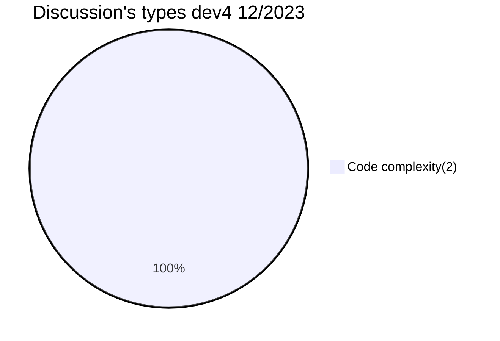
```mermaid
pie
title Discussion's types dev4 12/2023
"Code complexity(2)":2
```

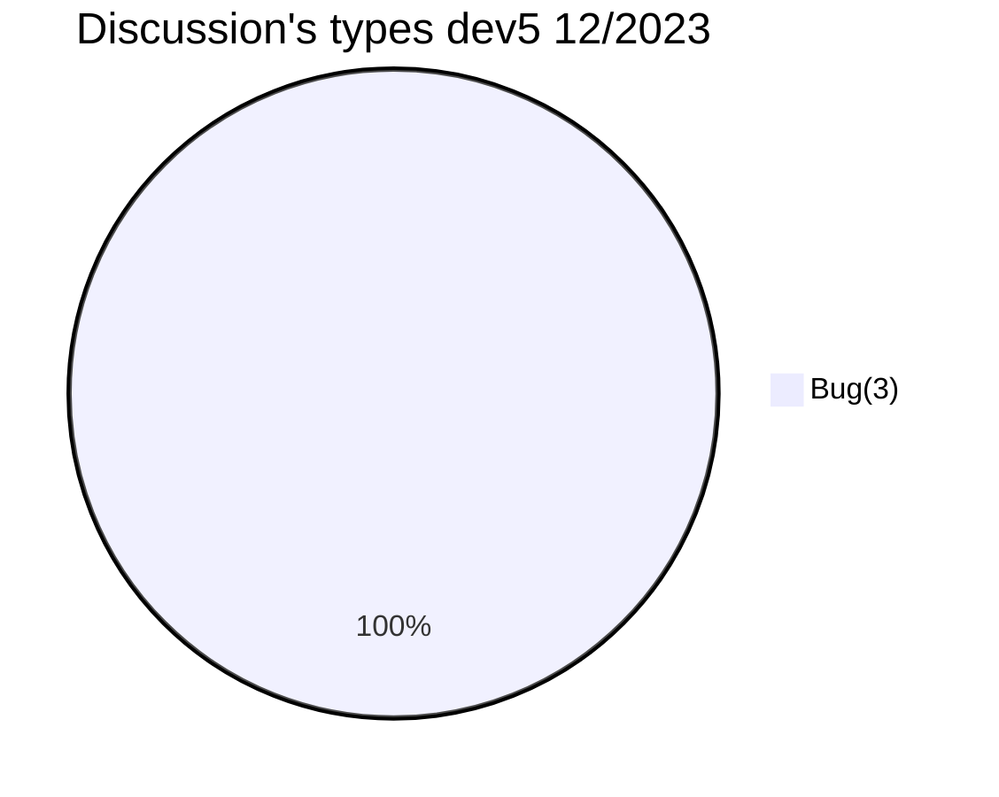
```mermaid
pie
title Discussion's types dev5 12/2023
"Bug(3)":3
```

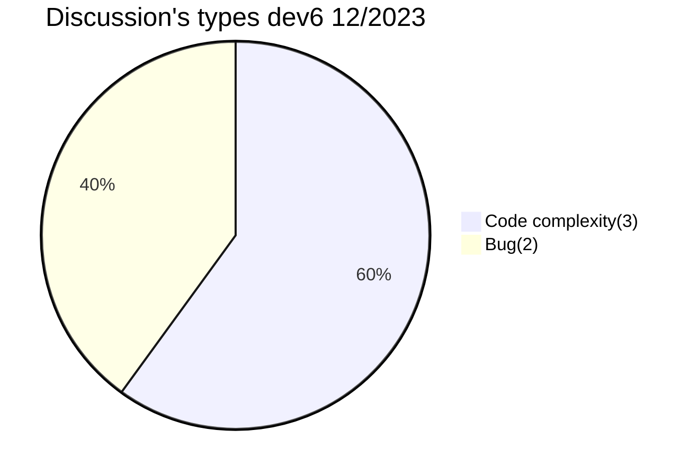
```mermaid
pie
title Discussion's types dev6 12/2023
"Code complexity(3)":3
"Bug(2)":2
```

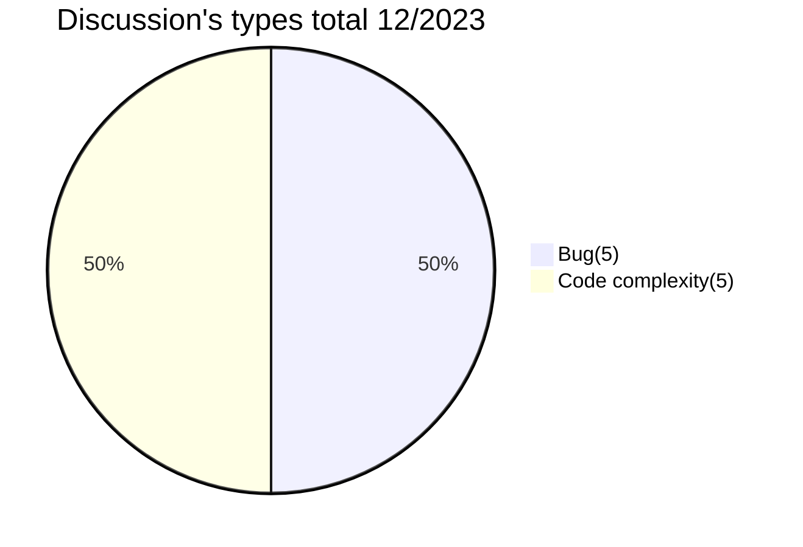
```mermaid
pie
title Discussion's types total 12/2023
"Bug(5)":5
"Code complexity(5)":5
```

### Pull requests timeline(percentile75) 11/2023

**Time to review** - time from PR creation to first review.
**Time to approve** - time from PR creation to first approval without requested changes.
**Time to merge** - time from PR creation to merge.
| user | Time to review | Time to approve | Time to merge | Total merged PRs |
| :------: | :------: | :------: | :------: | :------: |
| **AlexSim93** | 54 minutes | 1 hour 25 minutes | 6 hours 22 minutes | 22 |
| **dev4** | 1 hour 7 minutes | 10 hours 27 minutes | 17 hours 3 minutes | 8 |
| **dev5** | 1 hour 29 minutes | 8 hours | 25 hours 13 minutes | 12 |
| **dev6** | 1 hour 52 minutes | 1 hour 52 minutes | 37 hours 46 minutes | 15 |
| **dev7** | 8 hours 2 minutes | 8 hours 6 minutes | 36 hours 27 minutes | 11 |
| **total** | 1 hour 58 minutes | 5 hours 23 minutes | 25 hours 44 minutes | 68 |


```mermaid
gantt
title Pull requests timeline(percentile75) 11/2023 / minutes
dateFormat X
axisFormat %s
section AlexSim93
                Time to review :  0, 54
Time to approve :  0, 85
Time to merge :  0, 382

section dev4
                Time to review :  0, 67
Time to approve :  0, 627
Time to merge :  0, 1023

section dev5
                Time to review :  0, 89
Time to approve :  0, 480
Time to merge :  0, 1513

section dev6
                Time to review :  0, 112
Time to approve :  0, 112
Time to merge :  0, 2266

section dev7
                Time to review :  0, 482
Time to approve :  0, 486
Time to merge :  0, 2187

section total
                Time to review :  0, 118
Time to approve :  0, 323
Time to merge :  0, 1544

```

### Workload stats 11/2023

**Reviews conducted** - number of Reviews conducted. 1 PR may have only single review.
| user | Total opened PRs | Total merged PRs | Additions/Deletions | Total comments | Reviews conducted |
| :------: | :------: | :------: | :------: | :------: | :------: |
| **AlexSim93** | 22 | 22 | +2529/-2371 | 5 | 22 |
| **dev4** | 8 | 8 | +2627/-1910 | 54 | 9 |
| **dev5** | 12 | 12 | +1546/-791 | 70 | 8 |
| **dev6** | 17 | 15 | +1907/-814 | 30 | 19 |
| **dev7** | 12 | 11 | +980/-455 | 10 | 20 |
| **total** | 72 | 68 | +9590/-6347 | 169 | 68 |

### Pull requests review stats 11/2023

**Changes requested / Comments / Approvals** - number of Reviews conducted by user. For a single pull request, only one review of each status will be counted for a user.
| user | Total merged PRs | Discussions conducted | Comments conducted | Changes requested / Comments / Approvals |
| :------: | :------: | :------: | :------: | :------: |
| **AlexSim93** | 22 | 50 | 63 | 11 / 10 / 22 |
| **dev4** | 8 | 5 | 5 | 0 / 5 / 5 |
| **dev5** | 12 | 2 | 2 | 0 / 1 / 8 |
| **dev6** | 15 | 1 | 1 | 0 / 1 / 19 |
| **dev7** | 11 | 12 | 13 | 2 / 1 / 19 |
| **total** | 68 | 70 | 84 | 13 / 21 / 67 |

### Pull requests quality stats 11/2023

The table includes discussions and comments on closed pull requests.
| user | Total merged PRs | Changes requested received | Discussions received | Comments received |
| :------: | :------: | :------: | :------: | :------: |
| **AlexSim93** | 22 | 0 | 3 | 3 |
| **dev4** | 8 | 5 | 19 | 27 |
| **dev5** | 12 | 4 | 31 | 34 |
| **dev6** | 15 | 3 | 15 | 16 |
| **dev7** | 11 | 1 | 2 | 4 |
| **total** | 68 | 13 | 70 | 84 |

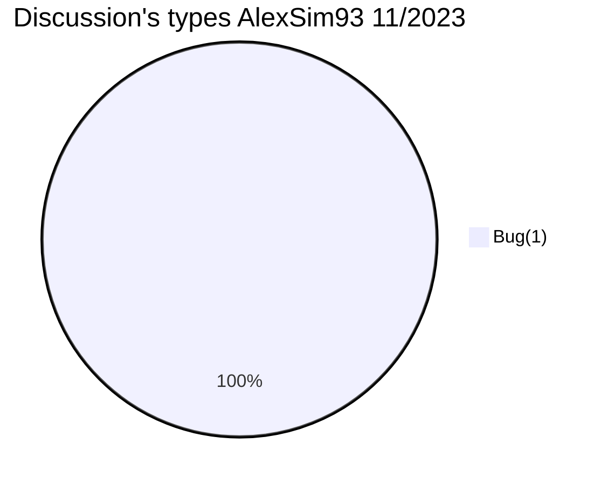
```mermaid
pie
title Discussion's types AlexSim93 11/2023
"Bug(1)":1
```

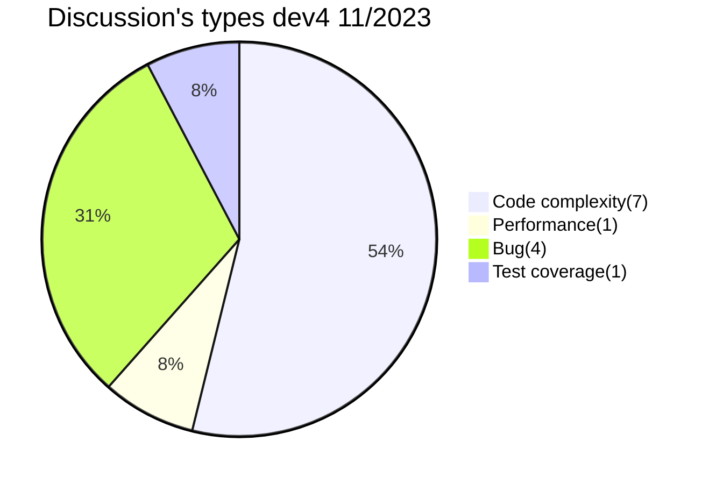
```mermaid
pie
title Discussion's types dev4 11/2023
"Code complexity(7)":7
"Performance(1)":1
"Bug(4)":4
"Test coverage(1)":1
```

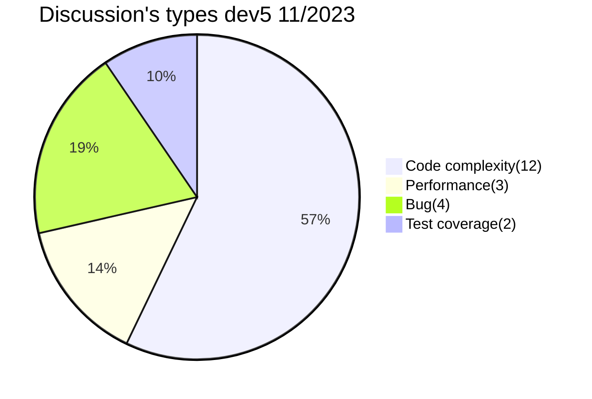
```mermaid
pie
title Discussion's types dev5 11/2023
"Code complexity(12)":12
"Performance(3)":3
"Bug(4)":4
"Test coverage(2)":2
```

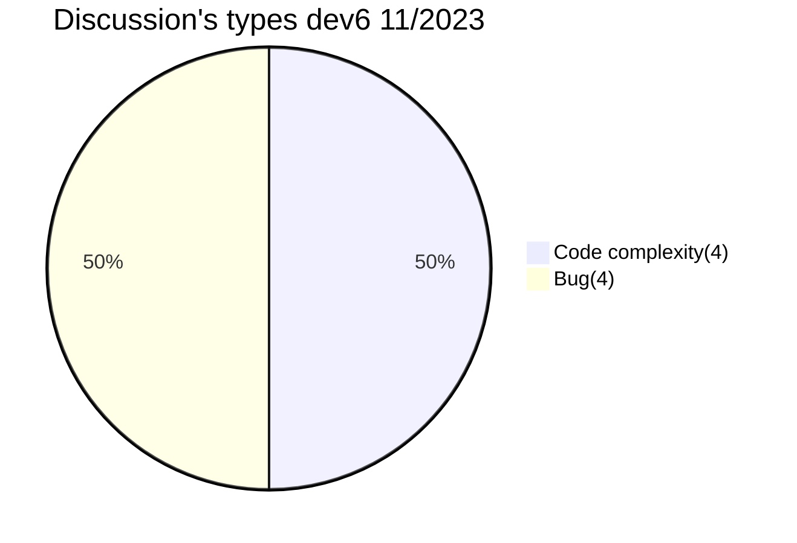
```mermaid
pie
title Discussion's types dev6 11/2023
"Code complexity(4)":4
"Bug(4)":4
```

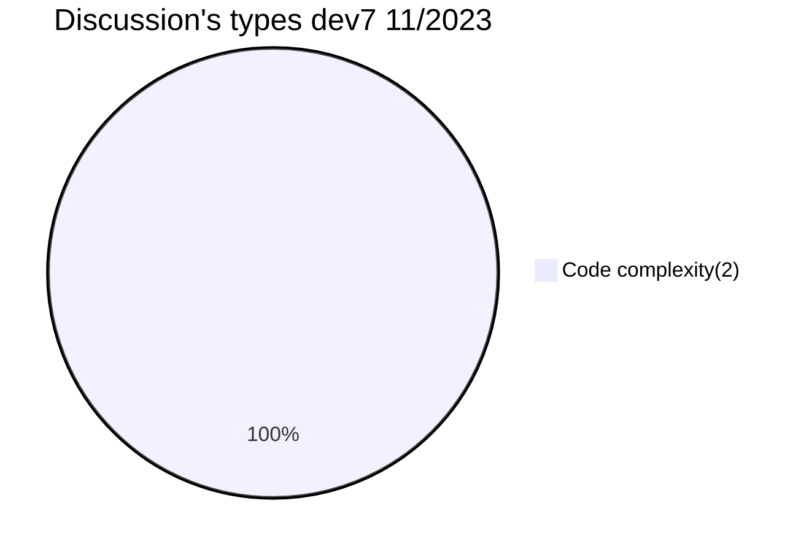
```mermaid
pie
title Discussion's types dev7 11/2023
"Code complexity(2)":2
```

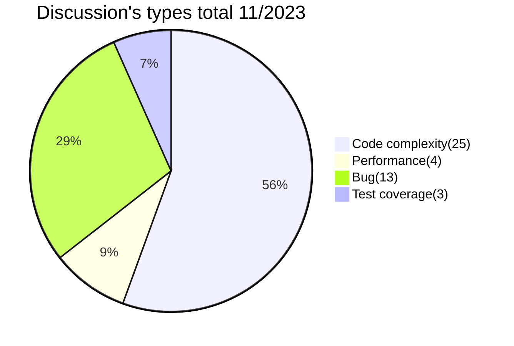
```mermaid
pie
title Discussion's types total 11/2023
"Code complexity(25)":25
"Performance(4)":4
"Bug(13)":13
"Test coverage(3)":3
```

### Pull requests timeline(percentile75) 10/2022

**Time to review** - time from PR creation to first review.
**Time to approve** - time from PR creation to first approval without requested changes.
**Time to merge** - time from PR creation to merge.
| user | Time to review | Time to approve | Time to merge | Total merged PRs |
| :------: | :------: | :------: | :------: | :------: |
| **total** | 1 minute | 1 minute | 34 hours 17 minutes | 1 |


```mermaid
gantt
title Pull requests timeline(percentile75) 10/2022 / minutes
dateFormat X
axisFormat %s
section total
                Time to review :  0, 1
Time to approve :  0, 1
Time to merge :  0, 2057

```

### Workload stats 10/2022

**Reviews conducted** - number of Reviews conducted. 1 PR may have only single review.
| user | Total opened PRs | Total merged PRs | Additions/Deletions | Total comments | Reviews conducted |
| :------: | :------: | :------: | :------: | :------: | :------: |
| **dev7** | 0 | 0 | +0/-0 | 0 | 1 |
| **total** | 1 | 1 | +4/-1 | 0 | 1 |

### Pull requests review stats 10/2022

**Changes requested / Comments / Approvals** - number of Reviews conducted by user. For a single pull request, only one review of each status will be counted for a user.
| user | Total merged PRs | Discussions conducted | Comments conducted | Changes requested / Comments / Approvals |
| :------: | :------: | :------: | :------: | :------: |
| **dev7** | 0 | 0 | 0 | 0 / 0 / 1 |
| **total** | 1 | 0 | 0 | 0 / 0 / 1 |

### Pull requests quality stats 10/2022

The table includes discussions and comments on closed pull requests.
| user | Total merged PRs | Changes requested received | Discussions received | Comments received |
| :------: | :------: | :------: | :------: | :------: |
| **total** | 1 | 0 | 0 | 0 |

### Pull requests timeline(percentile75) total

**Time to review** - time from PR creation to first review.
**Time to approve** - time from PR creation to first approval without requested changes.
**Time to merge** - time from PR creation to merge.
| user | Time to review | Time to approve | Time to merge | Total merged PRs |
| :------: | :------: | :------: | :------: | :------: |
| **AlexSim93** | 1 hour 39 minutes | 1 hour 50 minutes | 6 hours 35 minutes | 31 |
| **dev4** | 3 hours 35 minutes | 9 hours 2 minutes | 20 hours 33 minutes | 18 |
| **dev5** | 2 hours 21 minutes | 11 hours 23 minutes | 27 hours 43 minutes | 14 |
| **dev6** | 1 hour 52 minutes | 2 hours 9 minutes | 37 hours 46 minutes | 19 |
| **dev7** | 8 hours 2 minutes | 8 hours 6 minutes | 36 hours 27 minutes | 11 |
| **total** | 2 hours 21 minutes | 5 hours 23 minutes | 25 hours 13 minutes | 94 |


```mermaid
gantt
title Pull requests timeline(percentile75) total / minutes
dateFormat X
axisFormat %s
section AlexSim93
                Time to review :  0, 99
Time to approve :  0, 110
Time to merge :  0, 395

section dev4
                Time to review :  0, 215
Time to approve :  0, 542
Time to merge :  0, 1233

section dev5
                Time to review :  0, 141
Time to approve :  0, 683
Time to merge :  0, 1663

section dev6
                Time to review :  0, 112
Time to approve :  0, 129
Time to merge :  0, 2266

section dev7
                Time to review :  0, 482
Time to approve :  0, 486
Time to merge :  0, 2187

section total
                Time to review :  0, 141
Time to approve :  0, 323
Time to merge :  0, 1513

```

### Workload stats total

**Reviews conducted** - number of Reviews conducted. 1 PR may have only single review.
| user | Total opened PRs | Total merged PRs | Additions/Deletions | Total comments | Reviews conducted |
| :------: | :------: | :------: | :------: | :------: | :------: |
| **AlexSim93** | 31 | 31 | +2884/-2589 | 5 | 33 |
| **dev4** | 19 | 18 | +3709/-5604 | 57 | 16 |
| **dev5** | 15 | 14 | +2072/-1049 | 91 | 11 |
| **dev6** | 21 | 19 | +2233/-956 | 42 | 22 |
| **dev7** | 12 | 11 | +980/-455 | 10 | 24 |
| **total** | 100 | 94 | +11883/-10660 | 205 | 94 |

### Pull requests review stats total

**Changes requested / Comments / Approvals** - number of Reviews conducted by user. For a single pull request, only one review of each status will be counted for a user.
| user | Total merged PRs | Discussions conducted | Comments conducted | Changes requested / Comments / Approvals |
| :------: | :------: | :------: | :------: | :------: |
| **AlexSim93** | 31 | 61 | 77 | 15 / 13 / 32 |
| **dev4** | 18 | 9 | 9 | 0 / 6 / 12 |
| **dev5** | 14 | 2 | 2 | 0 / 1 / 11 |
| **dev6** | 19 | 1 | 1 | 0 / 1 / 22 |
| **dev7** | 11 | 14 | 15 | 2 / 1 / 23 |
| **total** | 94 | 87 | 104 | 17 / 27 / 92 |

### Pull requests quality stats total

The table includes discussions and comments on closed pull requests.
| user | Total merged PRs | Changes requested received | Discussions received | Comments received |
| :------: | :------: | :------: | :------: | :------: |
| **AlexSim93** | 31 | 0 | 3 | 3 |
| **dev4** | 18 | 7 | 21 | 29 |
| **dev5** | 14 | 6 | 39 | 45 |
| **dev6** | 19 | 3 | 22 | 23 |
| **dev7** | 11 | 1 | 2 | 4 |
| **total** | 94 | 17 | 87 | 104 |

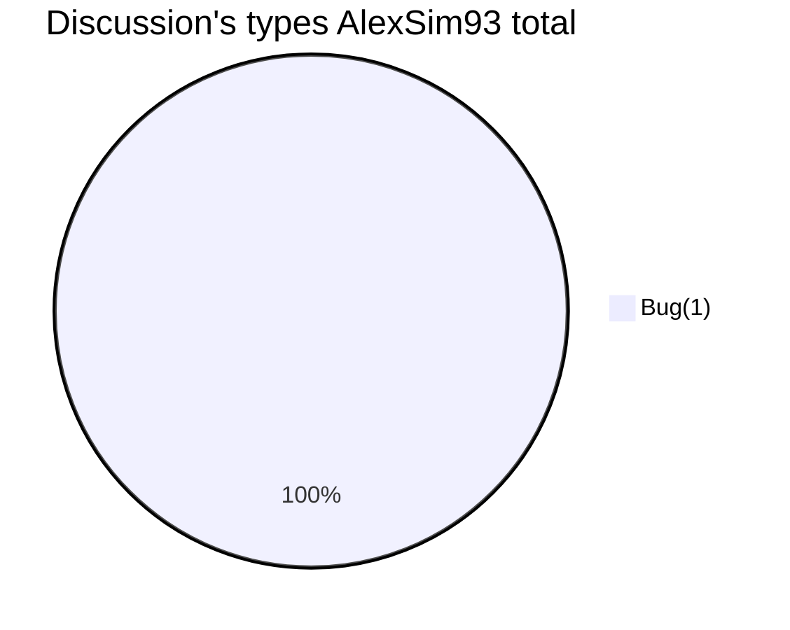
```mermaid
pie
title Discussion's types AlexSim93 total
"Bug(1)":1
```

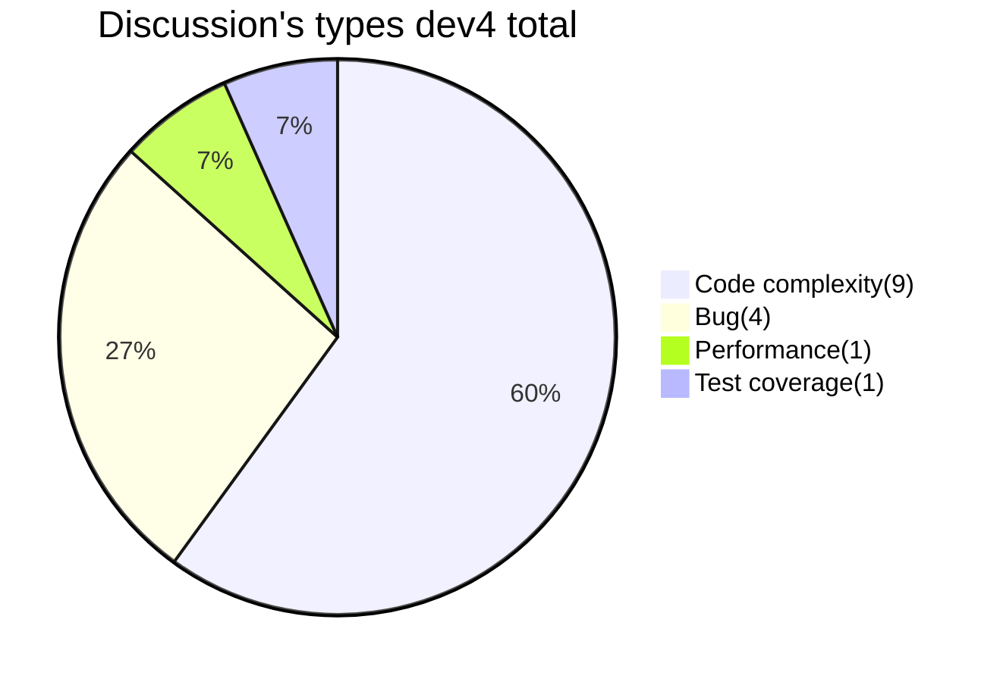
```mermaid
pie
title Discussion's types dev4 total
"Code complexity(9)":9
"Bug(4)":4
"Performance(1)":1
"Test coverage(1)":1
```

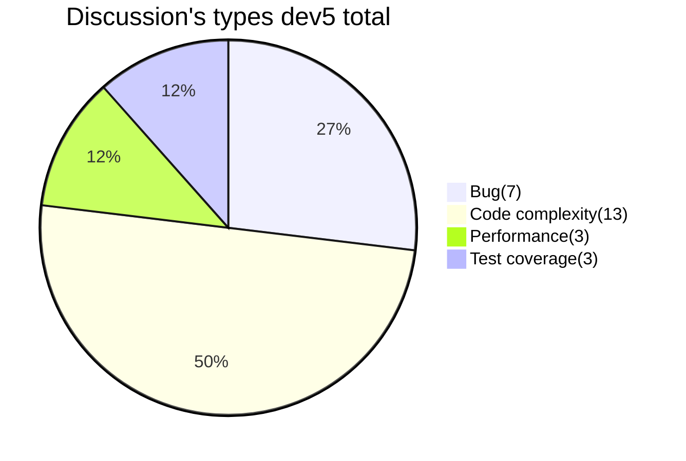
```mermaid
pie
title Discussion's types dev5 total
"Bug(7)":7
"Code complexity(13)":13
"Performance(3)":3
"Test coverage(3)":3
```

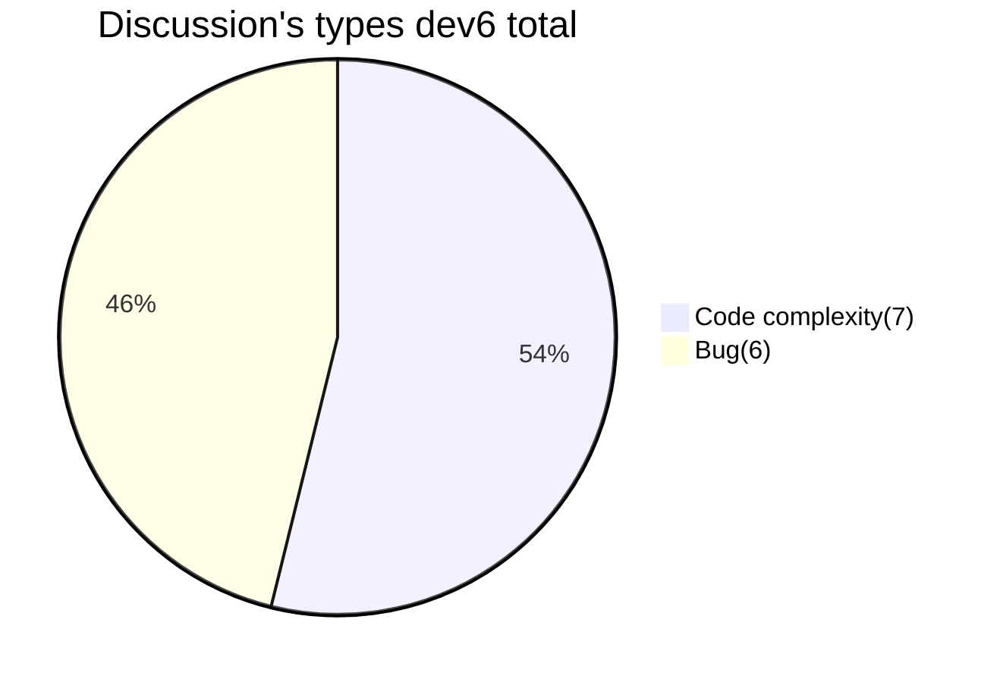
```mermaid
pie
title Discussion's types dev6 total
"Code complexity(7)":7
"Bug(6)":6
```

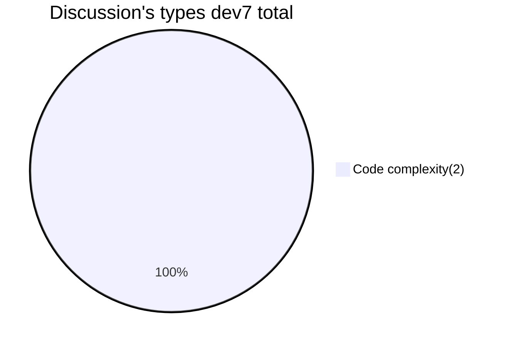
```mermaid
pie
title Discussion's types dev7 total
"Code complexity(2)":2
```

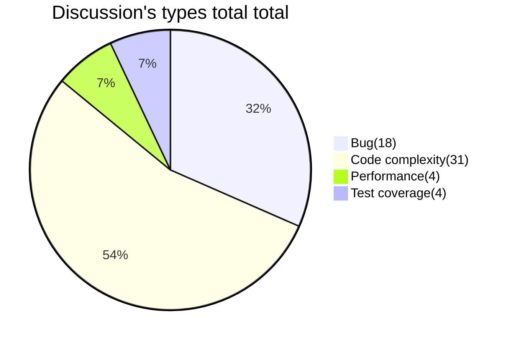
```mermaid
pie
title Discussion's types total total
"Bug(18)":18
"Code complexity(31)":31
"Performance(4)":4
"Test coverage(4)":4
```
