## Pull Request report
  This report based on 200 last updated PRs. To learn more about the project and its configuration, please visit [Pull request analytics action](https://github.com/AlexSim93/pull-request-analytics-action).
  
Below are the settings applied for this report:
```
GITHUB_OWNERS_REPOS: AlexSim93/example-repo
GITHUB_OWNER_FOR_ISSUE: AlexSim93
GITHUB_REPO_FOR_ISSUE: lang-card
SHOW_STATS_TYPES: timeline, workload, pr-quality, code-review-engagement, response-time
REVIEW_TIME_INTERVALS: 2,4,8,12,16,24
TOP_LIST_AMOUNT: 0
AGGREGATE_VALUE_METHODS: percentile
SHOW_CORRELATION_GRAPHS: true
SHOW_ACTIVITY_TIME_GRAPHS: true
PERCENTILE: 75
SHOW_USERS: dev1, dev2, dev3, dev4, dev5, total
TIMEZONE: Europe/Berlin
CORE_HOURS_START: 09:00
CORE_HOURS_END: 19:00
AMOUNT: 150
PERIOD_SPLIT_UNIT: months
USE_CHARTS: false
EXECUTION_OUTCOME: markdown
```
    
  
    
    
  

### Pull requests timeline(75th percentile) 12/2024
**Time to review** - time from PR creation to first review. 
**Time to approve** - time from PR creation to first approval without requested changes. 
**Time to merge** - time from PR creation to merge.
| user | Time in draft | Time to review request | Time to review | Time to Review After Re-request | Time to approve | Time to merge | Total merged PRs |
| :------: | :------: | :------: | :------: | :------: | :------: | :------: | :------: |
| **dev1** | 6 minutes | 6 minutes | 40 minutes |  | 3 hours 27 minutes | 8 hours 21 minutes | 15 |
| **dev2** | 6 minutes | 7 minutes | 4 hours 43 minutes |  | 8 hours 7 minutes | 14 hours 50 minutes | 23 |
| **dev3** | 6 minutes | 6 minutes | 2 hours 26 minutes |  | 8 hours 48 minutes | 21 hours 7 minutes | 10 |
| **dev4** | 27 minutes | 27 minutes | 3 hours 29 minutes | 3 hours 25 minutes | 8 hours 3 minutes | 56 hours 9 minutes | 17 |
| **dev5** | 15 minutes | 9 minutes | 1 hour 8 minutes | 5 hours 29 minutes | 12 hours 2 minutes | 36 hours 31 minutes | 17 |
| **total** | 9 minutes | 7 minutes | 2 hours 21 minutes | 4 hours 21 minutes | 8 hours 43 minutes | 22 hours 53 minutes | 83 |      
    

  
### Review time 12/2024

| users | 0-2h | 2-4h | 4-8h | 8-12h | 12-16h | 16-24h | 24+h |
| :------: | :------: | :------: | :------: | :------: | :------: | :------: | :------: |
| **dev1** | 12(80%) | 1(6.7%) | 0 | 1(6.7%) | 0 | 0 | 1(6.7%) |
| **dev2** | 16(69.6%) | 0 | 4(17.4%) | 3(13%) | 0 | 0 | 0 |
| **dev3** | 6(60%) | 2(20%) | 2(20%) | 0 | 0 | 0 | 0 |
| **dev4** | 12(70.6%) | 0 | 4(23.5%) | 0 | 0 | 1(5.9%) | 0 |
| **dev5** | 13(76.5%) | 2(11.8%) | 1(5.9%) | 1(5.9%) | 0 | 0 | 0 |
| **total** | 60(72.3%) | 5(6%) | 11(13.3%) | 5(6%) | 0 | 1(1.2%) | 1(1.2%) |      
    
  
  
  
  

### Contribution stats 12/2024
**Reviews conducted** - number of reviews conducted. 1 PR may have only single review.
**PR Size** - determined using the formula: `additions + deletions * 0.2`. Based on this calculation: 0-50: xs, 51-200: s, 201-400: m, 401-700: l, 701+: xl
**Total reverted PRs** - The number of reverted PRs based on the branch name pattern `/^revert-d+/`. This pattern is used for reverts made via GitHub.
| user | Total opened PRs | Total merged PRs | Total reverted PRs | PRs w/o review | PRs w/o approval | Additions / Deletions | PR size: xs/s/m/l/xl |
| :------: | :------: | :------: | :------: | :------: | :------: | :------: | :------: |
| **dev1** | 15 | 15 | 0 | 1 | 1 | +9316/-8217 | 11/2/0/1/1 |
| **dev2** | 24 | 23 | 2 | 3 | 3 | +1358/-1442 | 19/2/1/2/0 |
| **dev3** | 10 | 10 | 0 | 0 | 0 | +917/-217 | 5/3/2/0/0 |
| **dev4** | 17 | 17 | 0 | 0 | 0 | +1591/-743 | 10/3/3/1/0 |
| **dev5** | 17 | 17 | 1 | 4 | 3 | +3870/-1330 | 5/5/4/2/1 |
| **total** | 84 | 83 | 3 | 8 | 7 | +17057/-11954 | 51/15/10/6/2 |      
    


### Pull request quality 12/2024
**Agreed** - discussions with at least 1 reaction :+1:.
**Disagreed** - discussions with at least 1 reaction :-1:.
| user | Total merged PRs | Changes requested received | Agreed / Disagreed / Total discussions received | Comments received |
| :------: | :------: | :------: | :------: | :------: |
| **dev1** | 15 | 2 | 2 / 2 / 12 | 18 |
| **dev2** | 23 | 2 | 3 / 6 / 20 | 24 |
| **dev3** | 10 | 4 | 6 / 0 / 30 | 48 |
| **dev4** | 17 | 5 | 9 / 4 / 68 | 82 |
| **dev5** | 17 | 4 | 9 / 3 / 51 | 63 |
| **total** | 83 | 17 | 29 / 15 / 181 | 235 |      
    

### Discussion's types 12/2024

| users | imports between modules | browser support | Error handling | locale value getter | array performance | misprint | redux selectors |
| :------: | :------: | :------: | :------: | :------: | :------: | :------: | :------: |
| **dev1** | 1(33.3%) | 1(33.3%) | 1(33.3%) | 0 | 0 | 0 | 0 |
| **dev4** | 7(41.2%) | 4(23.5%) | 2(11.8%) | 2(11.8%) | 2(11.8%) | 0 | 0 |
| **dev5** | 1(11.1%) | 2(22.2%) | 3(33.3%) | 0 | 0 | 2(22.2%) | 1(11.1%) |
| **total** | 9(31%) | 7(24.1%) | 6(20.7%) | 2(6.9%) | 2(6.9%) | 2(6.9%) | 1(3.4%) |      
    


### Code review engagement 12/2024
**PR Size** - determined using the formula: `additions + deletions * 0.2`. Based on this calculation: 0-50: xs, 51-200: s, 201-400: m, 401-700: l, 701+: xl
**Changes requested / Comments / Approvals** - number of reviews conducted by user. For a single pull request, only one review of each status will be counted for a user.
**Agreed** - discussions with at least 1 reaction :+1:.
**Disagreed** - discussions with at least 1 reaction :-1:.
| user | Reviews conducted | Agreed / Disagreed / Total discussions conducted | Comments conducted | PR size: xs/s/m/l/xl | Changes requested / Commented / Approved |
| :------: | :------: | :------: | :------: | :------: | :------: |
| **dev1** | 25 | 0 / 0 / 46 | 64 | 8/6/7/3/1 | 8 / 10 / 24 |
| **dev2** | 28 | 0 / 0 / 11 | 12 | 16/6/5/1/0 | 8 / 0 / 28 |
| **dev3** | 8 | 0 / 0 / 1 | 1 | 6/1/0/0/1 | 0 / 1 / 8 |
| **dev4** | 20 | 0 / 0 / 2 | 2 | 16/2/1/1/0 | 1 / 0 / 20 |
| **dev5** | 8 | 0 / 0 / 4 | 5 | 6/1/1/0/0 | 2 / 0 / 8 |
| **total** | 83 | 29 / 15 / 181 | 235 | 51/15/10/6/2 | 17 / 39 / 83 |      
    

### Review Response Time(75th percentile) 12/2024
**Time from re-request to response** - time from a review re-request to the response. Multiple re-requests and responses can occur in a single pull request
| user | Review requests conducted | Reviews conducted | Time from opening to response | Time from initial request to response | Time from re-request to response |
| :------: | :------: | :------: | :------: | :------: | :------: |
| **dev1** | 67 | 25 | 6 hours 39 minutes | 7 hours 39 minutes | 5 hours 18 minutes |
| **dev2** | 58 | 28 | 6 hours 3 minutes | 5 hours 55 minutes | 2 hours 56 minutes |
| **dev3** | 73 | 8 | 4 hours | 4 hours |  |
| **dev4** | 63 | 20 | 7 hours 13 minutes | 6 hours 57 minutes |  |
| **dev5** | 66 | 8 | 3 hours 51 minutes | 3 hours 46 minutes |  |
| **total** | 334 | 83 | 6 hours 3 minutes | 6 hours 8 minutes | 4 hours 33 minutes |      
    
    

    
  

### Pull requests timeline(75th percentile) 11/2024
**Time to review** - time from PR creation to first review. 
**Time to approve** - time from PR creation to first approval without requested changes. 
**Time to merge** - time from PR creation to merge.
| user | Time in draft | Time to review request | Time to review | Time to Review After Re-request | Time to approve | Time to merge | Total merged PRs |
| :------: | :------: | :------: | :------: | :------: | :------: | :------: | :------: |
| **dev1** | 4 minutes | 4 minutes | 1 hour 40 minutes |  | 1 hour 42 minutes | 10 hours 1 minute | 4 |
| **dev2** | 45 minutes | 45 minutes | 1 hour 16 minutes | 4 hours 50 minutes | 6 hours 1 minute | 15 hours 53 minutes | 17 |
| **dev3** | 26 minutes | 24 minutes | 1 hour 51 minutes |  | 9 hours 33 minutes | 23 hours 16 minutes | 13 |
| **dev4** | 10 minutes | 12 minutes | 1 hour 9 minutes | 57 minutes | 1 hour 9 minutes | 9 hours 17 minutes | 13 |
| **dev5** | 7 minutes | 7 minutes | 4 hours 5 minutes | 3 hours 37 minutes | 13 hours 8 minutes | 27 hours 53 minutes | 15 |
| **total** | 15 minutes | 15 minutes | 1 hour 59 minutes | 3 hours 37 minutes | 7 hours 50 minutes | 23 hours 48 minutes | 62 |      
    

  
### Review time 11/2024

| users | 0-2h | 2-4h | 4-8h | 8-12h | 12-16h | 16-24h | 24+h |
| :------: | :------: | :------: | :------: | :------: | :------: | :------: | :------: |
| **dev1** | 3(75%) | 1(25%) | 0 | 0 | 0 | 0 | 0 |
| **dev2** | 13(76.5%) | 0 | 1(5.9%) | 1(5.9%) | 1(5.9%) | 0 | 1(5.9%) |
| **dev3** | 10(76.9%) | 1(7.7%) | 1(7.7%) | 1(7.7%) | 0 | 0 | 0 |
| **dev4** | 10(76.9%) | 1(7.7%) | 1(7.7%) | 1(7.7%) | 0 | 0 | 0 |
| **dev5** | 10(66.7%) | 1(6.7%) | 3(20%) | 1(6.7%) | 0 | 0 | 0 |
| **total** | 46(74.2%) | 4(6.5%) | 6(9.7%) | 4(6.5%) | 1(1.6%) | 0 | 1(1.6%) |      
    
  
  
  
  

### Contribution stats 11/2024
**Reviews conducted** - number of reviews conducted. 1 PR may have only single review.
**PR Size** - determined using the formula: `additions + deletions * 0.2`. Based on this calculation: 0-50: xs, 51-200: s, 201-400: m, 401-700: l, 701+: xl
**Total reverted PRs** - The number of reverted PRs based on the branch name pattern `/^revert-d+/`. This pattern is used for reverts made via GitHub.
| user | Total opened PRs | Total merged PRs | Total reverted PRs | PRs w/o review | PRs w/o approval | Additions / Deletions | PR size: xs/s/m/l/xl |
| :------: | :------: | :------: | :------: | :------: | :------: | :------: | :------: |
| **dev1** | 4 | 4 | 0 | 1 | 0 | +415/-89 | 1/3/0/0/0 |
| **dev2** | 17 | 17 | 0 | 0 | 0 | +3253/-2378 | 7/4/3/2/1 |
| **dev3** | 13 | 13 | 0 | 0 | 0 | +1713/-1742 | 4/6/1/2/0 |
| **dev4** | 14 | 13 | 0 | 1 | 1 | +1116/-1032 | 10/2/1/0/1 |
| **dev5** | 15 | 15 | 0 | 0 | 0 | +1048/-341 | 9/3/3/0/0 |
| **total** | 63 | 62 | 0 | 2 | 1 | +7545/-5582 | 31/18/8/4/2 |      
    


### Pull request quality 11/2024
**Agreed** - discussions with at least 1 reaction :+1:.
**Disagreed** - discussions with at least 1 reaction :-1:.
| user | Total merged PRs | Changes requested received | Agreed / Disagreed / Total discussions received | Comments received |
| :------: | :------: | :------: | :------: | :------: |
| **dev1** | 4 | 1 | 0 / 0 / 4 | 8 |
| **dev2** | 17 | 7 | 0 / 0 / 23 | 36 |
| **dev3** | 13 | 5 | 0 / 0 / 19 | 24 |
| **dev4** | 13 | 1 | 0 / 0 / 7 | 9 |
| **dev5** | 15 | 6 | 0 / 0 / 14 | 23 |
| **total** | 62 | 20 | 0 / 0 / 67 | 100 |      
    


### Code review engagement 11/2024
**PR Size** - determined using the formula: `additions + deletions * 0.2`. Based on this calculation: 0-50: xs, 51-200: s, 201-400: m, 401-700: l, 701+: xl
**Changes requested / Comments / Approvals** - number of reviews conducted by user. For a single pull request, only one review of each status will be counted for a user.
**Agreed** - discussions with at least 1 reaction :+1:.
**Disagreed** - discussions with at least 1 reaction :-1:.
| user | Reviews conducted | Agreed / Disagreed / Total discussions conducted | Comments conducted | PR size: xs/s/m/l/xl | Changes requested / Commented / Approved |
| :------: | :------: | :------: | :------: | :------: | :------: |
| **dev1** | 19 | 0 / 0 / 39 | 64 | 6/7/3/3/0 | 12 / 3 / 18 |
| **dev2** | 19 | 0 / 0 / 12 | 17 | 11/5/2/0/1 | 5 / 1 / 19 |
| **dev3** | 12 | 0 / 0 / 2 | 3 | 9/2/1/0/0 | 0 / 1 / 12 |
| **dev4** | 18 | 0 / 0 / 11 | 13 | 8/6/2/1/1 | 4 / 0 / 18 |
| **dev5** | 2 | 0 / 0 / 0 | 0 | 2/0/0/0/0 | 0 / 0 / 2 |
| **total** | 62 | 0 / 0 / 67 | 100 | 31/18/8/4/2 | 20 / 9 / 62 |      
    

### Review Response Time(75th percentile) 11/2024
**Time from re-request to response** - time from a review re-request to the response. Multiple re-requests and responses can occur in a single pull request
| user | Review requests conducted | Reviews conducted | Time from opening to response | Time from initial request to response | Time from re-request to response |
| :------: | :------: | :------: | :------: | :------: | :------: |
| **dev1** | 58 | 19 | 2 hours 26 minutes | 1 hour 29 minutes | 3 hours 46 minutes |
| **dev2** | 45 | 19 | 3 hours 29 minutes | 3 hours 25 minutes | 3 hours 7 minutes |
| **dev3** | 49 | 12 | 1 hour 40 minutes | 1 hour 36 minutes |  |
| **dev4** | 49 | 18 | 1 hour 6 minutes | 44 minutes |  |
| **dev5** | 47 | 2 | 1 hour 25 minutes | 1 hour 20 minutes |  |
| **total** | 253 | 62 | 3 hours 13 minutes | 1 hour 49 minutes | 6 hours 55 minutes |      
    
    

    
  

### Pull requests timeline(75th percentile) 10/2024
**Time to review** - time from PR creation to first review. 
**Time to approve** - time from PR creation to first approval without requested changes. 
**Time to merge** - time from PR creation to merge.
| user | Time in draft | Time to review request | Time to review | Time to Review After Re-request | Time to approve | Time to merge | Total merged PRs |
| :------: | :------: | :------: | :------: | :------: | :------: | :------: | :------: |
| **dev1** | 7 minutes | 7 minutes | 4 hours 15 minutes |  | 4 hours 15 minutes | 16 hours 11 minutes | 9 |
| **dev2** | 11 minutes | 11 minutes | 5 hours 31 minutes |  | 6 hours 54 minutes | 11 hours 52 minutes | 14 |
| **dev3** | 26 minutes | 26 minutes | 5 hours 31 minutes |  | 14 hours 44 minutes | 22 hours 40 minutes | 9 |
| **dev4** | 6 minutes | 6 minutes | 2 hours 8 minutes |  | 2 hours 8 minutes | 17 hours 36 minutes | 4 |
| **dev5** | 6 minutes | 6 minutes | 5 hours 55 minutes | 10 hours 12 minutes | 11 hours 8 minutes | 44 hours 47 minutes | 11 |
| **total** | 8 minutes | 8 minutes | 5 hours 21 minutes | 9 hours 22 minutes | 8 hours 29 minutes | 22 hours 18 minutes | 48 |      
    

  
### Review time 10/2024

| users | 0-2h | 2-4h | 4-8h | 8-12h | 12-16h | 16-24h | 24+h |
| :------: | :------: | :------: | :------: | :------: | :------: | :------: | :------: |
| **dev1** | 3(33.3%) | 3(33.3%) | 3(33.3%) | 0 | 0 | 0 | 0 |
| **dev2** | 9(64.3%) | 1(7.1%) | 2(14.3%) | 1(7.1%) | 0 | 0 | 1(7.1%) |
| **dev3** | 1(11.1%) | 2(22.2%) | 4(44.4%) | 1(11.1%) | 0 | 1(11.1%) | 0 |
| **dev4** | 2(50%) | 1(25%) | 1(25%) | 0 | 0 | 0 | 0 |
| **dev5** | 5(38.5%) | 3(23.1%) | 3(23.1%) | 2(15.4%) | 0 | 0 | 0 |
| **total** | 21(42%) | 10(20%) | 13(26%) | 4(8%) | 0 | 1(2%) | 1(2%) |      
    
  
  
  
  

### Contribution stats 10/2024
**Reviews conducted** - number of reviews conducted. 1 PR may have only single review.
**PR Size** - determined using the formula: `additions + deletions * 0.2`. Based on this calculation: 0-50: xs, 51-200: s, 201-400: m, 401-700: l, 701+: xl
**Total reverted PRs** - The number of reverted PRs based on the branch name pattern `/^revert-d+/`. This pattern is used for reverts made via GitHub.
| user | Total opened PRs | Total merged PRs | Total reverted PRs | PRs w/o review | PRs w/o approval | Additions / Deletions | PR size: xs/s/m/l/xl |
| :------: | :------: | :------: | :------: | :------: | :------: | :------: | :------: |
| **dev1** | 9 | 9 | 0 | 0 | 0 | +424/-499 | 7/0/2/0/0 |
| **dev2** | 14 | 14 | 0 | 1 | 1 | +952/-531 | 8/3/3/0/0 |
| **dev3** | 9 | 9 | 0 | 0 | 0 | +489/-1576 | 4/3/2/0/0 |
| **dev4** | 4 | 4 | 0 | 0 | 0 | +181/-226 | 3/1/0/0/0 |
| **dev5** | 14 | 11 | 0 | 1 | 2 | +1502/-314 | 8/3/1/2/0 |
| **total** | 51 | 48 | 0 | 2 | 3 | +3581/-3155 | 31/10/8/2/0 |      
    


### Pull request quality 10/2024
**Agreed** - discussions with at least 1 reaction :+1:.
**Disagreed** - discussions with at least 1 reaction :-1:.
| user | Total merged PRs | Changes requested received | Agreed / Disagreed / Total discussions received | Comments received |
| :------: | :------: | :------: | :------: | :------: |
| **dev1** | 9 | 2 | 0 / 0 / 2 | 2 |
| **dev2** | 14 | 4 | 0 / 0 / 9 | 15 |
| **dev3** | 9 | 5 | 0 / 0 / 20 | 23 |
| **dev4** | 4 | 1 | 0 / 0 / 0 | 1 |
| **dev5** | 11 | 4 | 0 / 0 / 10 | 13 |
| **total** | 48 | 16 | 0 / 0 / 41 | 54 |      
    


### Code review engagement 10/2024
**PR Size** - determined using the formula: `additions + deletions * 0.2`. Based on this calculation: 0-50: xs, 51-200: s, 201-400: m, 401-700: l, 701+: xl
**Changes requested / Comments / Approvals** - number of reviews conducted by user. For a single pull request, only one review of each status will be counted for a user.
**Agreed** - discussions with at least 1 reaction :+1:.
**Disagreed** - discussions with at least 1 reaction :-1:.
| user | Reviews conducted | Agreed / Disagreed / Total discussions conducted | Comments conducted | PR size: xs/s/m/l/xl | Changes requested / Commented / Approved |
| :------: | :------: | :------: | :------: | :------: | :------: |
| **dev1** | 20 | 0 / 0 / 24 | 33 | 12/5/3/0/0 | 9 / 5 / 18 |
| **dev2** | 13 | 0 / 0 / 7 | 10 | 7/4/2/0/0 | 5 / 2 / 13 |
| **dev3** | 8 | 0 / 0 / 1 | 1 | 6/1/1/0/0 | 0 / 1 / 7 |
| **dev4** | 11 | 0 / 0 / 6 | 7 | 6/2/2/1/0 | 3 / 0 / 11 |
| **dev5** | 4 | 0 / 0 / 3 | 3 | 3/0/1/0/0 | 0 / 1 / 3 |
| **total** | 50 | 0 / 0 / 41 | 54 | 31/10/8/2/0 | 16 / 9 / 49 |      
    

### Review Response Time(75th percentile) 10/2024
**Time from re-request to response** - time from a review re-request to the response. Multiple re-requests and responses can occur in a single pull request
| user | Review requests conducted | Reviews conducted | Time from opening to response | Time from initial request to response | Time from re-request to response |
| :------: | :------: | :------: | :------: | :------: | :------: |
| **dev1** | 41 | 20 | 5 hours 21 minutes | 4 hours 27 minutes | 7 hours 26 minutes |
| **dev2** | 35 | 13 | 3 hours 41 minutes | 2 hours 8 minutes | 2 hours 16 minutes |
| **dev3** | 41 | 8 | 5 hours 51 minutes | 6 hours |  |
| **dev4** | 46 | 11 | 48 minutes | 29 minutes |  |
| **dev5** | 36 | 4 | 5 hours 35 minutes | 6 hours 21 minutes |  |
| **total** | 199 | 50 | 5 hours 21 minutes | 5 hours 8 minutes | 9 hours 22 minutes |      
    
    


    
  

### Pull requests timeline(75th percentile) total
**Time to review** - time from PR creation to first review. 
**Time to approve** - time from PR creation to first approval without requested changes. 
**Time to merge** - time from PR creation to merge.
| user | Time in draft | Time to review request | Time to review | Time to Review After Re-request | Time to approve | Time to merge | Total merged PRs |
| :------: | :------: | :------: | :------: | :------: | :------: | :------: | :------: |
| **dev1** | 6 minutes | 6 minutes | 2 hours 37 minutes |  | 3 hours 44 minutes | 10 hours 1 minute | 28 |
| **dev2** | 12 minutes | 13 minutes | 5 hours 26 minutes | 7 hours 10 minutes | 7 hours 38 minutes | 15 hours 20 minutes | 54 |
| **dev3** | 26 minutes | 26 minutes | 4 hours 17 minutes |  | 10 hours 22 minutes | 23 hours 15 minutes | 32 |
| **dev4** | 11 minutes | 12 minutes | 2 hours 5 minutes | 2 hours 53 minutes | 4 hours 56 minutes | 22 hours 27 minutes | 34 |
| **dev5** | 8 minutes | 7 minutes | 3 hours 26 minutes | 7 hours 13 minutes | 13 hours 4 minutes | 37 hours 53 minutes | 43 |
| **total** | 10 minutes | 10 minutes | 3 hours 48 minutes | 6 hours 21 minutes | 8 hours 33 minutes | 23 hours 11 minutes | 193 |      
    

  
### Review time total

| users | 0-2h | 2-4h | 4-8h | 8-12h | 12-16h | 16-24h | 24+h |
| :------: | :------: | :------: | :------: | :------: | :------: | :------: | :------: |
| **dev1** | 18(64.3%) | 5(17.9%) | 3(10.7%) | 1(3.6%) | 0 | 0 | 1(3.6%) |
| **dev2** | 38(70.4%) | 1(1.9%) | 7(13%) | 5(9.3%) | 1(1.9%) | 0 | 2(3.7%) |
| **dev3** | 17(53.1%) | 5(15.6%) | 7(21.9%) | 2(6.3%) | 0 | 1(3.1%) | 0 |
| **dev4** | 24(70.6%) | 2(5.9%) | 6(17.6%) | 1(2.9%) | 0 | 1(2.9%) | 0 |
| **dev5** | 28(62.2%) | 6(13.3%) | 7(15.6%) | 4(8.9%) | 0 | 0 | 0 |
| **total** | 127(65.1%) | 19(9.7%) | 30(15.4%) | 13(6.7%) | 1(0.5%) | 2(1%) | 3(1.5%) |      
    
  
  
  
  

### Contribution stats total
**Reviews conducted** - number of reviews conducted. 1 PR may have only single review.
**PR Size** - determined using the formula: `additions + deletions * 0.2`. Based on this calculation: 0-50: xs, 51-200: s, 201-400: m, 401-700: l, 701+: xl
**Total reverted PRs** - The number of reverted PRs based on the branch name pattern `/^revert-d+/`. This pattern is used for reverts made via GitHub.
| user | Total opened PRs | Total merged PRs | Total reverted PRs | PRs w/o review | PRs w/o approval | Additions / Deletions | PR size: xs/s/m/l/xl |
| :------: | :------: | :------: | :------: | :------: | :------: | :------: | :------: |
| **dev1** | 28 | 28 | 0 | 2 | 1 | +10155/-8805 | 19/5/2/1/1 |
| **dev2** | 55 | 54 | 2 | 4 | 4 | +5563/-4351 | 34/9/7/4/1 |
| **dev3** | 32 | 32 | 0 | 0 | 0 | +3119/-3535 | 13/12/5/2/0 |
| **dev4** | 35 | 34 | 0 | 1 | 1 | +2888/-2001 | 23/6/4/1/1 |
| **dev5** | 46 | 43 | 1 | 5 | 5 | +6420/-1985 | 22/11/8/4/1 |
| **total** | 200 | 193 | 3 | 14 | 13 | +28185/-20708 | 115/43/26/12/4 |      
    


### Pull request quality total
**Agreed** - discussions with at least 1 reaction :+1:.
**Disagreed** - discussions with at least 1 reaction :-1:.
| user | Total merged PRs | Changes requested received | Agreed / Disagreed / Total discussions received | Comments received |
| :------: | :------: | :------: | :------: | :------: |
| **dev1** | 28 | 5 | 2 / 2 / 18 | 28 |
| **dev2** | 54 | 13 | 3 / 6 / 52 | 75 |
| **dev3** | 32 | 14 | 6 / 0 / 69 | 95 |
| **dev4** | 34 | 7 | 9 / 4 / 75 | 92 |
| **dev5** | 43 | 14 | 9 / 3 / 75 | 99 |
| **total** | 193 | 53 | 29 / 15 / 289 | 389 |      
    

### Discussion's types total

| users | imports between modules | browser support | Error handling | locale value getter | array performance | misprint | redux selectors |
| :------: | :------: | :------: | :------: | :------: | :------: | :------: | :------: |
| **dev1** | 1(33.3%) | 1(33.3%) | 1(33.3%) | 0 | 0 | 0 | 0 |
| **dev4** | 7(41.2%) | 4(23.5%) | 2(11.8%) | 2(11.8%) | 2(11.8%) | 0 | 0 |
| **dev5** | 1(11.1%) | 2(22.2%) | 3(33.3%) | 0 | 0 | 2(22.2%) | 1(11.1%) |
| **total** | 9(31%) | 7(24.1%) | 6(20.7%) | 2(6.9%) | 2(6.9%) | 2(6.9%) | 1(3.4%) |      
    


### Code review engagement total
**PR Size** - determined using the formula: `additions + deletions * 0.2`. Based on this calculation: 0-50: xs, 51-200: s, 201-400: m, 401-700: l, 701+: xl
**Changes requested / Comments / Approvals** - number of reviews conducted by user. For a single pull request, only one review of each status will be counted for a user.
**Agreed** - discussions with at least 1 reaction :+1:.
**Disagreed** - discussions with at least 1 reaction :-1:.
| user | Reviews conducted | Agreed / Disagreed / Total discussions conducted | Comments conducted | PR size: xs/s/m/l/xl | Changes requested / Commented / Approved |
| :------: | :------: | :------: | :------: | :------: | :------: |
| **dev1** | 64 | 0 / 0 / 109 | 161 | 26/18/13/6/1 | 29 / 18 / 60 |
| **dev2** | 60 | 0 / 0 / 30 | 39 | 34/15/9/1/1 | 18 / 3 / 60 |
| **dev3** | 28 | 0 / 0 / 4 | 5 | 21/4/2/0/1 | 0 / 3 / 27 |
| **dev4** | 49 | 0 / 0 / 19 | 22 | 30/10/5/3/1 | 8 / 0 / 49 |
| **dev5** | 14 | 0 / 0 / 7 | 8 | 11/1/2/0/0 | 2 / 1 / 13 |
| **total** | 195 | 29 / 15 / 289 | 389 | 115/43/26/12/4 | 53 / 57 / 194 |      
    

### Review Response Time(75th percentile) total
**Time from re-request to response** - time from a review re-request to the response. Multiple re-requests and responses can occur in a single pull request
| user | Review requests conducted | Reviews conducted | Time from opening to response | Time from initial request to response | Time from re-request to response |
| :------: | :------: | :------: | :------: | :------: | :------: |
| **dev1** | 168 | 64 | 5 hours 39 minutes | 4 hours 27 minutes | 6 hours 51 minutes |
| **dev2** | 139 | 60 | 4 hours 10 minutes | 4 hours 3 minutes | 3 hours 11 minutes |
| **dev3** | 164 | 28 | 4 hours 56 minutes | 4 hours 22 minutes |  |
| **dev4** | 159 | 49 | 2 hours 2 minutes | 1 hour 19 minutes | 10 hours 46 minutes |
| **dev5** | 150 | 14 | 4 hours 45 minutes | 4 hours 59 minutes |  |
| **total** | 792 | 195 | 5 hours 20 minutes | 4 hours 4 minutes | 6 hours 55 minutes |      
    
    
  
`#FFA500`Time From Initial Request To Response, `#EE82EE`Time From Opening To Response, `#0000CD`Time From Rerequest To Response, `#696969`Time In Draft, `#B22222`Time To Review Request, `#FFD700`Time To Review, `#40E0D0`Time To Review After Rerequest, `#7FFF00`Time To Approve, `#8A2BE2`Time To Merge
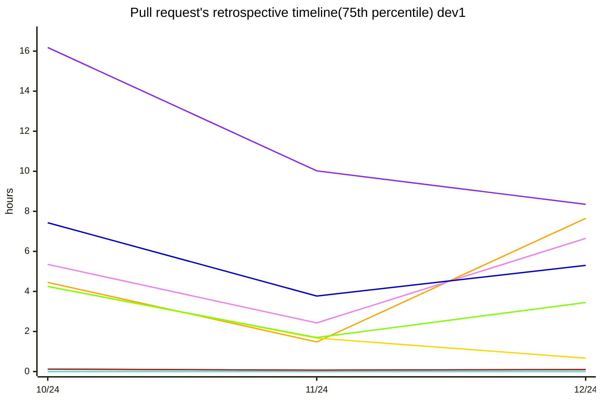

`#8A2BE2`Discussions Conducted, `#00008B`Discussions Received, `#DC143C`Changes Requested Conducted, `#B22222`Changes Requested Received, `#FFD700`Reviews Conducted, `#7FFF00`Merged PRs
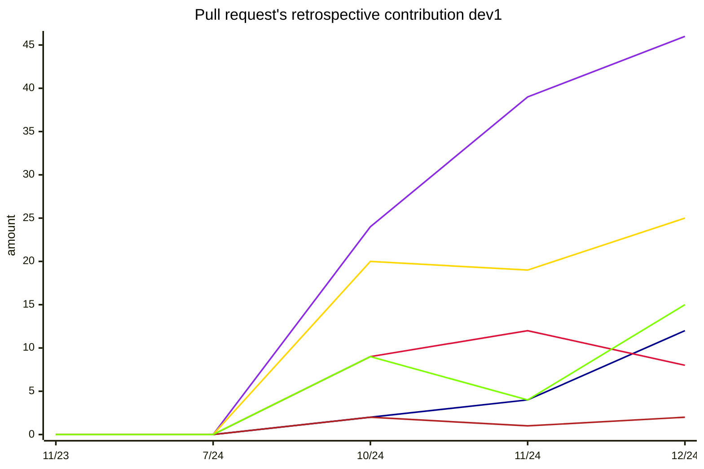

`#FFA500`Time From Initial Request To Response, `#EE82EE`Time From Opening To Response, `#0000CD`Time From Rerequest To Response, `#696969`Time In Draft, `#B22222`Time To Review Request, `#FFD700`Time To Review, `#40E0D0`Time To Review After Rerequest, `#7FFF00`Time To Approve, `#8A2BE2`Time To Merge
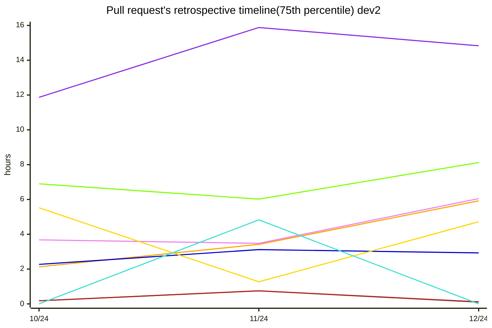

`#8A2BE2`Discussions Conducted, `#00008B`Discussions Received, `#DC143C`Changes Requested Conducted, `#B22222`Changes Requested Received, `#FFD700`Reviews Conducted, `#7FFF00`Merged PRs
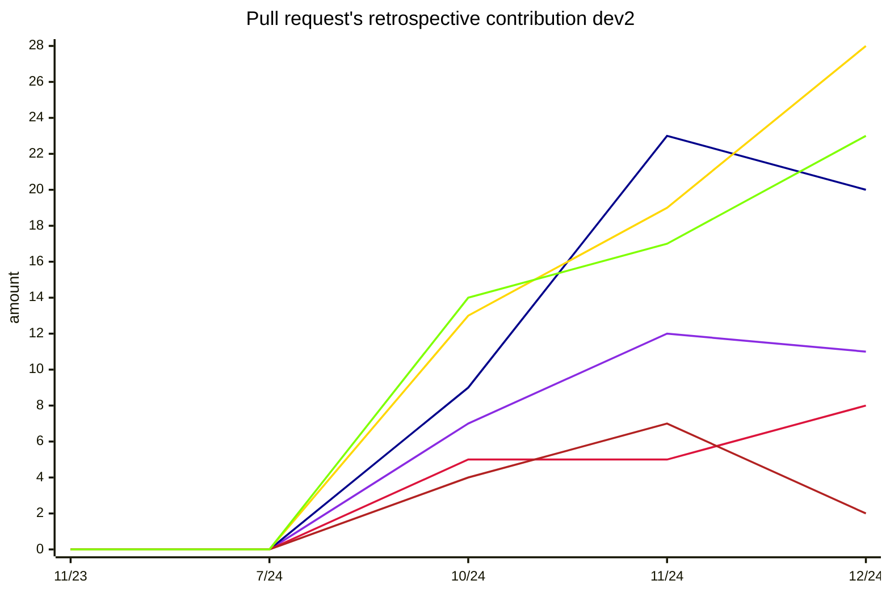

`#FFA500`Time From Initial Request To Response, `#EE82EE`Time From Opening To Response, `#0000CD`Time From Rerequest To Response, `#696969`Time In Draft, `#B22222`Time To Review Request, `#FFD700`Time To Review, `#40E0D0`Time To Review After Rerequest, `#7FFF00`Time To Approve, `#8A2BE2`Time To Merge
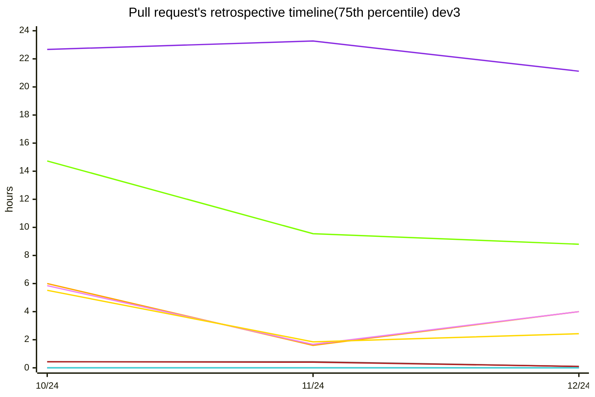

`#8A2BE2`Discussions Conducted, `#00008B`Discussions Received, `#DC143C`Changes Requested Conducted, `#B22222`Changes Requested Received, `#FFD700`Reviews Conducted, `#7FFF00`Merged PRs
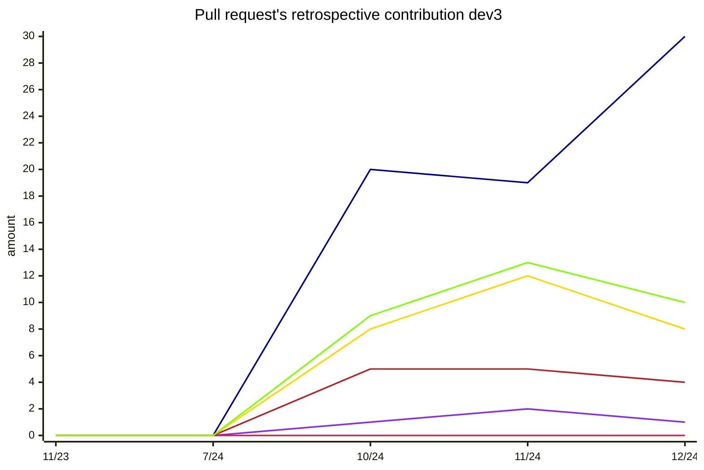

`#FFA500`Time From Initial Request To Response, `#EE82EE`Time From Opening To Response, `#0000CD`Time From Rerequest To Response, `#696969`Time In Draft, `#B22222`Time To Review Request, `#FFD700`Time To Review, `#40E0D0`Time To Review After Rerequest, `#7FFF00`Time To Approve, `#8A2BE2`Time To Merge
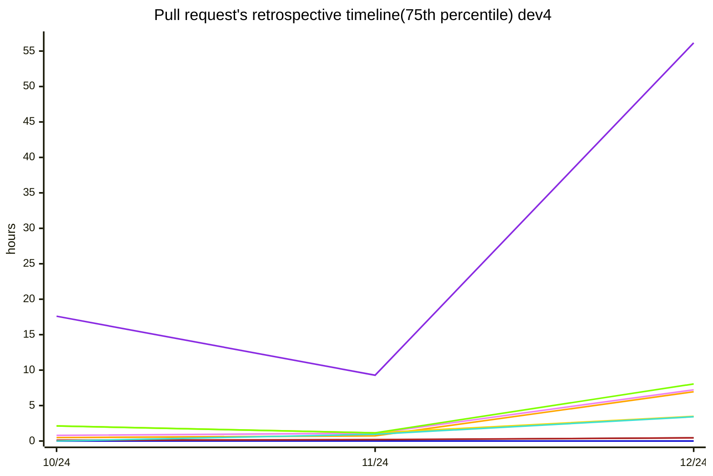

`#8A2BE2`Discussions Conducted, `#00008B`Discussions Received, `#DC143C`Changes Requested Conducted, `#B22222`Changes Requested Received, `#FFD700`Reviews Conducted, `#7FFF00`Merged PRs
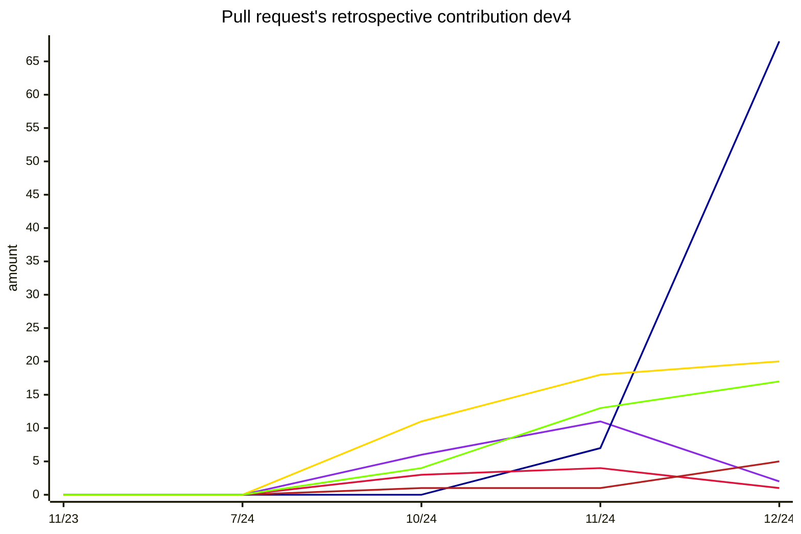

`#FFA500`Time From Initial Request To Response, `#EE82EE`Time From Opening To Response, `#0000CD`Time From Rerequest To Response, `#696969`Time In Draft, `#B22222`Time To Review Request, `#FFD700`Time To Review, `#40E0D0`Time To Review After Rerequest, `#7FFF00`Time To Approve, `#8A2BE2`Time To Merge
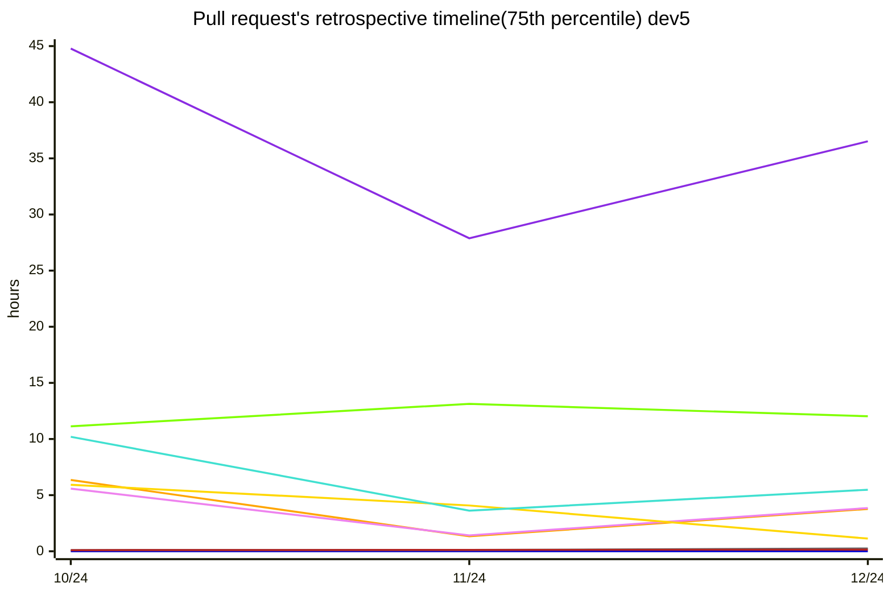

`#8A2BE2`Discussions Conducted, `#00008B`Discussions Received, `#DC143C`Changes Requested Conducted, `#B22222`Changes Requested Received, `#FFD700`Reviews Conducted, `#7FFF00`Merged PRs
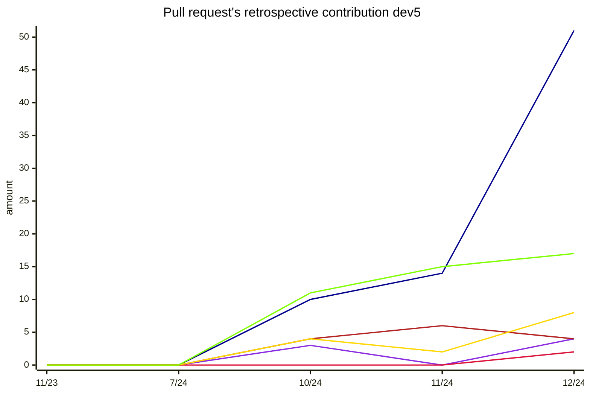

`#FFA500`Time From Initial Request To Response, `#EE82EE`Time From Opening To Response, `#0000CD`Time From Rerequest To Response, `#696969`Time In Draft, `#B22222`Time To Review Request, `#FFD700`Time To Review, `#40E0D0`Time To Review After Rerequest, `#7FFF00`Time To Approve, `#8A2BE2`Time To Merge
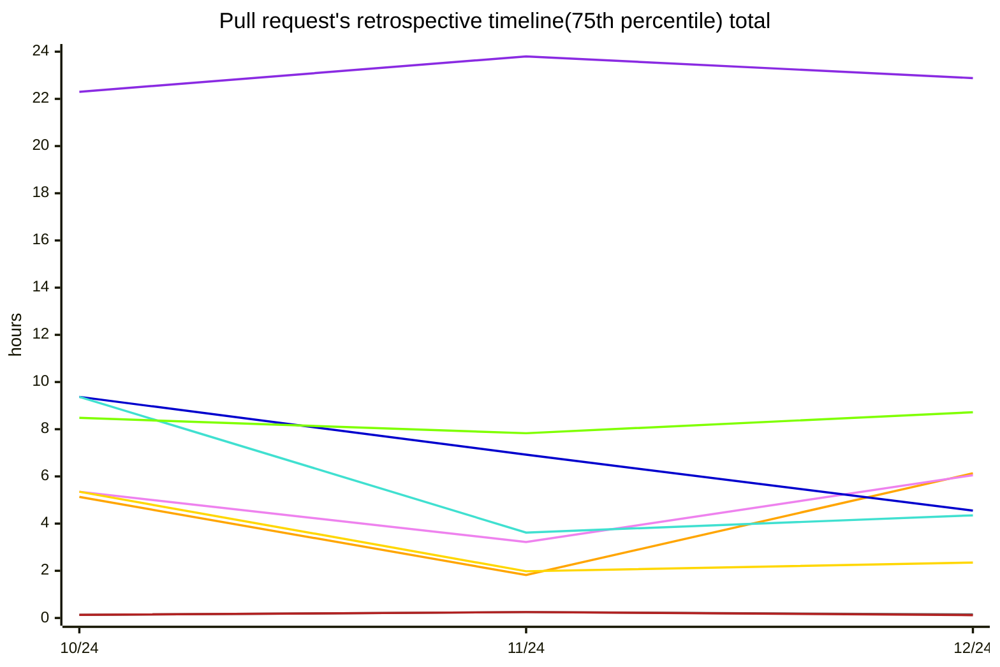

`#8A2BE2`Discussions Conducted, `#00008B`Discussions Received, `#DC143C`Changes Requested Conducted, `#B22222`Changes Requested Received, `#FFD700`Reviews Conducted, `#7FFF00`Merged PRs
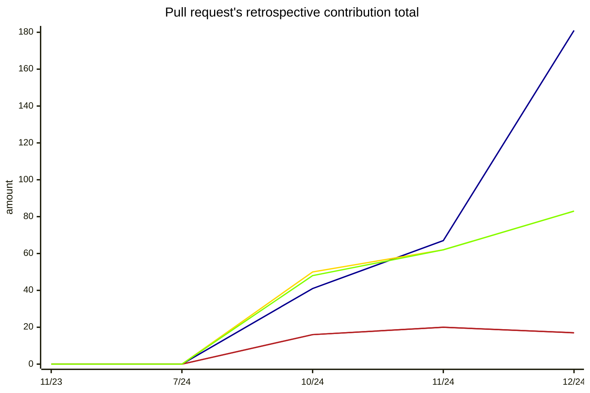