## Pull Request report
    
This report based on 50 last updated PRs. last updated PRs. To learn more about the project and its configuration, please visit [Pull request analytics action](https://github.com/AlexSim93/pull-request-analytics-action).
Below are the settings applied for this report:
```
GITHUB_OWNERS_REPOS: owner/repository
GITHUB_REPO_FOR_ISSUE: repository-to-create-issue
GITHUB_OWNER_FOR_ISSUE: owner-of-repository-to-create-issue
AMOUNT: 50
CORE_HOURS_START: 09:00
CORE_HOURS_END: 20:00
REPORT_DATE_START: 
REPORT_DATE_END: 
PERCENTILE: 75
LABELS: report
ASSIGNEES: AlexSim93
```
    
    
      
### Pull requests timeline(average) 12/2023
**Time to review** - time from PR creation to first review. 
**Time to approve** - time from PR creation to first approval without requested changes. 
**Time to merge** - time from PR creation to merge.
| user | Time to review | Time to approve | Time to merge | Total merged PRs |
| ------ | ------ | ------ | ------ | ------ |
| **AlexSim93** | 7 minutes | 7 minutes | 13 minutes | 1 |
| **total** | 7 minutes | 7 minutes | 13 minutes | 1 |      
    
      

    
      

      
```mermaid
gantt
title Pull requests timeline(average) 12/2023 / minutes
dateFormat X
axisFormat %s
section AlexSim93
                Time to review :  0, 7
Time to approve :  0, 7
Time to merge :  0, 13
        
section total
                Time to review :  0, 7
Time to approve :  0, 7
Time to merge :  0, 13
        
```

### Pull requests timeline(median) 12/2023
**Time to review** - time from PR creation to first review. 
**Time to approve** - time from PR creation to first approval without requested changes. 
**Time to merge** - time from PR creation to merge.
| user | Time to review | Time to approve | Time to merge | Total merged PRs |
| ------ | ------ | ------ | ------ | ------ |
| **AlexSim93** | 7 minutes | 7 minutes | 13 minutes | 1 |
| **total** | 7 minutes | 7 minutes | 13 minutes | 1 |      
    
      

    
      

      
### Pull requests timeline(percentile75) 12/2023
**Time to review** - time from PR creation to first review. 
**Time to approve** - time from PR creation to first approval without requested changes. 
**Time to merge** - time from PR creation to merge.
| user | Time to review | Time to approve | Time to merge | Total merged PRs |
| ------ | ------ | ------ | ------ | ------ |
| **AlexSim93** | 7 minutes | 7 minutes | 13 minutes | 1 |
| **total** | 7 minutes | 7 minutes | 13 minutes | 1 |      
    
      

    
      
    
### Pull requests stats 12/2023
**Reviews conducted** - number of Reviews conducted. 1 PR may have only single review.
| user | Total merged PRs | Additions/Deletions | Comments on PRs | Reviews conducted |
| ------ | ------ | ------ | ------ | ------ |
| **AlexSim93** | 1 | +2/-2 | 0 | 0 |
| **total** | 1 | +2/-2 | 0 | 0 |      
    
    

    
      
### Pull requests timeline(average) 11/2023
**Time to review** - time from PR creation to first review. 
**Time to approve** - time from PR creation to first approval without requested changes. 
**Time to merge** - time from PR creation to merge.
| user | Time to review | Time to approve | Time to merge | Total merged PRs |
| ------ | ------ | ------ | ------ | ------ |
| **AlexSim93** | 8 hours 13 minutes | 8 hours 19 minutes | 12 hours 47 minutes | 17 |
| **Developer1** | 1 hour 24 minutes | 10 hours 41 minutes | 16 hours 56 minutes | 7 |
| **Developer2** | 5 hours 48 minutes | 25 hours 21 minutes | 59 hours 26 minutes | 7 |
| **Developer3** | 2 hours 26 minutes | 4 hours 50 minutes | 30 hours 46 minutes | 8 |
| **Developer4** | 55 minutes | 5 hours 20 minutes | 20 hours 21 minutes | 8 |
| **total** | 4 hours 38 minutes | 9 hours 53 minutes | 23 hours 57 minutes | 47 |      
    
      

    
      

      
### Pull requests timeline(median) 11/2023
**Time to review** - time from PR creation to first review. 
**Time to approve** - time from PR creation to first approval without requested changes. 
**Time to merge** - time from PR creation to merge.
| user | Time to review | Time to approve | Time to merge | Total merged PRs |
| ------ | ------ | ------ | ------ | ------ |
| **AlexSim93** | 31 minutes | 34 minutes | 55 minutes | 17 |
| **Developer1** | 39 minutes | 7 hours 39 minutes | 15 hours 3 minutes | 7 |
| **Developer2** | 8 hours 59 minutes | 8 hours 59 minutes | 44 hours 27 minutes | 7 |
| **Developer3** | 3 hours 8 minutes | 3 hours 8 minutes | 38 hours 48 minutes | 8 |
| **Developer4** | 1 hour 7 minutes | 2 hours 37 minutes | 30 hours 26 minutes | 8 |
| **total** | 41 minutes | 1 hour 50 minutes | 15 hours 25 minutes | 47 |      

```mermaid
gantt
title Pull requests timeline(median) 11/2023 / minutes
dateFormat X
axisFormat %s
section AlexSim93
                Time to review :  0, 31
Time to approve :  0, 34
Time to merge :  0, 55
        
section Developer1
                Time to review :  0, 39
Time to approve :  0, 459
Time to merge :  0, 903
        
section Developer2
                Time to review :  0, 539
Time to approve :  0, 539
Time to merge :  0, 2667
        
section Developer3
                Time to review :  0, 188
Time to approve :  0, 188
Time to merge :  0, 2328
        
section Developer4
                Time to review :  0, 67
Time to approve :  0, 157
Time to merge :  0, 1826
        
section total
                Time to review :  0, 41
Time to approve :  0, 110
Time to merge :  0, 925
        
```
    
      

    
      

      
### Pull requests timeline(percentile75) 11/2023
**Time to review** - time from PR creation to first review. 
**Time to approve** - time from PR creation to first approval without requested changes. 
**Time to merge** - time from PR creation to merge.
| user | Time to review | Time to approve | Time to merge | Total merged PRs |
| ------ | ------ | ------ | ------ | ------ |
| **AlexSim93** | 1 hour 25 minutes | 1 hour 50 minutes | 8 hours 35 minutes | 17 |
| **Developer1** | 1 hour 58 minutes | 18 hours 43 minutes | 21 hours 3 minutes | 7 |
| **Developer2** | 10 hours 2 minutes | 15 hours 5 minutes | 66 hours 52 minutes | 7 |
| **Developer3** | 3 hours 38 minutes | 3 hours 38 minutes | 40 hours 7 minutes | 8 |
| **Developer4** | 1 hour 8 minutes | 10 hours | 31 hours 13 minutes | 8 |
| **total** | 3 hours 8 minutes | 9 hours 25 minutes | 33 hours 48 minutes | 47 |      

```mermaid
gantt
title Pull requests timeline(percentile75) 11/2023 / minutes
dateFormat X
axisFormat %s
section AlexSim93
                Time to review :  0, 85
Time to approve :  0, 110
Time to merge :  0, 515
        
section Developer1
                Time to review :  0, 118
Time to approve :  0, 1123
Time to merge :  0, 1263
        
section Developer2
                Time to review :  0, 602
Time to approve :  0, 905
Time to merge :  0, 4012
        
section Developer3
                Time to review :  0, 218
Time to approve :  0, 218
Time to merge :  0, 2407
        
section Developer4
                Time to review :  0, 68
Time to approve :  0, 600
Time to merge :  0, 1873
        
section total
                Time to review :  0, 188
Time to approve :  0, 565
Time to merge :  0, 2028
        
```
    
      

    
      
    
### Pull requests stats 11/2023
**Reviews conducted** - number of Reviews conducted. 1 PR may have only single review.
| user | Total merged PRs | Additions/Deletions | Comments on PRs | Reviews conducted |
| ------ | ------ | ------ | ------ | ------ |
| **AlexSim93** | 17 | +1651/-1988 | 5 | 16 |
| **Developer1** | 7 | +2052/-1852 | 43 | 7 |
| **Developer2** | 7 | +911/-421 | 10 | 13 |
| **Developer3** | 8 | +387/-281 | 17 | 13 |
| **Developer4** | 8 | +1355/-763 | 63 | 7 |
| **total** | 47 | +6356/-5305 | 138 | 0 |      
    
    
    
      
### Pull requests timeline(average) total
**Time to review** - time from PR creation to first review. 
**Time to approve** - time from PR creation to first approval without requested changes. 
**Time to merge** - time from PR creation to merge.
| user | Time to review | Time to approve | Time to merge | Total merged PRs |
| ------ | ------ | ------ | ------ | ------ |
| **AlexSim93** | 7 hours 46 minutes | 7 hours 52 minutes | 12 hours 5 minutes | 18 |
| **Developer1** | 1 hour 24 minutes | 10 hours 41 minutes | 16 hours 56 minutes | 7 |
| **Developer2** | 5 hours 48 minutes | 25 hours 21 minutes | 59 hours 26 minutes | 7 |
| **Developer3** | 2 hours 26 minutes | 4 hours 50 minutes | 30 hours 46 minutes | 8 |
| **Developer4** | 55 minutes | 5 hours 20 minutes | 20 hours 21 minutes | 8 |
| **total** | 4 hours 32 minutes | 9 hours 41 minutes | 23 hours 27 minutes | 48 |      

```mermaid
gantt
title Pull requests timeline(average) total / minutes
dateFormat X
axisFormat %s
section AlexSim93
                Time to review :  0, 466
Time to approve :  0, 472
Time to merge :  0, 725
        
section Developer1
                Time to review :  0, 84
Time to approve :  0, 641
Time to merge :  0, 1016
        
section Developer2
                Time to review :  0, 348
Time to approve :  0, 1521
Time to merge :  0, 3566
        
section Developer3
                Time to review :  0, 146
Time to approve :  0, 290
Time to merge :  0, 1846
        
section Developer4
                Time to review :  0, 55
Time to approve :  0, 320
Time to merge :  0, 1221
        
section total
                Time to review :  0, 272
Time to approve :  0, 581
Time to merge :  0, 1407
        
```
    
      

    
      

      
### Pull requests timeline(median) total
**Time to review** - time from PR creation to first review. 
**Time to approve** - time from PR creation to first approval without requested changes. 
**Time to merge** - time from PR creation to merge.
| user | Time to review | Time to approve | Time to merge | Total merged PRs |
| ------ | ------ | ------ | ------ | ------ |
| **AlexSim93** | 31 minutes | 34 minutes | 55 minutes | 18 |
| **Developer1** | 39 minutes | 7 hours 39 minutes | 15 hours 3 minutes | 7 |
| **Developer2** | 8 hours 59 minutes | 8 hours 59 minutes | 44 hours 27 minutes | 7 |
| **Developer3** | 3 hours 8 minutes | 3 hours 8 minutes | 38 hours 48 minutes | 8 |
| **Developer4** | 1 hour 7 minutes | 2 hours 37 minutes | 30 hours 26 minutes | 8 |
| **total** | 41 minutes | 1 hour 50 minutes | 15 hours 3 minutes | 48 |      
    
      

    
      

      
### Pull requests timeline(percentile75) total
**Time to review** - time from PR creation to first review. 
**Time to approve** - time from PR creation to first approval without requested changes. 
**Time to merge** - time from PR creation to merge.
| user | Time to review | Time to approve | Time to merge | Total merged PRs |
| ------ | ------ | ------ | ------ | ------ |
| **AlexSim93** | 1 hour 25 minutes | 1 hour 50 minutes | 8 hours 35 minutes | 18 |
| **Developer1** | 1 hour 58 minutes | 18 hours 43 minutes | 21 hours 3 minutes | 7 |
| **Developer2** | 10 hours 2 minutes | 15 hours 5 minutes | 66 hours 52 minutes | 7 |
| **Developer3** | 3 hours 38 minutes | 3 hours 38 minutes | 40 hours 7 minutes | 8 |
| **Developer4** | 1 hour 8 minutes | 10 hours | 31 hours 13 minutes | 8 |
| **total** | 3 hours 8 minutes | 9 hours 25 minutes | 33 hours 48 minutes | 48 |      
    
      

    
      
    
### Pull requests stats total
**Reviews conducted** - number of Reviews conducted. 1 PR may have only single review.
| user | Total merged PRs | Additions/Deletions | Comments on PRs | Reviews conducted |
| ------ | ------ | ------ | ------ | ------ |
| **AlexSim93** | 18 | +1653/-1990 | 5 | 16 |
| **Developer1** | 7 | +2052/-1852 | 43 | 8 |
| **Developer2** | 7 | +911/-421 | 10 | 13 |
| **Developer3** | 8 | +387/-281 | 17 | 13 |
| **Developer4** | 8 | +1355/-763 | 63 | 7 |
| **total** | 48 | +6358/-5307 | 138 | 0 |      
    
    
  