## Pull Request report

This report based on 100 last updated PRs. To learn more about the project and its configuration, please visit [Pull request analytics action](https://github.com/AlexSim93/pull-request-analytics-action).

Below are the settings applied for this report:

```
GITHUB_OWNERS_REPOS: owner/repo
GITHUB_OWNER_FOR_ISSUE: owner
GITHUB_REPO_FOR_ISSUE: repo
ASSIGNEES: dev2
LABELS: Analytics
SHOW_STATS_TYPES: timeline, workload, pr-quality, code-review-engagement
TOP_LIST_AMOUNT: 0
AGGREGATE_VALUE_METHODS: percentile
PERCENTILE: 75
TIMEZONE: Europe/Berlin
CORE_HOURS_START: 09:00
CORE_HOURS_END: 18:00
AMOUNT: 100
PERIOD_SPLIT_UNIT: none
EXECUTION_OUTCOME: markdown
```

### Pull requests timeline(75th percentile) total

**Time to review** - time from PR creation to first review.
**Time to approve** - time from PR creation to first approval without requested changes.
**Time to merge** - time from PR creation to merge.
| user | Time in draft | Time to review request | Time to review | Time to approve | Time to merge | Total merged PRs |
| :------: | :------: | :------: | :------: | :------: | :------: | :------: |
| **dev1** | 15 minutes | 15 minutes | 3 hours 8 minutes | 3 hours 49 minutes | 15 hours 17 minutes | 17 |
| **dev2** | 15 minutes | 12 minutes | 5 hours 8 minutes | 7 hours 49 minutes | 18 hours 48 minutes | 24 |
| **dev3** | 7 minutes | 7 minutes | 2 hours 51 minutes | 3 hours 3 minutes | 18 hours 58 minutes | 23 |
| **dev4** | 1 hour 7 minutes | 1 hour 7 minutes | 2 hours 59 minutes | 24 hours 31 minutes | 51 hours 45 minutes | 13 |
| **dev5** | 18 minutes | 18 minutes | 6 hours 39 minutes | 6 hours 39 minutes | 45 hours 16 minutes | 21 |
| **total** | 18 minutes | 17 minutes | 4 hours 56 minutes | 7 hours 27 minutes | 30 hours 3 minutes | 98 |

```mermaid
gantt
title Pull requests timeline(75th percentile) total / minutes
dateFormat X
axisFormat %s
section dev1
                Time in draft(15 minutes) :  0, 15
Time to review request(15 minutes) :  0, 15
Time to review(3 hours 8 minutes) :  0, 188
Time to approve(3 hours 49 minutes) :  0, 229
Time to merge(15 hours 17 minutes) :  0, 917

section dev2
                Time in draft(15 minutes) :  0, 15
Time to review request(12 minutes) :  0, 12
Time to review(5 hours 8 minutes) :  0, 308
Time to approve(7 hours 49 minutes) :  0, 469
Time to merge(18 hours 48 minutes) :  0, 1128

section dev3
                Time in draft(7 minutes) :  0, 7
Time to review request(7 minutes) :  0, 7
Time to review(2 hours 51 minutes) :  0, 171
Time to approve(3 hours 3 minutes) :  0, 183
Time to merge(18 hours 58 minutes) :  0, 1138

section dev4
                Time in draft(1 hour 7 minutes) :  0, 67
Time to review request(1 hour 7 minutes) :  0, 67
Time to review(2 hours 59 minutes) :  0, 179
Time to approve(24 hours 31 minutes) :  0, 1471
Time to merge(51 hours 45 minutes) :  0, 3105

section dev5
                Time in draft(18 minutes) :  0, 18
Time to review request(18 minutes) :  0, 18
Time to review(6 hours 39 minutes) :  0, 399
Time to approve(6 hours 39 minutes) :  0, 399
Time to merge(45 hours 16 minutes) :  0, 2716

section total
                Time in draft(18 minutes) :  0, 18
Time to review request(17 minutes) :  0, 17
Time to review(4 hours 56 minutes) :  0, 296
Time to approve(7 hours 27 minutes) :  0, 447
Time to merge(30 hours 3 minutes) :  0, 1803

```



### Workload stats total

**Reviews conducted** - number of reviews conducted. 1 PR may have only single review.
**PR Size** - determined using the formula: `additions + deletions * 0.5`. Based on this calculation: 0-50: xs, 51-200: s, 201-400: m, 401-700: l, 701+: xl
| user | Total opened PRs | Total merged PRs | Additions/Deletions | PR size: xs/s/m/l/xl | Total comments | Reviews conducted |
| :------: | :------: | :------: | :------: | :------: | :------: | :------: |
| **dev1** | 18 | 17 | +1389/-2073 | 9/7/1/0/1 | 25 | 19 |
| **dev2** | 24 | 24 | +2864/-4976 | 11/6/2/1/4 | 22 | 33 |
| **dev3** | 24 | 23 | +2141/-1507 | 15/5/1/2/1 | 40 | 20 |
| **dev4** | 13 | 13 | +1657/-355 | 3/7/3/0/0 | 108 | 32 |
| **dev5** | 21 | 21 | +788/-488 | 12/9/0/0/0 | 6 | 8 |
| **total** | 100 | 98 | +8839/-9399 | 50/34/7/3/6 | 201 | 98 |

### Pull request quality total

**Agreed** - discussions with at least 1 reaction :+1:.
**Disagreed** - discussions with at least 1 reaction :-1:.
| user | Total merged PRs | Changes requested received | Agreed / Disagreed / Total discussions received | Comments received |
| :------: | :------: | :------: | :------: | :------: |
| **dev1** | 17 | 2 | 0 / 0 / 9 | 14 |
| **dev2** | 24 | 0 | 0 / 0 / 13 | 13 |
| **dev3** | 23 | 4 | 0 / 0 / 17 | 19 |
| **dev4** | 13 | 5 | 0 / 0 / 45 | 58 |
| **dev5** | 21 | 0 | 0 / 0 / 3 | 3 |
| **total** | 98 | 11 | 0 / 0 / 87 | 107 |

### Code review engagement total

**PR Size** - determined using the formula: `additions + deletions * 0.5`. Based on this calculation: 0-50: xs, 51-200: s, 201-400: m, 401-700: l, 701+: xl
**Changes requested / Comments / Approvals** - number of reviews conducted by user. For a single pull request, only one review of each status will be counted for a user.
**Agreed** - discussions with at least 1 reaction :+1:.
**Disagreed** - discussions with at least 1 reaction :-1:.
| user | Total merged PRs | Agreed / Disagreed / Total discussions conducted | Comments conducted | PR size: xs/s/m/l/xl | Changes requested / Commented / Approved | Review requests conducted |
| :------: | :------: | :------: | :------: | :------: | :------: | :------: |
| **dev1** | 17 | 0 / 0 / 18 | 19 | 8/6/2/2/1 | 3 / 3 / 17 | 82 |
| **dev2** | 24 | 0 / 0 / 49 | 65 | 11/16/4/0/2 | 10 / 8 / 30 | 76 |
| **dev3** | 23 | 0 / 0 / 14 | 17 | 12/4/2/0/2 | 0 / 7 / 19 | 76 |
| **dev4** | 13 | 0 / 0 / 2 | 2 | 17/12/0/0/3 | 0 / 2 / 32 | 85 |
| **dev5** | 21 | 0 / 0 / 4 | 4 | 4/3/1/0/0 | 0 / 2 / 8 | 79 |
| **total** | 98 | 0 / 0 / 87 | 107 | 50/34/7/3/6 | 11 / 20 / 98 | 398 |
