```mermaid
gantt
title Pull requests timeline(percentile75) total / minutes
dateFormat X
axisFormat %s
section dev1
                Time to review(3 hours 34 minutes) :  0, 214
Time to approve(7 hours 32 minutes) :  0, 452
Time to merge(14 hours 9 minutes) :  0, 849

section dev2
                Time to review(4 hours) :  0, 240
Time to approve(4 hours) :  0, 240
Time to merge(23 hours 1 minute) :  0, 1381

section dev3
                Time to review(15 hours 16 minutes) :  0, 916
Time to approve(24 hours 7 minutes) :  0, 1447
Time to merge(53 hours 43 minutes) :  0, 3223

section dev4
                Time to review(2 hours 41 minutes) :  0, 161
Time to approve(9 hours 15 minutes) :  0, 555
Time to merge(47 hours 41 minutes) :  0, 2861

section dev5
                Time to review(5 hours 59 minutes) :  0, 359
Time to approve(18 hours 55 minutes) :  0, 1135
Time to merge(40 hours 7 minutes) :  0, 2407

section total
                Time to review(4 hours 21 minutes) :  0, 261
Time to approve(7 hours 36 minutes) :  0, 456
Time to merge(26 hours 14 minutes) :  0, 1574

```

## Pull Request report

This report based on 50 last updated PRs. To learn more about the project and its configuration, please visit [Pull request analytics action](https://github.com/AlexSim93/pull-request-analytics-action).

Below are the settings applied for this report:

```
GITHUB_OWNERS_REPOS: owner/repo
GITHUB_OWNER_FOR_ISSUE: issue-owner
GITHUB_REPO_FOR_ISSUE: issue-repo
LABELS: Report
SHOW_STATS_TYPES: timeline, workload, pr-quality, code-review-engagement
TOP_LIST_AMOUNT: 3
AGGREGATE_VALUE_METHODS: percentile
PERCENTILE: 75
TIMEZONE: Europe/Berlin
CORE_HOURS_START: 10:00
CORE_HOURS_END: 19:00
AMOUNT: 50
PERIOD_SPLIT_UNIT: months
EXECUTION_OUTCOME: markdown
```

### Pull requests timeline(percentile75) 12/2023

**Time to review** - time from PR creation to first review.
**Time to approve** - time from PR creation to first approval without requested changes.
**Time to merge** - time from PR creation to merge.
| user | Time to review | Time to approve | Time to merge | Total merged PRs |
| :------: | :------: | :------: | :------: | :------: |
| **dev1** | 3 hours 34 minutes | 7 hours 32 minutes | 14 hours 9 minutes | 22 |
| **dev2** | 4 hours | 4 hours | 23 hours 1 minute | 13 |
| **dev3** | 15 hours 16 minutes | 24 hours 7 minutes | 53 hours 43 minutes | 2 |
| **dev4** | 2 hours 41 minutes | 9 hours 15 minutes | 47 hours 41 minutes | 8 |
| **dev5** | 5 hours 59 minutes | 18 hours 55 minutes | 40 hours 7 minutes | 2 |
| **total** | 4 hours 21 minutes | 7 hours 36 minutes | 26 hours 14 minutes | 47 |


### longest-pending reviews

1. [Feature: PR Title(example) (7 hours 26 minutes)](https://github.com/AlexSim93/pull-request-analytics-action/pull/15)
2. [Feature: PR Title(example) (7 hours 20 minutes)](https://github.com/AlexSim93/pull-request-analytics-action/pull/15)
3. [Feature: PR Title(example) (7 hours 10 minutes)](https://github.com/AlexSim93/pull-request-analytics-action/pull/15)

### longest-pending approvals

1. [Feature: PR Title(example) (2 hours 15 minutes)](https://github.com/AlexSim93/pull-request-analytics-action/pull/15)
2. [Feature: PR Title(example) (2 hours 7 minutes)](https://github.com/AlexSim93/pull-request-analytics-action/pull/15)
3. [Feature: PR Title(example) (2 hours 3 minutes)](https://github.com/AlexSim93/pull-request-analytics-action/pull/15)

### longest-pending merge

1. [Feature: PR Title(example) (2 hours 33 minutes)](https://github.com/AlexSim93/pull-request-analytics-action/pull/15)
2. [Feature: PR Title(example) (2 hours 30 minutes)](https://github.com/AlexSim93/pull-request-analytics-action/pull/15)
3. [Feature: PR Title(example) (2 hours 12 minutes)](https://github.com/AlexSim93/pull-request-analytics-action/pull/15)

### Workload stats 12/2023

**Reviews conducted** - number of reviews conducted. 1 PR may have only single review.
**PR Size** - determined using the formula: `additions + deletions * 0.5`. Based on this calculation: 0-50: xs, 51-200: s, 201-400: m, 401-700: l, 701+: xl
| user | Total opened PRs | Total merged PRs | Additions/Deletions | PR size: xs/s/m/l/xl | Total comments | Reviews conducted |
| :------: | :------: | :------: | :------: | :------: | :------: | :------: |
| **dev1** | 24 | 22 | +1448/-3110 | 14/5/4/0/1 | 41 | 8 |
| **dev2** | 14 | 13 | +813/-2062 | 7/4/1/2/0 | 6 | 20 |
| **dev3** | 2 | 2 | +15/-3 | 2/0/0/0/0 | 1 | 10 |
| **dev4** | 8 | 8 | +5416/-4600 | 6/0/1/0/1 | 7 | 9 |
| **dev5** | 2 | 2 | +838/-362 | 1/0/0/0/1 | 16 | 2 |
| **total** | 50 | 47 | +8530/-10137 | 30/9/6/2/3 | 71 | 46 |

### Pull request quality 12/2023

**Agreed** - discussions with at least 1 reaction :+1:.
**Disagreed** - discussions with at least 1 reaction :-1:.
| user | Total merged PRs | Changes requested received | Agreed / Disagreed / Total discussions received | Comments received |
| :------: | :------: | :------: | :------: | :------: |
| **dev1** | 22 | 3 | 0 / 0 / 10 | 20 |
| **dev2** | 13 | 1 | 0 / 0 / 2 | 3 |
| **dev3** | 2 | 0 | 0 / 0 / 1 | 1 |
| **dev4** | 8 | 1 | 0 / 0 / 4 | 4 |
| **dev5** | 2 | 1 | 3 / 2 / 8 | 9 |
| **total** | 47 | 6 | 3 / 2 / 25 | 37 |

### The most commented PRs

1. [Feature: PR Title(example)(18)](https://github.com/AlexSim93/pull-request-analytics-action/pull/15)
2. [Feature: PR Title(example)(16)](https://github.com/AlexSim93/pull-request-analytics-action/pull/15)
3. [Feature: PR Title(example)(15)](https://github.com/AlexSim93/pull-request-analytics-action/pull/15)

### Code review engagement 12/2023

**PR Size** - determined using the formula: `additions + deletions * 0.5`. Based on this calculation: 0-50: xs, 51-200: s, 201-400: m, 401-700: l, 701+: xl
**Changes requested / Comments / Approvals** - number of reviews conducted by user. For a single pull request, only one review of each status will be counted for a user.
**Agreed** - discussions with at least 1 reaction :+1:.
**Disagreed** - discussions with at least 1 reaction :-1:.
| user | Total merged PRs | Agreed / Disagreed / Total discussions conducted | Comments conducted | PR size: xs/s/m/l/xl | Changes requested / Commented / Approved |
| :------: | :------: | :------: | :------: | :------: | :------: |
| **dev1** | 22 | 0 / 0 / 0 | 0 | 5/2/0/1/0 | 0 / 0 / 8 |
| **dev2** | 13 | 3 / 2 / 22 | 33 | 10/3/4/0/3 | 5 / 8 / 20 |
| **dev3** | 2 | 0 / 0 / 2 | 3 | 4/2/1/2/1 | 1 / 1 / 10 |
| **dev4** | 8 | 0 / 0 / 0 | 0 | 6/2/1/0/0 | 0 / 0 / 9 |
| **dev5** | 2 | 0 / 0 / 1 | 1 | 2/0/0/0/0 | 0 / 1 / 2 |
| **total** | 47 | 3 / 2 / 25 | 37 | 30/9/6/2/3 | 6 / 12 / 46 |

### Pull requests timeline(percentile75) total

**Time to review** - time from PR creation to first review.
**Time to approve** - time from PR creation to first approval without requested changes.
**Time to merge** - time from PR creation to merge.
| user | Time to review | Time to approve | Time to merge | Total merged PRs |
| :------: | :------: | :------: | :------: | :------: |
| **dev1** | 3 hours 34 minutes | 7 hours 32 minutes | 14 hours 9 minutes | 22 |
| **dev2** | 4 hours | 4 hours | 23 hours 1 minute | 13 |
| **dev3** | 15 hours 16 minutes | 24 hours 7 minutes | 53 hours 43 minutes | 2 |
| **dev4** | 2 hours 41 minutes | 9 hours 15 minutes | 47 hours 41 minutes | 8 |
| **dev5** | 5 hours 59 minutes | 18 hours 55 minutes | 40 hours 7 minutes | 2 |
| **total** | 4 hours 21 minutes | 7 hours 36 minutes | 26 hours 14 minutes | 47 |



### longest-pending reviews

1. [Feature: PR Title(example) (7 hours 26 minutes)](https://github.com/AlexSim93/pull-request-analytics-action/pull/15)
2. [Feature: PR Title(example) (7 hours 20 minutes)](https://github.com/AlexSim93/pull-request-analytics-action/pull/15)
3. [Feature: PR Title(example) (7 hours 10 minutes)](https://github.com/AlexSim93/pull-request-analytics-action/pull/15)

### longest-pending approvals

1. [Feature: PR Title(example) (2 hours 15 minutes)](https://github.com/AlexSim93/pull-request-analytics-action/pull/15)
2. [Feature: PR Title(example) (2 hours 7 minutes)](https://github.com/AlexSim93/pull-request-analytics-action/pull/15)
3. [Feature: PR Title(example) (2 hours 3 minutes)](https://github.com/AlexSim93/pull-request-analytics-action/pull/15)

### longest-pending merge

1. [Feature: PR Title(example) (2 hours 33 minutes)](https://github.com/AlexSim93/pull-request-analytics-action/pull/15)
2. [Feature: PR Title(example) (2 hours 30 minutes)](https://github.com/AlexSim93/pull-request-analytics-action/pull/15)
3. [Feature: PR Title(example) (2 hours 12 minutes)](https://github.com/AlexSim93/pull-request-analytics-action/pull/15)

### Workload stats total

**Reviews conducted** - number of reviews conducted. 1 PR may have only single review.
**PR Size** - determined using the formula: `additions + deletions * 0.5`. Based on this calculation: 0-50: xs, 51-200: s, 201-400: m, 401-700: l, 701+: xl
| user | Total opened PRs | Total merged PRs | Additions/Deletions | PR size: xs/s/m/l/xl | Total comments | Reviews conducted |
| :------: | :------: | :------: | :------: | :------: | :------: | :------: |
| **dev1** | 24 | 22 | +1448/-3110 | 14/5/4/0/1 | 41 | 8 |
| **dev2** | 14 | 13 | +813/-2062 | 7/4/1/2/0 | 6 | 20 |
| **dev3** | 2 | 2 | +15/-3 | 2/0/0/0/0 | 1 | 10 |
| **dev4** | 8 | 8 | +5416/-4600 | 6/0/1/0/1 | 7 | 9 |
| **dev5** | 2 | 2 | +838/-362 | 1/0/0/0/1 | 16 | 2 |
| **total** | 50 | 47 | +8530/-10137 | 30/9/6/2/3 | 71 | 46 |

### Pull request quality total

**Agreed** - discussions with at least 1 reaction :+1:.
**Disagreed** - discussions with at least 1 reaction :-1:.
| user | Total merged PRs | Changes requested received | Agreed / Disagreed / Total discussions received | Comments received |
| :------: | :------: | :------: | :------: | :------: |
| **dev1** | 22 | 3 | 0 / 0 / 10 | 20 |
| **dev2** | 13 | 1 | 0 / 0 / 2 | 3 |
| **dev3** | 2 | 0 | 0 / 0 / 1 | 1 |
| **dev4** | 8 | 1 | 0 / 0 / 4 | 4 |
| **dev5** | 2 | 1 | 3 / 2 / 8 | 9 |
| **total** | 47 | 6 | 3 / 2 / 25 | 37 |

### The most commented PRs

1. [Feature: PR Title(example)(18)](https://github.com/AlexSim93/pull-request-analytics-action/pull/15)
2. [Feature: PR Title(example)(16)](https://github.com/AlexSim93/pull-request-analytics-action/pull/15)
3. [Feature: PR Title(example)(15)](https://github.com/AlexSim93/pull-request-analytics-action/pull/15)

### Code review engagement total

**PR Size** - determined using the formula: `additions + deletions * 0.5`. Based on this calculation: 0-50: xs, 51-200: s, 201-400: m, 401-700: l, 701+: xl
**Changes requested / Comments / Approvals** - number of reviews conducted by user. For a single pull request, only one review of each status will be counted for a user.
**Agreed** - discussions with at least 1 reaction :+1:.
**Disagreed** - discussions with at least 1 reaction :-1:.
| user | Total merged PRs | Agreed / Disagreed / Total discussions conducted | Comments conducted | PR size: xs/s/m/l/xl | Changes requested / Commented / Approved |
| :------: | :------: | :------: | :------: | :------: | :------: |
| **dev1** | 22 | 0 / 0 / 0 | 0 | 5/2/0/1/0 | 0 / 0 / 8 |
| **dev2** | 13 | 3 / 2 / 22 | 33 | 10/3/4/0/3 | 5 / 8 / 20 |
| **dev3** | 2 | 0 / 0 / 2 | 3 | 4/2/1/2/1 | 1 / 1 / 10 |
| **dev4** | 8 | 0 / 0 / 0 | 0 | 6/2/1/0/0 | 0 / 0 / 9 |
| **dev5** | 2 | 0 / 0 / 1 | 1 | 2/0/0/0/0 | 0 / 1 / 2 |
| **total** | 47 | 3 / 2 / 25 | 37 | 30/9/6/2/3 | 6 / 12 / 46 |
