## Pull Request report

This report based on 270 last updated PRs. To learn more about the project and its configuration, please visit [Pull request analytics action](https://github.com/AlexSim93/pull-request-analytics-action).

Below are the settings applied for this report:

```
GITHUB_OWNERS_REPOS: owner/repo
GITHUB_REPO_FOR_ISSUE: issue-repo
GITHUB_OWNER_FOR_ISSUE: AlexSim93
AMOUNT: 100
CORE_HOURS_START: 10:00
CORE_HOURS_END: 19:00
TIMEZONE:
REPORT_DATE_START: 01/09/2023
REPORT_DATE_END: 01/12/2023
PERCENTILE: 75
AGGREGATE_VALUE_METHODS: percentile
LABELS: Analytics
ASSIGNEES: AlexSim93
HIDE_USERS: dev1, dev2, dev3, dev4
SHOW_USERS:
INCLUDE_LABELS:
EXCLUDE_LABELS:
```

### Pull requests timeline(percentile75) 11/2023

**Time to review** - time from PR creation to first review.
**Time to approve** - time from PR creation to first approval without requested changes.
**Time to merge** - time from PR creation to merge.
| user | Time to review | Time to approve | Time to merge | Total merged PRs |
| :------: | :------: | :------: | :------: | :------: |
| **dev5** | 8 hours 6 minutes | 11 hours 5 minutes | 38 hours 56 minutes | 12 |
| **dev6** | 2 hours 9 minutes | 2 hours 19 minutes | 37 hours 46 minutes | 17 |
| **AlexSim93** | 54 minutes | 1 hour 25 minutes | 6 hours 22 minutes | 23 |
| **dev7** | 1 hour 7 minutes | 10 hours 27 minutes | 17 hours 3 minutes | 9 |
| **dev8** | 1 hour 29 minutes | 8 hours | 25 hours 13 minutes | 13 |
| **total** | 2 hours 9 minutes | 5 hours 23 minutes | 27 hours 43 minutes | 74 |


```mermaid
gantt
title Pull requests timeline(percentile75) 11/2023 / minutes
dateFormat X
axisFormat %s
section dev5
                Time to review :  0, 486
Time to approve :  0, 665
Time to merge :  0, 2336

section dev6
                Time to review :  0, 129
Time to approve :  0, 139
Time to merge :  0, 2266

section AlexSim93
                Time to review :  0, 54
Time to approve :  0, 85
Time to merge :  0, 382

section dev7
                Time to review :  0, 67
Time to approve :  0, 627
Time to merge :  0, 1023

section dev8
                Time to review :  0, 89
Time to approve :  0, 480
Time to merge :  0, 1513

section total
                Time to review :  0, 129
Time to approve :  0, 323
Time to merge :  0, 1663

```

### Workload stats 11/2023

**Reviews conducted** - number of Reviews conducted. 1 PR may have only single review.
| user | Total opened PRs | Total merged PRs | Additions/Deletions | Total comments | Reviews conducted |
| :------: | :------: | :------: | :------: | :------: | :------: |
| **dev5** | 13 | 12 | +1283/-627 | 10 | 25 |
| **dev6** | 19 | 17 | +2294/-1668 | 42 | 21 |
| **AlexSim93** | 23 | 23 | +2535/-2379 | 5 | 24 |
| **dev7** | 11 | 9 | +2878/-1919 | 58 | 10 |
| **dev8** | 13 | 13 | +1568/-800 | 70 | 8 |
| **dev9** | 0 | 0 | +0/-0 | 0 | 1 |
| **total** | 81 | 74 | +18759/-7452 | 190 | 76 |

### Pull requests review stats 11/2023

**Changes requested / Comments / Approvals** - number of Reviews conducted by user. For a single pull request, only one review of each status will be counted for a user.
| user | Total merged PRs | Discussions conducted | Comments conducted | Changes requested / Comments / Approvals |
| :------: | :------: | :------: | :------: | :------: |
| **dev5** | 12 | 21 | 22 | 3 / 3 / 22 |
| **dev6** | 17 | 1 | 1 | 0 / 1 / 21 |
| **AlexSim93** | 23 | 50 | 63 | 11 / 10 / 24 |
| **dev7** | 9 | 5 | 5 | 0 / 5 / 6 |
| **dev8** | 13 | 2 | 2 | 0 / 1 / 8 |
| **dev9** | 0 | 1 | 2 | 0 / 1 / 1 |
| **total** | 74 | 80 | 95 | 14 / 24 / 75 |

### Pull requests quality stats 11/2023

The table includes discussions and comments on closed pull requests.
| user | Total merged PRs | Changes requested received | Discussions received | Comments received |
| :------: | :------: | :------: | :------: | :------: |
| **dev5** | 12 | 1 | 2 | 4 |
| **dev6** | 17 | 4 | 21 | 22 |
| **AlexSim93** | 23 | 0 | 3 | 3 |
| **dev7** | 9 | 5 | 21 | 30 |
| **dev8** | 13 | 4 | 31 | 34 |
| **total** | 74 | 14 | 80 | 95 |


```mermaid
pie
title Discussion's types dev5 11/2023
"Code complexity(1)":1
```

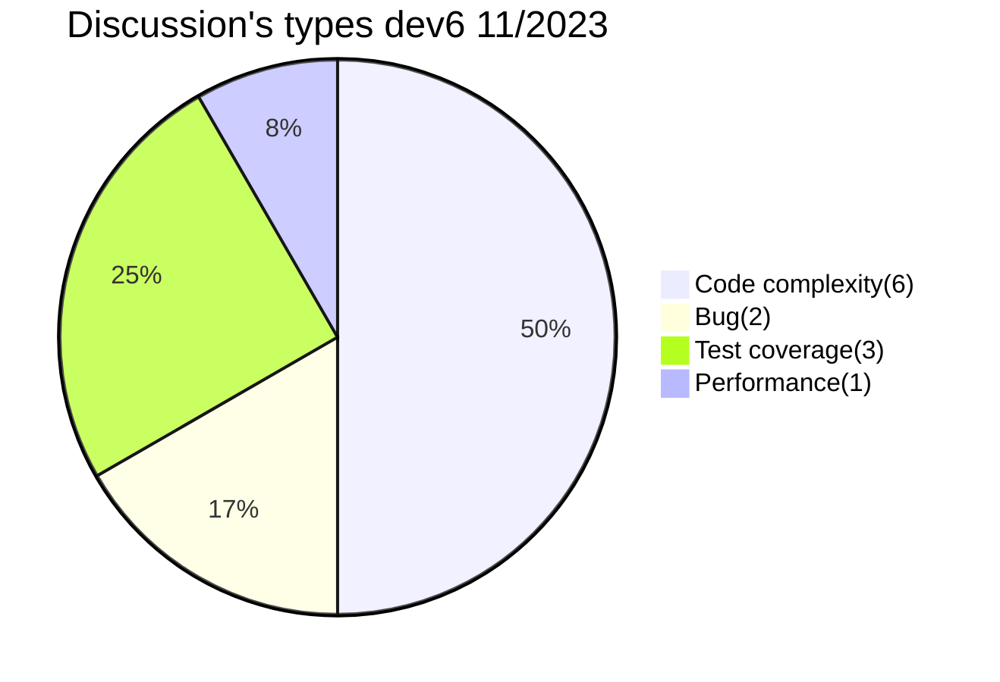
```mermaid
pie
title Discussion's types dev6 11/2023
"Code complexity(6)":6
"Bug(2)":2
"Test coverage(3)":3
"Performance(1)":1
```

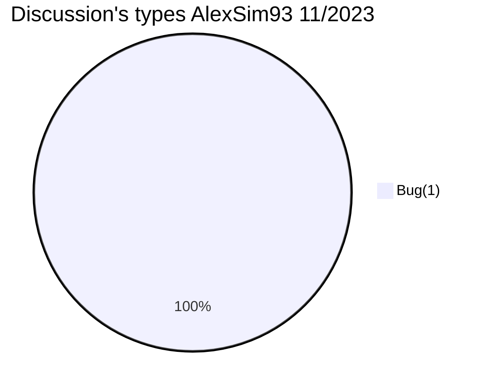
```mermaid
pie
title Discussion's types AlexSim93 11/2023
"Bug(1)":1
```

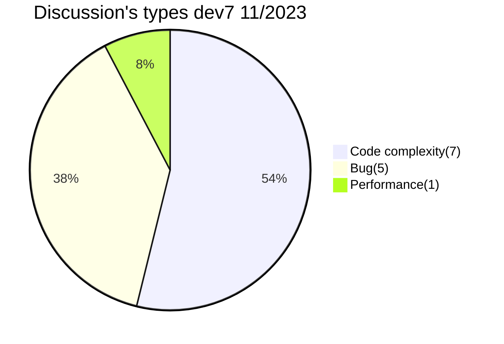
```mermaid
pie
title Discussion's types dev7 11/2023
"Code complexity(7)":7
"Bug(5)":5
"Performance(1)":1
```

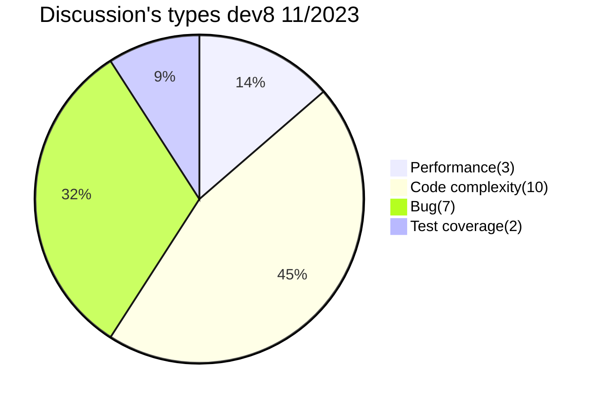
```mermaid
pie
title Discussion's types dev8 11/2023
"Performance(3)":3
"Code complexity(10)":10
"Bug(7)":7
"Test coverage(2)":2
```

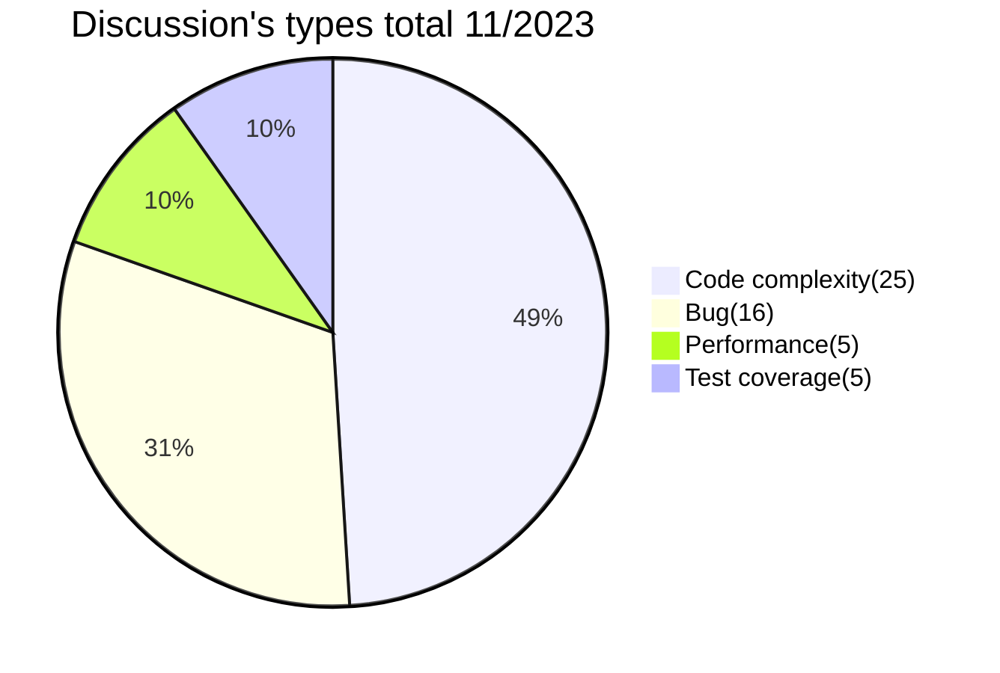
```mermaid
pie
title Discussion's types total 11/2023
"Code complexity(25)":25
"Bug(16)":16
"Performance(5)":5
"Test coverage(5)":5
```

### Pull requests timeline(percentile75) 10/2023

**Time to review** - time from PR creation to first review.
**Time to approve** - time from PR creation to first approval without requested changes.
**Time to merge** - time from PR creation to merge.
| user | Time to review | Time to approve | Time to merge | Total merged PRs |
| :------: | :------: | :------: | :------: | :------: |
| **dev5** | 7 hours 37 minutes | 7 hours 37 minutes | 44 hours 51 minutes | 15 |
| **dev6** | 3 hours 9 minutes | 3 hours 9 minutes | 19 hours 23 minutes | 16 |
| **AlexSim93** | 2 hours 32 minutes | 3 hours 24 minutes | 6 hours 58 minutes | 21 |
| **dev7** | 2 hours 23 minutes | 14 hours | 20 hours 57 minutes | 14 |
| **dev8** | 6 hours 37 minutes | 15 hours 21 minutes | 36 hours 39 minutes | 13 |
| **total** | 3 hours 20 minutes | 7 hours 3 minutes | 19 hours 5 minutes | 79 |


```mermaid
gantt
title Pull requests timeline(percentile75) 10/2023 / minutes
dateFormat X
axisFormat %s
section dev5
                Time to review :  0, 457
Time to approve :  0, 457
Time to merge :  0, 2691

section dev6
                Time to review :  0, 189
Time to approve :  0, 189
Time to merge :  0, 1163

section AlexSim93
                Time to review :  0, 152
Time to approve :  0, 204
Time to merge :  0, 418

section dev7
                Time to review :  0, 143
Time to approve :  0, 840
Time to merge :  0, 1257

section dev8
                Time to review :  0, 397
Time to approve :  0, 921
Time to merge :  0, 2199

section total
                Time to review :  0, 200
Time to approve :  0, 423
Time to merge :  0, 1145

```

### Workload stats 10/2023

**Reviews conducted** - number of Reviews conducted. 1 PR may have only single review.
| user | Total opened PRs | Total merged PRs | Additions/Deletions | Total comments | Reviews conducted |
| :------: | :------: | :------: | :------: | :------: | :------: |
| **dev5** | 16 | 15 | +1250/-742 | 5 | 17 |
| **dev6** | 16 | 16 | +1964/-1443 | 15 | 22 |
| **AlexSim93** | 23 | 21 | +2007/-1135 | 24 | 29 |
| **dev7** | 16 | 14 | +3501/-583 | 261 | 18 |
| **dev8** | 13 | 13 | +1113/-247 | 70 | 7 |
| **dev10** | 0 | 0 | +0/-0 | 0 | 1 |
| **total** | 84 | 79 | +9835/-4150 | 375 | 78 |

### Pull requests review stats 10/2023

**Changes requested / Comments / Approvals** - number of Reviews conducted by user. For a single pull request, only one review of each status will be counted for a user.
| user | Total merged PRs | Discussions conducted | Comments conducted | Changes requested / Comments / Approvals |
| :------: | :------: | :------: | :------: | :------: |
| **dev5** | 15 | 18 | 19 | 3 / 1 / 17 |
| **dev6** | 16 | 4 | 4 | 0 / 3 / 21 |
| **AlexSim93** | 21 | 83 | 135 | 11 / 13 / 29 |
| **dev7** | 14 | 11 | 21 | 0 / 8 / 14 |
| **dev8** | 13 | 0 | 0 | 0 / 0 / 7 |
| **dev10** | 0 | 0 | 0 | 0 / 0 / 0 |
| **total** | 79 | 116 | 179 | 13 / 22 / 78 |

### Pull requests quality stats 10/2023

The table includes discussions and comments on closed pull requests.
| user | Total merged PRs | Changes requested received | Discussions received | Comments received |
| :------: | :------: | :------: | :------: | :------: |
| **dev5** | 15 | 0 | 3 | 3 |
| **dev6** | 16 | 0 | 7 | 8 |
| **AlexSim93** | 21 | 1 | 7 | 14 |
| **dev7** | 14 | 9 | 75 | 118 |
| **dev8** | 13 | 3 | 24 | 36 |
| **total** | 79 | 13 | 116 | 179 |

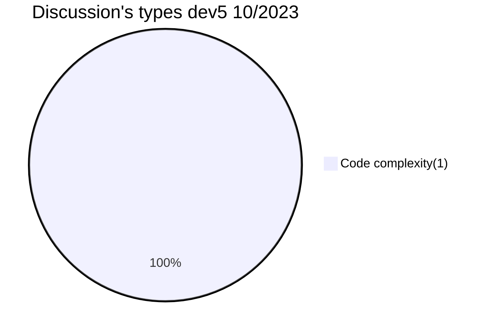
```mermaid
pie
title Discussion's types dev5 10/2023
"Code complexity(1)":1
```

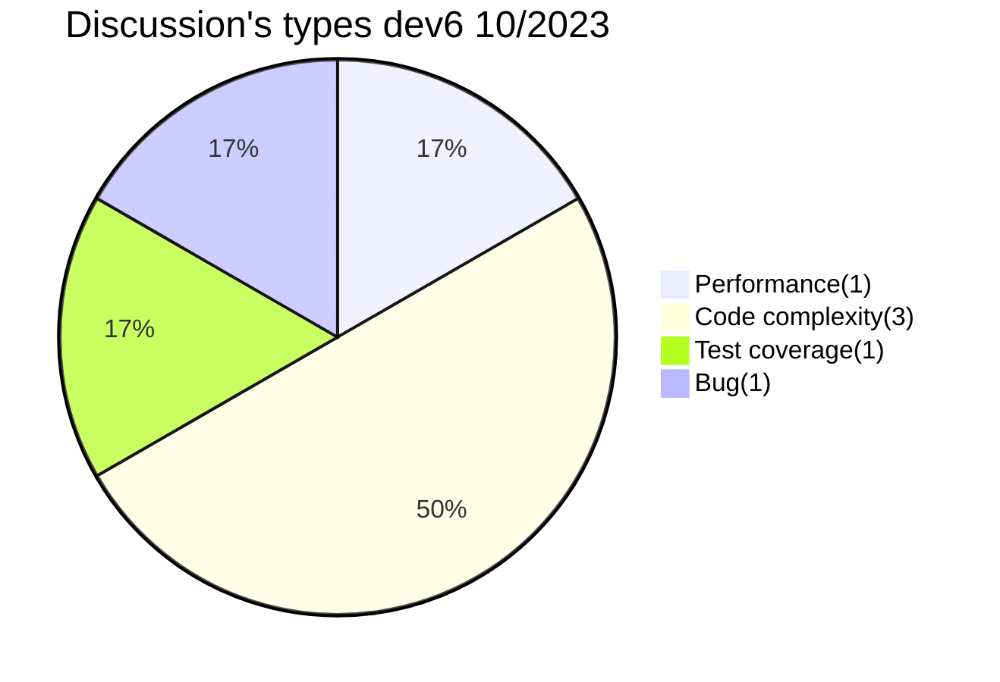
```mermaid
pie
title Discussion's types dev6 10/2023
"Performance(1)":1
"Code complexity(3)":3
"Test coverage(1)":1
"Bug(1)":1
```

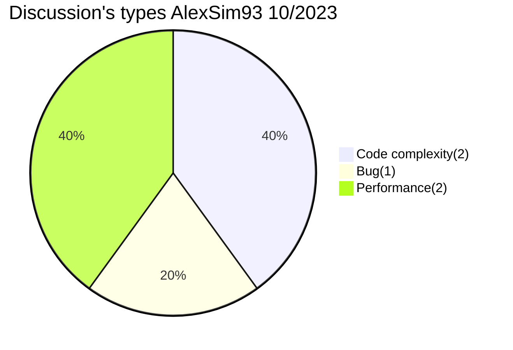
```mermaid
pie
title Discussion's types AlexSim93 10/2023
"Code complexity(2)":2
"Bug(1)":1
"Performance(2)":2
```

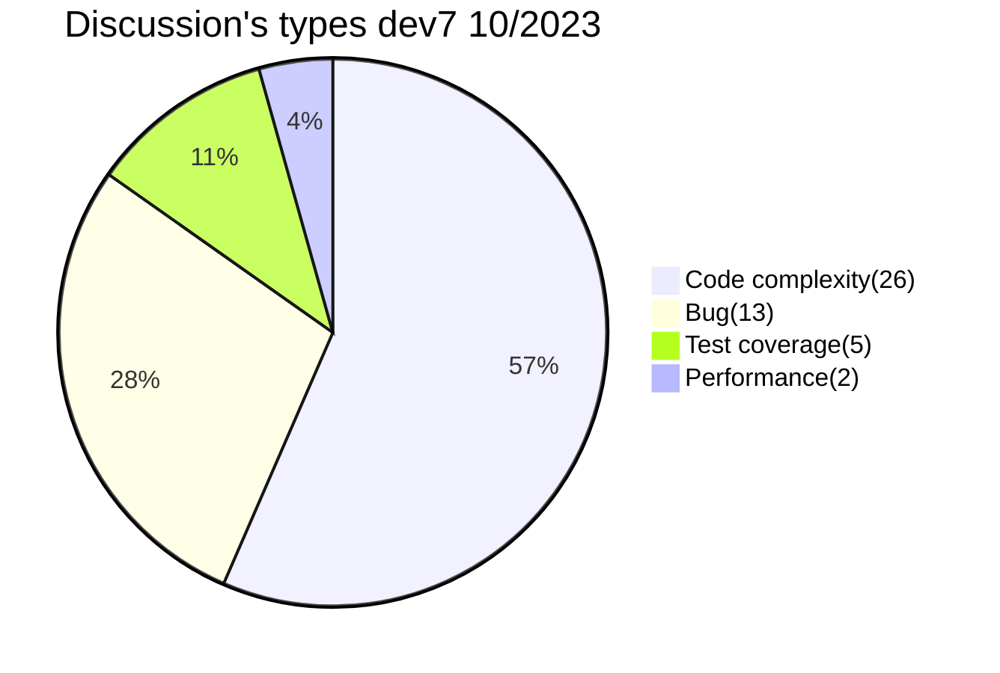
```mermaid
pie
title Discussion's types dev7 10/2023
"Code complexity(26)":26
"Bug(13)":13
"Test coverage(5)":5
"Performance(2)":2
```

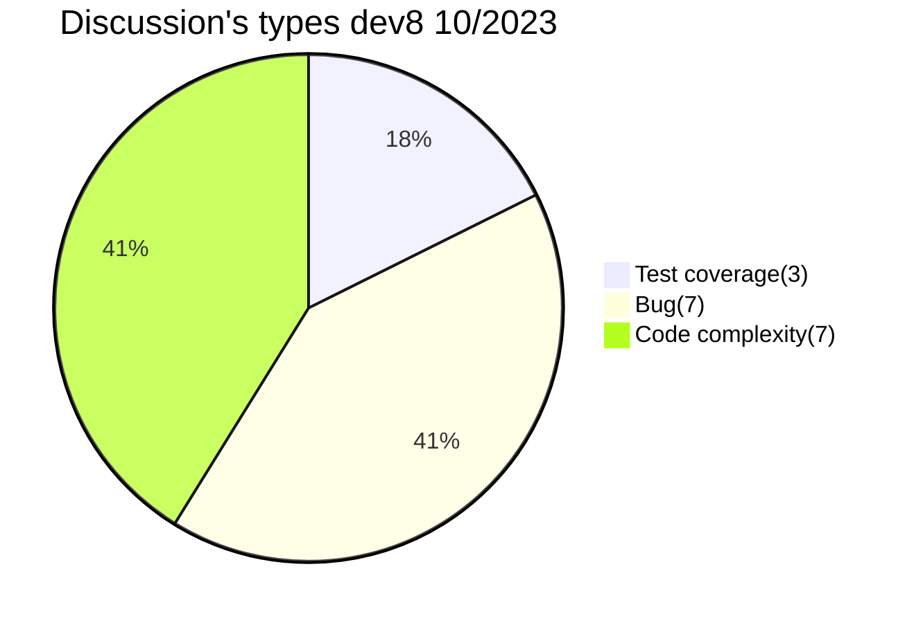
```mermaid
pie
title Discussion's types dev8 10/2023
"Test coverage(3)":3
"Bug(7)":7
"Code complexity(7)":7
```

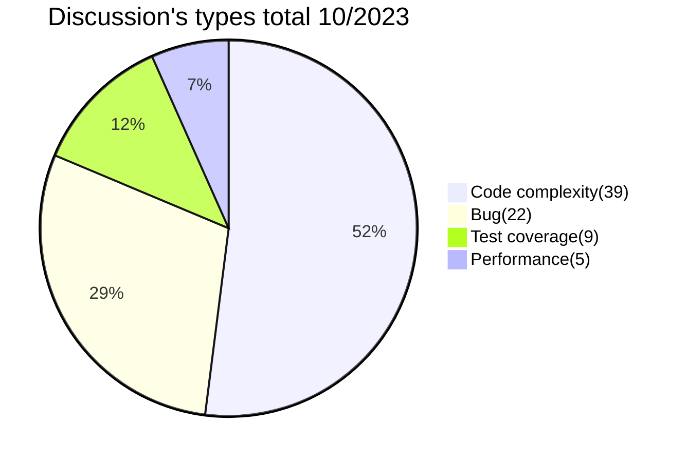
```mermaid
pie
title Discussion's types total 10/2023
"Code complexity(39)":39
"Bug(22)":22
"Test coverage(9)":9
"Performance(5)":5
```

### Pull requests timeline(percentile75) 9/2023

**Time to review** - time from PR creation to first review.
**Time to approve** - time from PR creation to first approval without requested changes.
**Time to merge** - time from PR creation to merge.
| user | Time to review | Time to approve | Time to merge | Total merged PRs |
| :------: | :------: | :------: | :------: | :------: |
| **dev5** | 1 hour 30 minutes | 2 hours 13 minutes | 18 hours 37 minutes | 13 |
| **dev6** | 2 hours 20 minutes | 2 hours 20 minutes | 23 hours 10 minutes | 9 |
| **AlexSim93** | 2 hours 5 minutes | 2 hours 18 minutes | 9 hours 17 minutes | 25 |
| **dev7** | 35 minutes | 3 hours 38 minutes | 22 hours 24 minutes | 26 |
| **dev8** | 4 hours 51 minutes | 6 hours 53 minutes | 32 hours 8 minutes | 18 |
| **total** | 2 hours 18 minutes | 3 hours 38 minutes | 22 hours 11 minutes | 93 |


```mermaid
gantt
title Pull requests timeline(percentile75) 9/2023 / minutes
dateFormat X
axisFormat %s
section dev5
                Time to review :  0, 90
Time to approve :  0, 133
Time to merge :  0, 1117

section dev6
                Time to review :  0, 140
Time to approve :  0, 140
Time to merge :  0, 1390

section AlexSim93
                Time to review :  0, 125
Time to approve :  0, 138
Time to merge :  0, 557

section dev7
                Time to review :  0, 35
Time to approve :  0, 218
Time to merge :  0, 1344

section dev8
                Time to review :  0, 291
Time to approve :  0, 413
Time to merge :  0, 1928

section total
                Time to review :  0, 138
Time to approve :  0, 218
Time to merge :  0, 1331

```

### Workload stats 9/2023

**Reviews conducted** - number of Reviews conducted. 1 PR may have only single review.
| user | Total opened PRs | Total merged PRs | Additions/Deletions | Total comments | Reviews conducted |
| :------: | :------: | :------: | :------: | :------: | :------: |
| **dev5** | 13 | 13 | +928/-697 | 20 | 19 |
| **dev6** | 9 | 9 | +1240/-206 | 7 | 19 |
| **AlexSim93** | 33 | 25 | +1683/-1431 | 38 | 25 |
| **dev7** | 28 | 26 | +2635/-2731 | 67 | 21 |
| **dev8** | 20 | 18 | +3659/-1374 | 22 | 16 |
| **dev11** | 0 | 0 | +0/-0 | 0 | 1 |
| **total** | 105 | 93 | +10176/-6511 | 154 | 83 |

### Pull requests review stats 9/2023

**Changes requested / Comments / Approvals** - number of Reviews conducted by user. For a single pull request, only one review of each status will be counted for a user.
| user | Total merged PRs | Discussions conducted | Comments conducted | Changes requested / Comments / Approvals |
| :------: | :------: | :------: | :------: | :------: |
| **dev5** | 13 | 8 | 9 | 0 / 3 / 17 |
| **dev6** | 9 | 6 | 6 | 1 / 4 / 17 |
| **AlexSim93** | 25 | 24 | 39 | 6 / 8 / 24 |
| **dev7** | 26 | 11 | 16 | 0 / 9 / 17 |
| **dev8** | 18 | 4 | 6 | 0 / 4 / 15 |
| **dev11** | 0 | 0 | 0 | 0 / 0 / 1 |
| **total** | 93 | 53 | 76 | 7 / 35 / 80 |

### Pull requests quality stats 9/2023

The table includes discussions and comments on closed pull requests.
| user | Total merged PRs | Changes requested received | Discussions received | Comments received |
| :------: | :------: | :------: | :------: | :------: |
| **dev5** | 13 | 0 | 4 | 11 |
| **dev6** | 9 | 0 | 4 | 4 |
| **AlexSim93** | 25 | 1 | 10 | 16 |
| **dev7** | 26 | 5 | 24 | 33 |
| **dev8** | 18 | 1 | 11 | 12 |
| **total** | 93 | 7 | 53 | 76 |

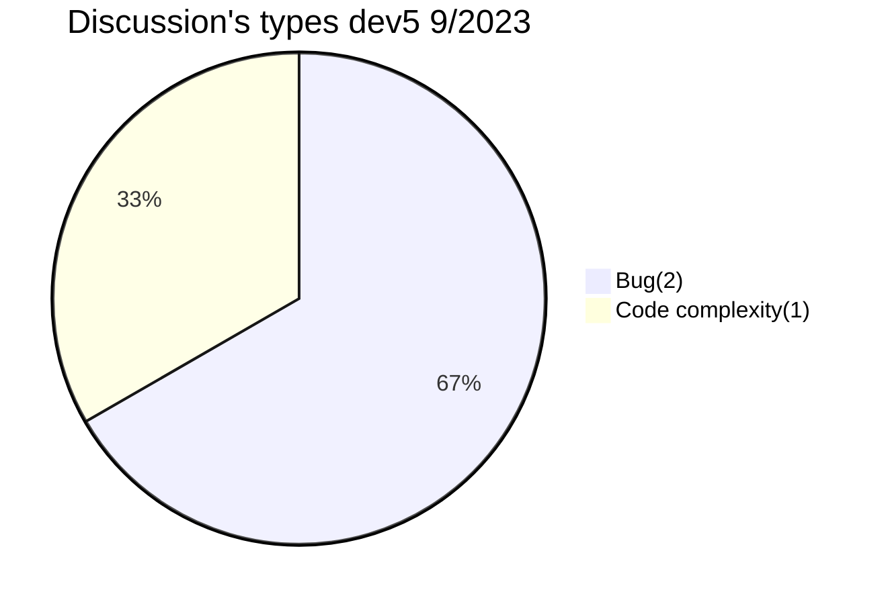
```mermaid
pie
title Discussion's types dev5 9/2023
"Bug(2)":2
"Code complexity(1)":1
```

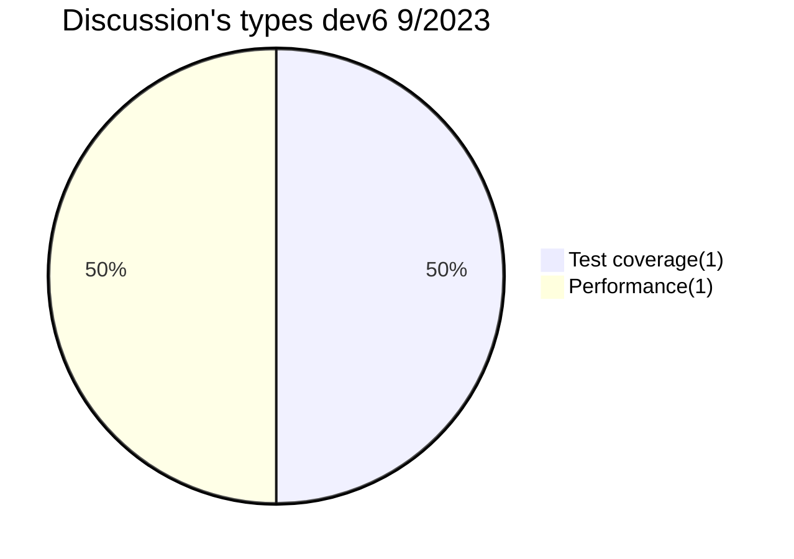
```mermaid
pie
title Discussion's types dev6 9/2023
"Test coverage(1)":1
"Performance(1)":1
```

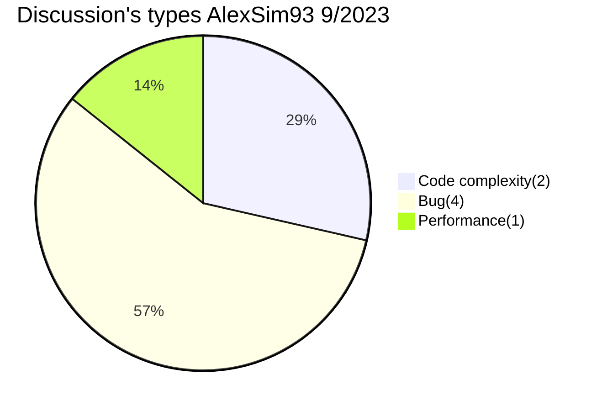
```mermaid
pie
title Discussion's types AlexSim93 9/2023
"Code complexity(2)":2
"Bug(4)":4
"Performance(1)":1
```

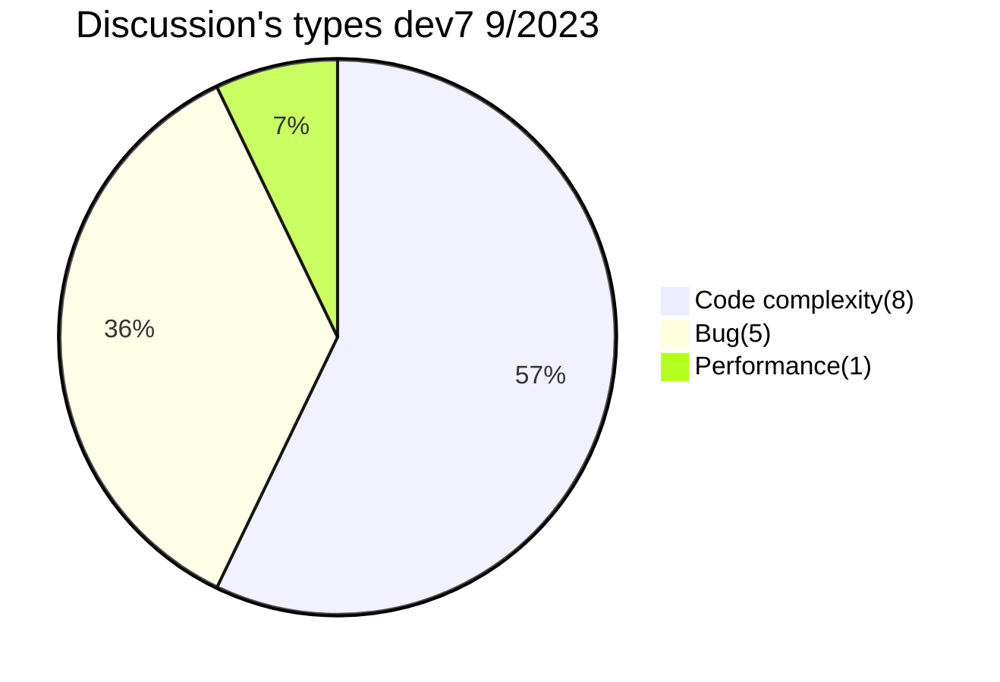
```mermaid
pie
title Discussion's types dev7 9/2023
"Code complexity(8)":8
"Bug(5)":5
"Performance(1)":1
```


```mermaid
pie
title Discussion's types dev8 9/2023
"Performance(3)":3
"Bug(3)":3
```

```mermaid
pie
title Discussion's types total 9/2023
"Code complexity(11)":11
"Bug(14)":14
"Performance(6)":6
"Test coverage(1)":1
```

### Pull requests timeline(percentile75) total

**Time to review** - time from PR creation to first review.
**Time to approve** - time from PR creation to first approval without requested changes.
**Time to merge** - time from PR creation to merge.
| user | Time to review | Time to approve | Time to merge | Total merged PRs |
| :------: | :------: | :------: | :------: | :------: |
| **dev5** | 6 hours 59 minutes | 6 hours 59 minutes | 32 hours 25 minutes | 40 |
| **dev6** | 2 hours 13 minutes | 2 hours 20 minutes | 29 hours 2 minutes | 42 |
| **AlexSim93** | 2 hours 5 minutes | 3 hours 20 minutes | 9 hours 9 minutes | 69 |
| **dev7** | 1 hour 19 minutes | 9 hours 26 minutes | 20 hours 57 minutes | 49 |
| **dev8** | 3 hours 39 minutes | 8 hours 56 minutes | 29 hours 44 minutes | 44 |
| **total** | 2 hours 31 minutes | 5 hours 1 minute | 23 hours 21 minutes | 246 |

```mermaid
gantt
title Pull requests timeline(percentile75) total / minutes
dateFormat X
axisFormat %s
section dev5
                Time to review :  0, 419
Time to approve :  0, 419
Time to merge :  0, 1945

section dev6
                Time to review :  0, 133
Time to approve :  0, 140
Time to merge :  0, 1742

section AlexSim93
                Time to review :  0, 125
Time to approve :  0, 200
Time to merge :  0, 549

section dev7
                Time to review :  0, 79
Time to approve :  0, 566
Time to merge :  0, 1257

section dev8
                Time to review :  0, 219
Time to approve :  0, 536
Time to merge :  0, 1784

section total
                Time to review :  0, 151
Time to approve :  0, 301
Time to merge :  0, 1401

```

### Workload stats total

**Reviews conducted** - number of Reviews conducted. 1 PR may have only single review.
| user | Total opened PRs | Total merged PRs | Additions/Deletions | Total comments | Reviews conducted |
| :------: | :------: | :------: | :------: | :------: | :------: |
| **dev5** | 42 | 40 | +3461/-2066 | 35 | 61 |
| **dev6** | 44 | 42 | +5498/-3317 | 64 | 62 |
| **AlexSim93** | 79 | 69 | +6225/-4945 | 67 | 78 |
| **dev7** | 55 | 49 | +9014/-5233 | 386 | 49 |
| **dev8** | 46 | 44 | +6340/-2421 | 162 | 31 |
| **dev9** | 0 | 0 | +0/-0 | 0 | 1 |
| **dev10** | 0 | 0 | +0/-0 | 0 | 1 |
| **dev11** | 0 | 0 | +0/-0 | 0 | 1 |
| **total** | 270 | 246 | +38770/-18113 | 719 | 237 |

### Pull requests review stats total

**Changes requested / Comments / Approvals** - number of Reviews conducted by user. For a single pull request, only one review of each status will be counted for a user.
| user | Total merged PRs | Discussions conducted | Comments conducted | Changes requested / Comments / Approvals |
| :------: | :------: | :------: | :------: | :------: |
| **dev5** | 40 | 47 | 50 | 6 / 7 / 56 |
| **dev6** | 42 | 11 | 11 | 1 / 8 / 59 |
| **AlexSim93** | 69 | 157 | 237 | 28 / 31 / 77 |
| **dev7** | 49 | 27 | 42 | 0 / 22 / 37 |
| **dev8** | 44 | 6 | 8 | 0 / 5 / 30 |
| **dev9** | 0 | 1 | 2 | 0 / 1 / 1 |
| **dev10** | 0 | 0 | 0 | 0 / 0 / 0 |
| **dev11** | 0 | 0 | 0 | 0 / 0 / 1 |
| **total** | 246 | 249 | 350 | 34 / 81 / 233 |

### Pull requests quality stats total

The table includes discussions and comments on closed pull requests.
| user | Total merged PRs | Changes requested received | Discussions received | Comments received |
| :------: | :------: | :------: | :------: | :------: |
| **dev5** | 40 | 1 | 9 | 18 |
| **dev6** | 42 | 4 | 32 | 34 |
| **AlexSim93** | 69 | 2 | 20 | 33 |
| **dev7** | 49 | 19 | 120 | 181 |
| **dev8** | 44 | 8 | 66 | 82 |
| **total** | 246 | 34 | 249 | 350 |

```mermaid
pie
title Discussion's types dev5 total
"Code complexity(3)":3
"Bug(2)":2
```

```mermaid
pie
title Discussion's types dev6 total
"Code complexity(9)":9
"Bug(3)":3
"Test coverage(5)":5
"Performance(3)":3
```

```mermaid
pie
title Discussion's types AlexSim93 total
"Code complexity(4)":4
"Bug(6)":6
"Performance(3)":3
```

```mermaid
pie
title Discussion's types dev7 total
"Code complexity(41)":41
"Bug(23)":23
"Performance(4)":4
"Test coverage(5)":5
```

```mermaid
pie
title Discussion's types dev8 total
"Performance(6)":6
"Code complexity(17)":17
"Bug(17)":17
"Test coverage(5)":5
```

```mermaid
pie
title Discussion's types total total
"Code complexity(75)":75
"Bug(52)":52
"Performance(16)":16
"Test coverage(15)":15
```
