## Pull Request report

This report based on 150 last updated PRs. To learn more about the project and its configuration, please visit [Pull request analytics action](https://github.com/AlexSim93/pull-request-analytics-action).

Below are the settings applied for this report:

```
GITHUB_OWNERS_REPOS: owner/repo
GITHUB_OWNER_FOR_ISSUE: owner
GITHUB_REPO_FOR_ISSUE: repo
SHOW_STATS_TYPES: timeline, workload, pr-quality, code-review-engagement
REVIEW_TIME_INTERVALS: 2,4,6,9,12,18
TOP_LIST_AMOUNT: 0
AGGREGATE_VALUE_METHODS: percentile
PERCENTILE: 75
HIDE_USERS: dev1, dev2, dev3
TIMEZONE: Europe/Berlin
CORE_HOURS_START: 09:00
CORE_HOURS_END: 18:00
REPORT_DATE_START: 01/11/2023
REPORT_DATE_END: 01/01/2024
AMOUNT: 100
PERIOD_SPLIT_UNIT: months
EXECUTION_OUTCOME: markdown
```

### Pull requests timeline(75th percentile) 12/2023

**Time to review** - time from PR creation to first review.
**Time to approve** - time from PR creation to first approval without requested changes.
**Time to merge** - time from PR creation to merge.
| user | Time in draft | Time to review request | Time to review | Time to approve | Time to merge | Total merged PRs |
| :------: | :------: | :------: | :------: | :------: | :------: | :------: |
| **dev4** | 7 minutes | 7 minutes | 4 hours 12 minutes | 7 hours 32 minutes | 15 hours 31 minutes | 29 |
| **dev8** | 8 minutes | 7 minutes | 3 hours 14 minutes | 3 hours 14 minutes | 16 hours 23 minutes | 19 |
| **dev5** | 6 minutes | 6 minutes | 7 hours 43 minutes | 12 hours 13 minutes | 50 hours 11 minutes | 2 |
| **dev6** | 29 minutes | 29 minutes | 3 hours 48 minutes | 3 hours 48 minutes | 32 hours 29 minutes | 6 |
| **dev7** | 13 minutes | 13 minutes | 3 hours 50 minutes | 9 hours 19 minutes | 48 hours 18 minutes | 9 |
| **total** | 8 minutes | 8 minutes | 4 hours 21 minutes | 6 hours 14 minutes | 24 hours 52 minutes | 65 |


```mermaid
gantt
title Pull requests timeline(75th percentile) 12/2023 / minutes
dateFormat X
axisFormat %s
section dev4
                Time in draft(7 minutes) :  0, 7
Time to review request(7 minutes) :  0, 7
Time to review(4 hours 12 minutes) :  0, 252
Time to approve(7 hours 32 minutes) :  0, 452
Time to merge(15 hours 31 minutes) :  0, 931

section dev8
                Time in draft(8 minutes) :  0, 8
Time to review request(7 minutes) :  0, 7
Time to review(3 hours 14 minutes) :  0, 194
Time to approve(3 hours 14 minutes) :  0, 194
Time to merge(16 hours 23 minutes) :  0, 983

section dev5
                Time in draft(6 minutes) :  0, 6
Time to review request(6 minutes) :  0, 6
Time to review(7 hours 43 minutes) :  0, 463
Time to approve(12 hours 13 minutes) :  0, 733
Time to merge(50 hours 11 minutes) :  0, 3011

section dev6
                Time in draft(29 minutes) :  0, 29
Time to review request(29 minutes) :  0, 29
Time to review(3 hours 48 minutes) :  0, 228
Time to approve(3 hours 48 minutes) :  0, 228
Time to merge(32 hours 29 minutes) :  0, 1949

section dev7
                Time in draft(13 minutes) :  0, 13
Time to review request(13 minutes) :  0, 13
Time to review(3 hours 50 minutes) :  0, 230
Time to approve(9 hours 19 minutes) :  0, 559
Time to merge(48 hours 18 minutes) :  0, 2898

section total
                Time in draft(8 minutes) :  0, 8
Time to review request(8 minutes) :  0, 8
Time to review(4 hours 21 minutes) :  0, 261
Time to approve(6 hours 14 minutes) :  0, 374
Time to merge(24 hours 52 minutes) :  0, 1492

```

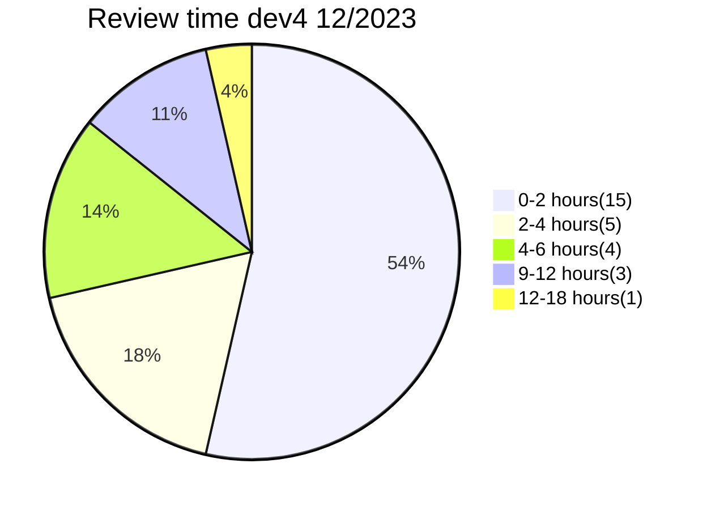
```mermaid
pie
title Review time dev4 12/2023
"0-2 hours(15)":15
"2-4 hours(5)":5
"4-6 hours(4)":4
"9-12 hours(3)":3
"12-18 hours(1)":1
```

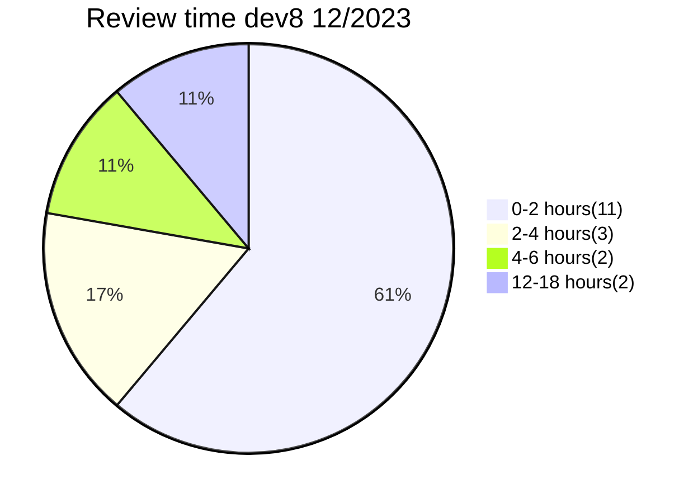
```mermaid
pie
title Review time dev8 12/2023
"0-2 hours(11)":11
"2-4 hours(3)":3
"4-6 hours(2)":2
"12-18 hours(2)":2
```

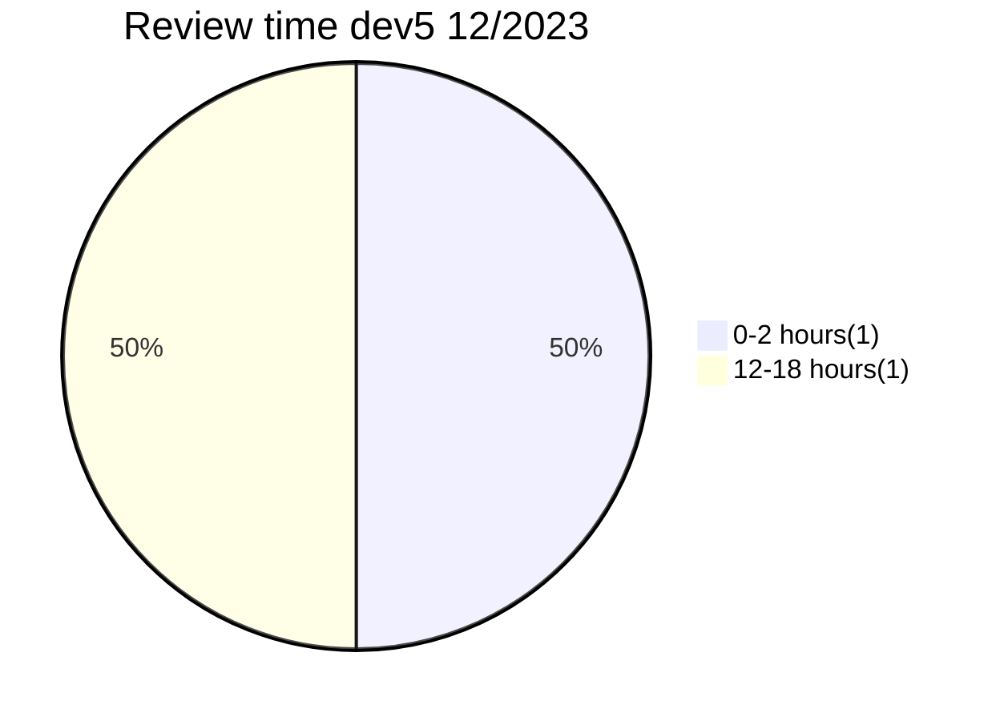
```mermaid
pie
title Review time dev5 12/2023
"0-2 hours(1)":1
"12-18 hours(1)":1
```

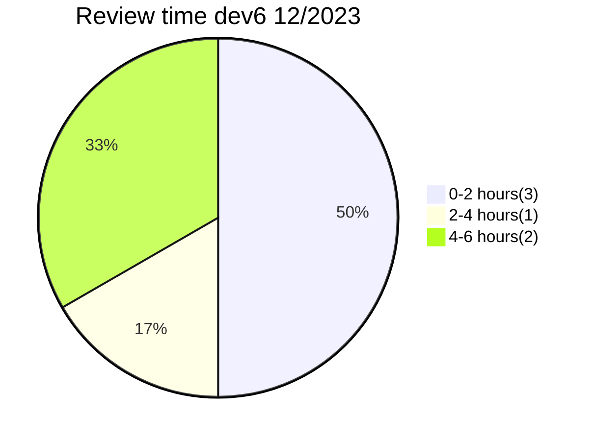
```mermaid
pie
title Review time dev6 12/2023
"0-2 hours(3)":3
"2-4 hours(1)":1
"4-6 hours(2)":2
```

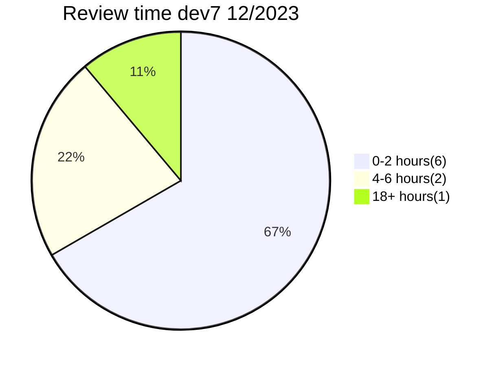
```mermaid
pie
title Review time dev7 12/2023
"0-2 hours(6)":6
"4-6 hours(2)":2
"18+ hours(1)":1
```

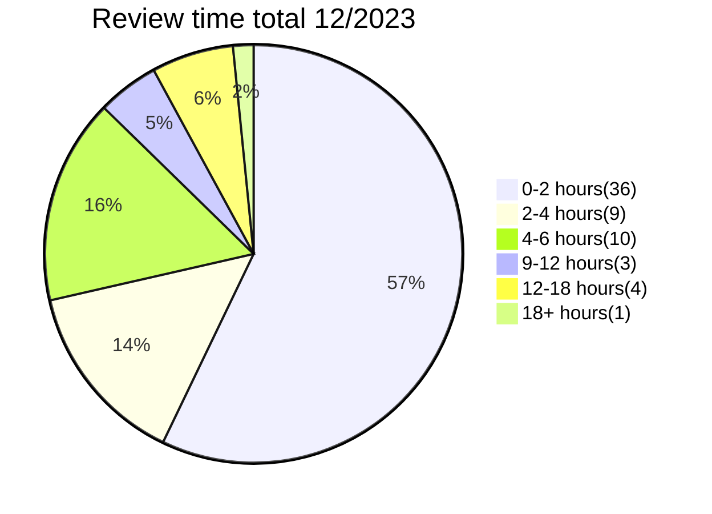
```mermaid
pie
title Review time total 12/2023
"0-2 hours(36)":36
"2-4 hours(9)":9
"4-6 hours(10)":10
"9-12 hours(3)":3
"12-18 hours(4)":4
"18+ hours(1)":1
```

### Workload stats 12/2023

**Reviews conducted** - number of reviews conducted. 1 PR may have only single review.
**PR Size** - determined using the formula: `additions + deletions * 0.5`. Based on this calculation: 0-50: xs, 51-200: s, 201-400: m, 401-700: l, 701+: xl
| user | Total opened PRs | Total merged PRs | Additions/Deletions | PR size: xs/s/m/l/xl | Total comments | Reviews conducted |
| :------: | :------: | :------: | :------: | :------: | :------: | :------: |
| **dev4** | 32 | 29 | +2428/-6786 | 20/5/4/0/3 | 44 | 12 |
| **dev8** | 20 | 19 | +954/-2167 | 11/6/1/2/0 | 6 | 28 |
| **dev5** | 2 | 2 | +15/-3 | 2/0/0/0/0 | 1 | 13 |
| **dev6** | 6 | 6 | +1164/-504 | 3/1/1/0/1 | 28 | 4 |
| **dev7** | 9 | 9 | +5553/-4706 | 6/1/1/0/1 | 22 | 11 |
| **total** | 69 | 65 | +10114/-14166 | 42/13/7/2/5 | 101 | 63 |

### Pull request quality 12/2023

**Agreed** - discussions with at least 1 reaction :+1:.
**Disagreed** - discussions with at least 1 reaction :-1:.
| user | Total merged PRs | Changes requested received | Agreed / Disagreed / Total discussions received | Comments received |
| :------: | :------: | :------: | :------: | :------: |
| **dev4** | 29 | 5 | 12 / 1 / 12 | 22 |
| **dev8** | 19 | 1 | 2 / 0 / 2 | 3 |
| **dev5** | 2 | 0 | 1 / 1 / 1 | 1 |
| **dev6** | 6 | 1 | 13 / 2 / 15 | 16 |
| **dev7** | 9 | 2 | 8 / 1 / 10 | 12 |
| **total** | 65 | 9 | 36 / 5 / 40 | 54 |

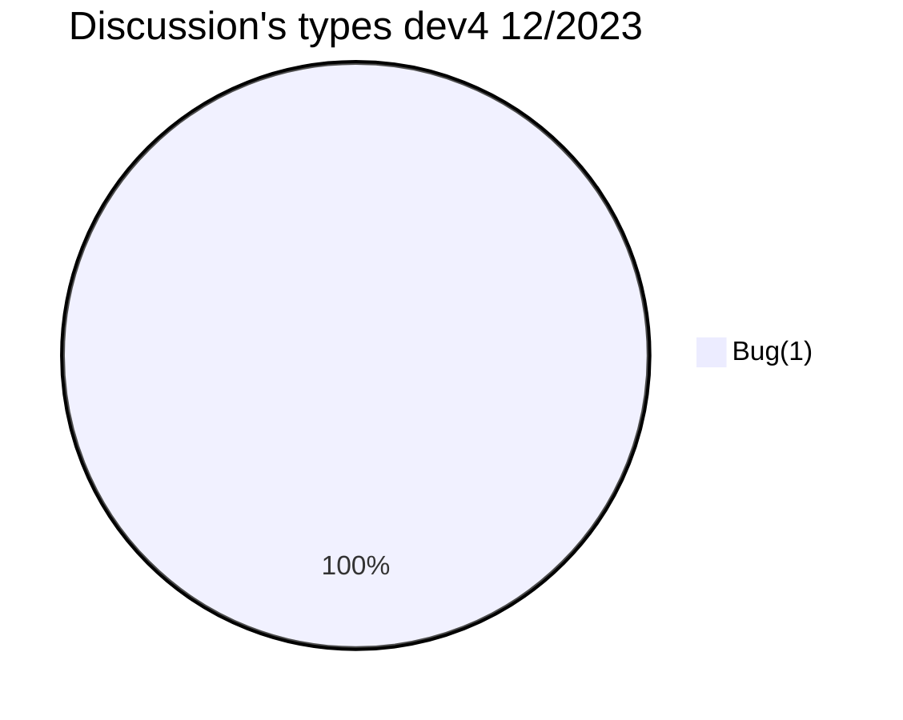
```mermaid
pie
title Discussion's types dev4 12/2023
"Bug(1)":1
```

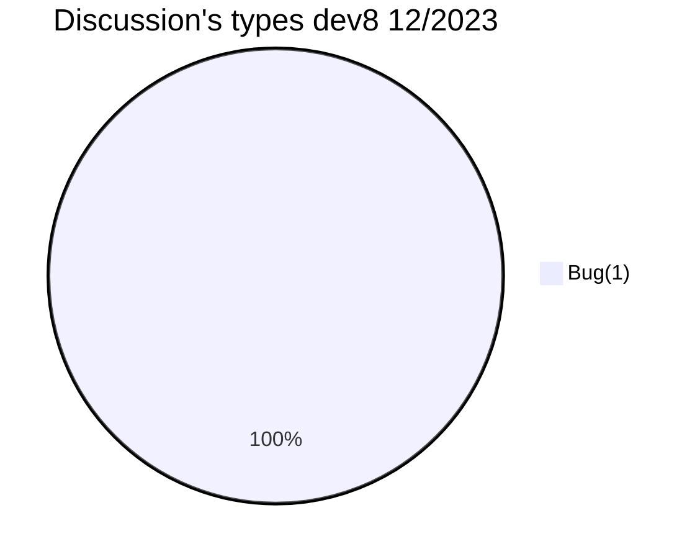
```mermaid
pie
title Discussion's types dev8 12/2023
"Bug(1)":1
```

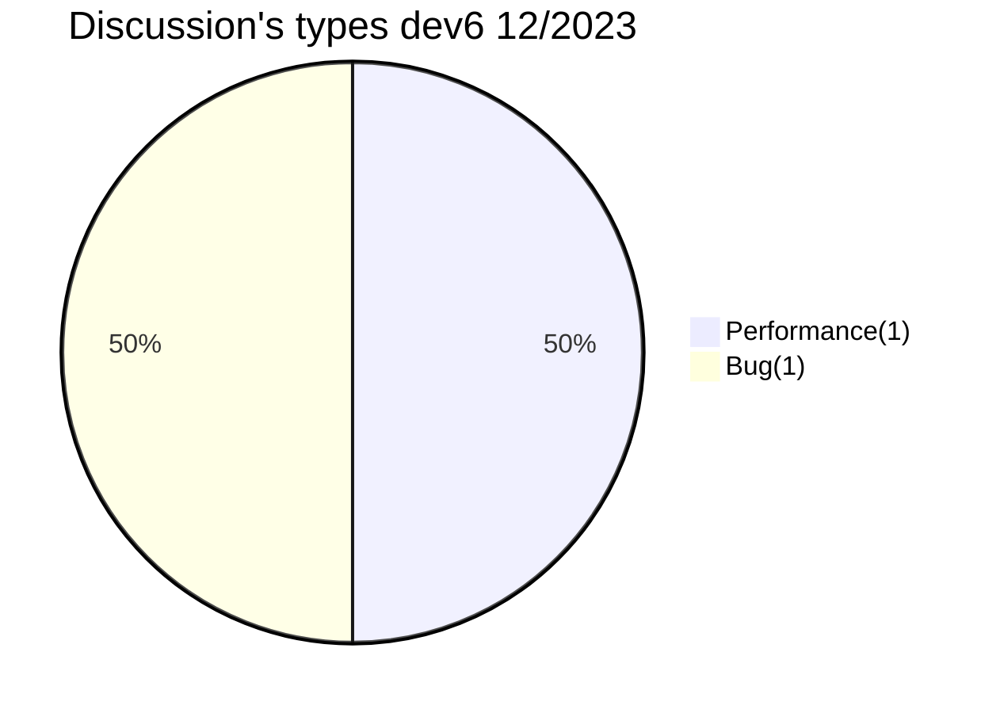
```mermaid
pie
title Discussion's types dev6 12/2023
"Performance(1)":1
"Bug(1)":1
```

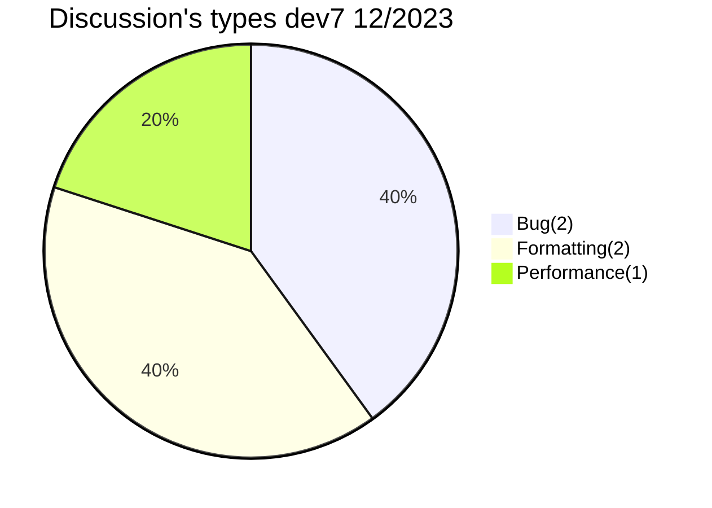
```mermaid
pie
title Discussion's types dev7 12/2023
"Bug(2)":2
"Formatting(2)":2
"Performance(1)":1
```

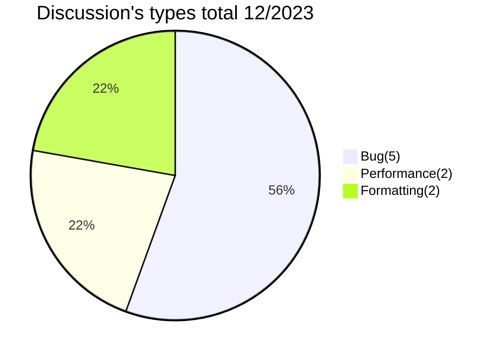
```mermaid
pie
title Discussion's types total 12/2023
"Bug(5)":5
"Performance(2)":2
"Formatting(2)":2
```

### Code review engagement 12/2023

**PR Size** - determined using the formula: `additions + deletions * 0.5`. Based on this calculation: 0-50: xs, 51-200: s, 201-400: m, 401-700: l, 701+: xl
**Changes requested / Comments / Approvals** - number of reviews conducted by user. For a single pull request, only one review of each status will be counted for a user.
**Agreed** - discussions with at least 1 reaction :+1:.
**Disagreed** - discussions with at least 1 reaction :-1:.
| user | Total merged PRs | Agreed / Disagreed / Total discussions conducted | Comments conducted | PR size: xs/s/m/l/xl | Changes requested / Commented / Approved | Review requests conducted |
| :------: | :------: | :------: | :------: | :------: | :------: | :------: |
| **dev4** | 29 | 4 / 0 / 4 | 4 | 7/3/1/1/0 | 0 / 1 / 12 | 37 |
| **dev8** | 19 | 27 / 4 / 31 | 44 | 14/5/4/0/5 | 8 / 7 / 28 | 49 |
| **dev5** | 2 | 4 / 0 / 4 | 5 | 7/2/1/2/1 | 1 / 0 / 13 | 67 |
| **dev6** | 6 | 1 / 1 / 1 | 1 | 4/0/0/0/0 | 0 / 1 / 4 | 63 |
| **dev7** | 9 | 0 / 0 / 0 | 0 | 8/2/1/0/0 | 0 / 0 / 11 | 59 |
| **total** | 65 | 36 / 5 / 40 | 54 | 42/13/7/2/5 | 9 / 9 / 63 | 275 |

### Pull requests timeline(75th percentile) 11/2023

**Time to review** - time from PR creation to first review.
**Time to approve** - time from PR creation to first approval without requested changes.
**Time to merge** - time from PR creation to merge.
| user | Time in draft | Time to review request | Time to review | Time to approve | Time to merge | Total merged PRs |
| :------: | :------: | :------: | :------: | :------: | :------: | :------: |
| **dev4** | 17 minutes | 10 minutes | 55 minutes | 8 hours 4 minutes | 17 hours 1 minute | 9 |
| **dev8** | 6 minutes | 6 minutes | 1 hour 10 minutes | 1 hour 30 minutes | 3 hours 29 minutes | 23 |
| **dev5** | 18 minutes | 18 minutes | 8 hours 3 minutes | 8 hours 7 minutes | 36 hours 28 minutes | 12 |
| **dev6** | 7 minutes | 7 minutes | 1 hour 59 minutes | 2 hours 19 minutes | 35 hours 34 minutes | 17 |
| **dev7** | 6 minutes | 6 minutes | 1 hour 30 minutes | 8 hours | 25 hours 1 minute | 13 |
| **total** | 7 minutes | 7 minutes | 2 hours 16 minutes | 5 hours 9 minutes | 26 hours 13 minutes | 74 |


```mermaid
gantt
title Pull requests timeline(75th percentile) 11/2023 / minutes
dateFormat X
axisFormat %s
section dev4
                Time in draft(17 minutes) :  0, 17
Time to review request(10 minutes) :  0, 10
Time to review(55 minutes) :  0, 55
Time to approve(8 hours 4 minutes) :  0, 484
Time to merge(17 hours 1 minute) :  0, 1021

section dev8
                Time in draft(6 minutes) :  0, 6
Time to review request(6 minutes) :  0, 6
Time to review(1 hour 10 minutes) :  0, 70
Time to approve(1 hour 30 minutes) :  0, 90
Time to merge(3 hours 29 minutes) :  0, 209

section dev5
                Time in draft(18 minutes) :  0, 18
Time to review request(18 minutes) :  0, 18
Time to review(8 hours 3 minutes) :  0, 483
Time to approve(8 hours 7 minutes) :  0, 487
Time to merge(36 hours 28 minutes) :  0, 2188

section dev6
                Time in draft(7 minutes) :  0, 7
Time to review request(7 minutes) :  0, 7
Time to review(1 hour 59 minutes) :  0, 119
Time to approve(2 hours 19 minutes) :  0, 139
Time to merge(35 hours 34 minutes) :  0, 2134

section dev7
                Time in draft(6 minutes) :  0, 6
Time to review request(6 minutes) :  0, 6
Time to review(1 hour 30 minutes) :  0, 90
Time to approve(8 hours) :  0, 480
Time to merge(25 hours 1 minute) :  0, 1501

section total
                Time in draft(7 minutes) :  0, 7
Time to review request(7 minutes) :  0, 7
Time to review(2 hours 16 minutes) :  0, 136
Time to approve(5 hours 9 minutes) :  0, 309
Time to merge(26 hours 13 minutes) :  0, 1573

```

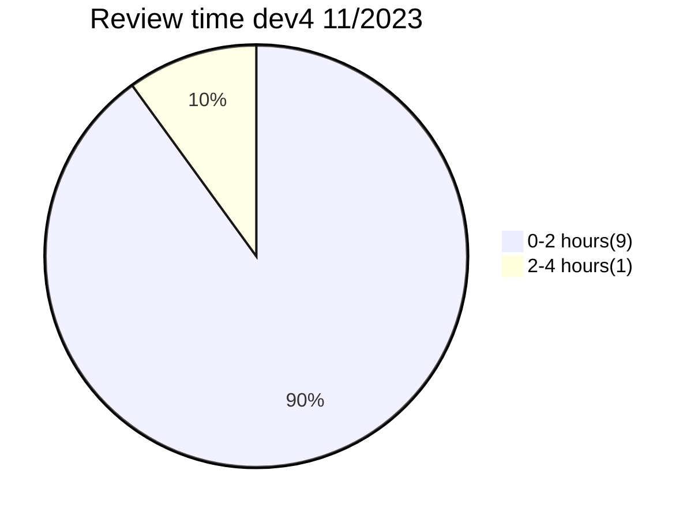
```mermaid
pie
title Review time dev4 11/2023
"0-2 hours(9)":9
"2-4 hours(1)":1
```

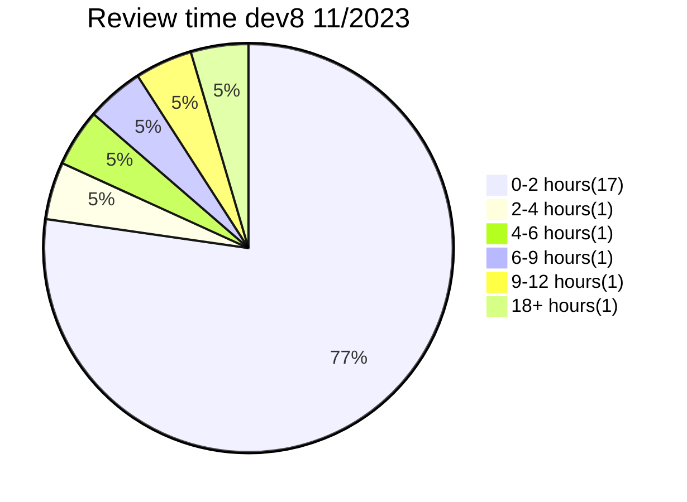
```mermaid
pie
title Review time dev8 11/2023
"0-2 hours(17)":17
"2-4 hours(1)":1
"4-6 hours(1)":1
"6-9 hours(1)":1
"9-12 hours(1)":1
"18+ hours(1)":1
```

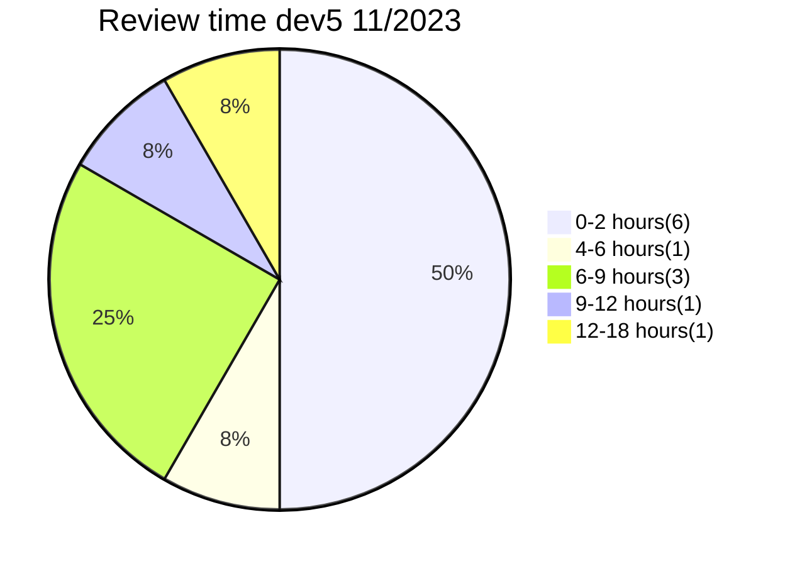
```mermaid
pie
title Review time dev5 11/2023
"0-2 hours(6)":6
"4-6 hours(1)":1
"6-9 hours(3)":3
"9-12 hours(1)":1
"12-18 hours(1)":1
```

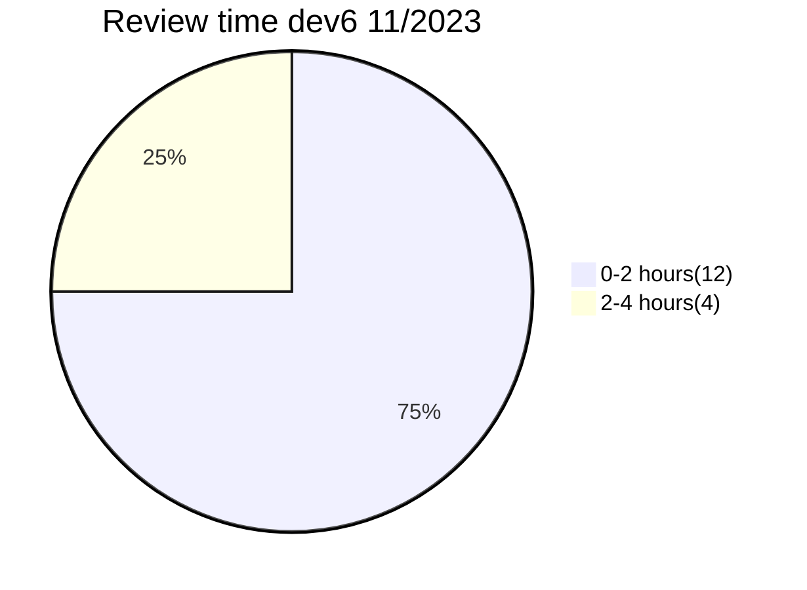
```mermaid
pie
title Review time dev6 11/2023
"0-2 hours(12)":12
"2-4 hours(4)":4
```

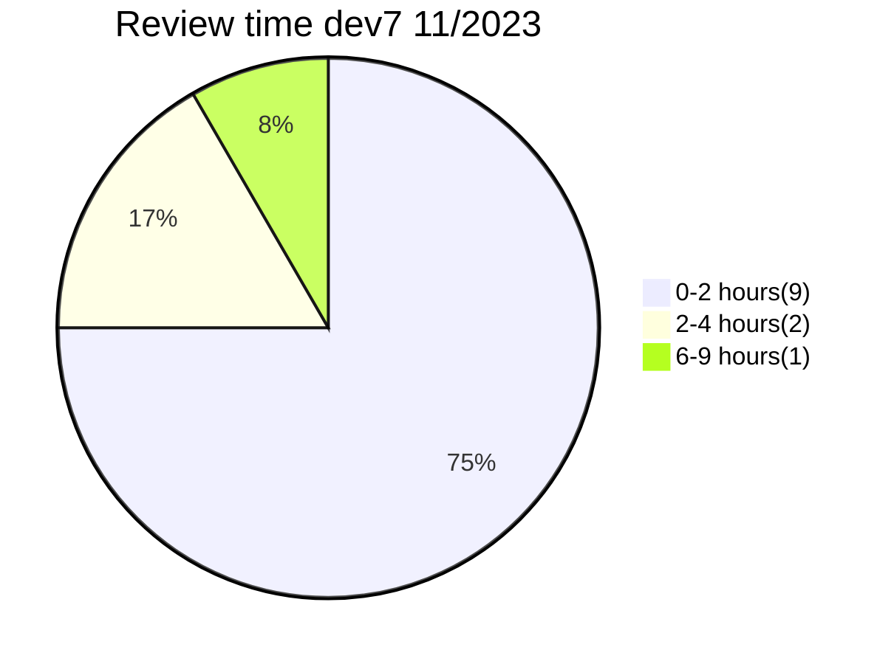
```mermaid
pie
title Review time dev7 11/2023
"0-2 hours(9)":9
"2-4 hours(2)":2
"6-9 hours(1)":1
```

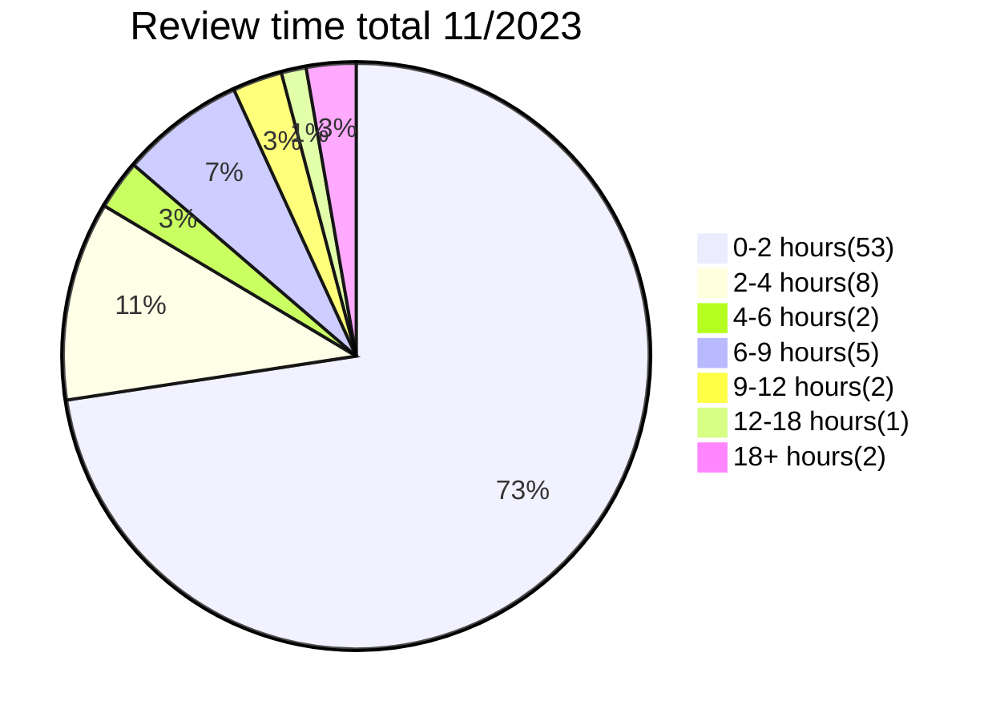
```mermaid
pie
title Review time total 11/2023
"0-2 hours(53)":53
"2-4 hours(8)":8
"4-6 hours(2)":2
"6-9 hours(5)":5
"9-12 hours(2)":2
"12-18 hours(1)":1
"18+ hours(2)":2
```

### Workload stats 11/2023

**Reviews conducted** - number of reviews conducted. 1 PR may have only single review.
**PR Size** - determined using the formula: `additions + deletions * 0.5`. Based on this calculation: 0-50: xs, 51-200: s, 201-400: m, 401-700: l, 701+: xl
| user | Total opened PRs | Total merged PRs | Additions/Deletions | PR size: xs/s/m/l/xl | Total comments | Reviews conducted |
| :------: | :------: | :------: | :------: | :------: | :------: | :------: |
| **dev4** | 11 | 9 | +2878/-1919 | 4/3/2/1/1 | 58 | 10 |
| **dev8** | 23 | 23 | +2535/-2379 | 16/4/1/0/2 | 5 | 24 |
| **dev5** | 13 | 12 | +1283/-627 | 10/0/2/1/0 | 10 | 25 |
| **dev6** | 19 | 17 | +2294/-1668 | 11/5/0/1/2 | 42 | 21 |
| **dev7** | 13 | 13 | +1568/-800 | 8/2/1/1/1 | 70 | 8 |
| **total** | 81 | 74 | +18759/-7452 | 50/14/6/4/7 | 190 | 76 |

### Pull request quality 11/2023

**Agreed** - discussions with at least 1 reaction :+1:.
**Disagreed** - discussions with at least 1 reaction :-1:.
| user | Total merged PRs | Changes requested received | Agreed / Disagreed / Total discussions received | Comments received |
| :------: | :------: | :------: | :------: | :------: |
| **dev4** | 9 | 5 | 18 / 2 / 21 | 30 |
| **dev8** | 23 | 0 | 3 / 2 / 3 | 3 |
| **dev5** | 12 | 1 | 2 / 0 / 2 | 4 |
| **dev6** | 17 | 4 | 18 / 4 / 21 | 22 |
| **dev7** | 13 | 4 | 28 / 5 / 31 | 34 |
| **total** | 74 | 14 | 71 / 13 / 80 | 95 |

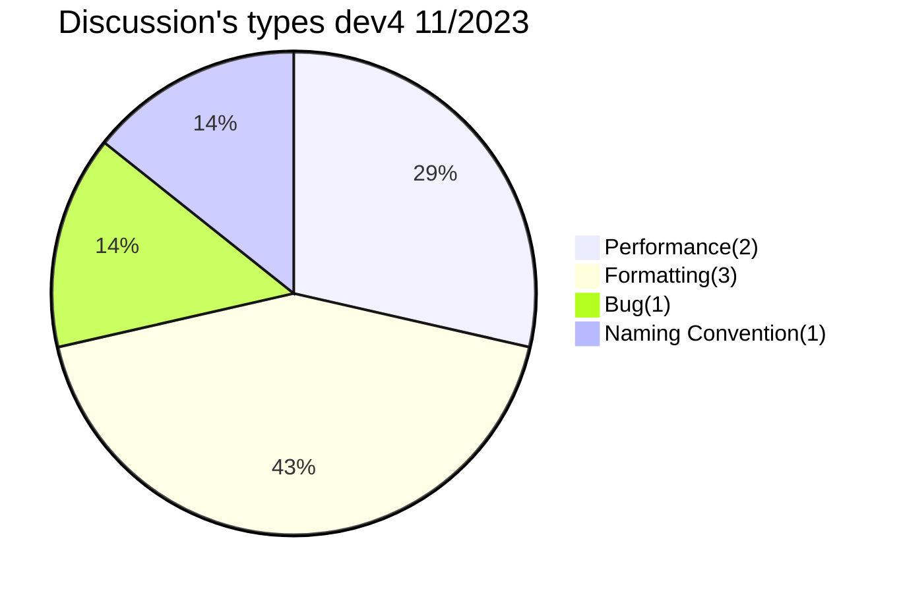
```mermaid
pie
title Discussion's types dev4 11/2023
"Performance(2)":2
"Formatting(3)":3
"Bug(1)":1
"Naming Convention(1)":1
```

```mermaid
pie
title Discussion's types dev8 11/2023
"Bug(1)":1
```

```mermaid
pie
title Discussion's types dev5 11/2023
"Formatting(1)":1
```

```mermaid
pie
title Discussion's types dev6 11/2023
"Overengineering(1)":1
"Naming Convention(1)":1
"Performance(1)":1
"Bug(1)":1
```

```mermaid
pie
title Discussion's types dev7 11/2023
"Naming Convention(1)":1
"Formatting(3)":3
"Bug(3)":3
"Overengineering(1)":1
"Performance(1)":1
```

```mermaid
pie
title Discussion's types total 11/2023
"Performance(4)":4
"Formatting(7)":7
"Bug(6)":6
"Naming Convention(3)":3
"Overengineering(3)":3
```

### Code review engagement 11/2023

**PR Size** - determined using the formula: `additions + deletions * 0.5`. Based on this calculation: 0-50: xs, 51-200: s, 201-400: m, 401-700: l, 701+: xl
**Changes requested / Comments / Approvals** - number of reviews conducted by user. For a single pull request, only one review of each status will be counted for a user.
**Agreed** - discussions with at least 1 reaction :+1:.
**Disagreed** - discussions with at least 1 reaction :-1:.
| user | Total merged PRs | Agreed / Disagreed / Total discussions conducted | Comments conducted | PR size: xs/s/m/l/xl | Changes requested / Commented / Approved | Review requests conducted |
| :------: | :------: | :------: | :------: | :------: | :------: | :------: |
| **dev4** | 9 | 5 / 2 / 5 | 5 | 6/3/0/0/1 | 0 / 5 / 6 | 67 |
| **dev8** | 23 | 44 / 6 / 50 | 63 | 12/4/2/3/3 | 11 / 4 / 24 | 52 |
| **dev5** | 12 | 18 / 5 / 21 | 22 | 16/5/1/1/2 | 3 / 3 / 22 | 64 |
| **dev6** | 17 | 1 / 0 / 1 | 1 | 16/1/2/1/1 | 0 / 1 / 21 | 60 |
| **dev7** | 13 | 2 / 0 / 2 | 2 | 3/4/1/0/0 | 0 / 1 / 8 | 63 |
| **total** | 74 | 71 / 13 / 80 | 95 | 50/14/6/4/7 | 14 / 12 / 75 | 306 |

### Pull requests timeline(75th percentile) total

**Time to review** - time from PR creation to first review.
**Time to approve** - time from PR creation to first approval without requested changes.
**Time to merge** - time from PR creation to merge.
| user | Time in draft | Time to review request | Time to review | Time to approve | Time to merge | Total merged PRs |
| :------: | :------: | :------: | :------: | :------: | :------: | :------: |
| **dev4** | 9 minutes | 8 minutes | 3 hours 1 minute | 7 hours 34 minutes | 16 hours 58 minutes | 38 |
| **dev8** | 7 minutes | 7 minutes | 2 hours 29 minutes | 2 hours 27 minutes | 11 hours 6 minutes | 42 |
| **dev5** | 16 minutes | 16 minutes | 8 hours 5 minutes | 9 hours 51 minutes | 42 hours 48 minutes | 14 |
| **dev6** | 7 minutes | 7 minutes | 2 hours 14 minutes | 2 hours 59 minutes | 37 hours 1 minute | 23 |
| **dev7** | 7 minutes | 7 minutes | 2 hours 15 minutes | 9 hours 19 minutes | 28 hours 44 minutes | 22 |
| **total** | 8 minutes | 7 minutes | 3 hours 8 minutes | 5 hours 45 minutes | 25 hours 47 minutes | 139 |

```mermaid
gantt
title Pull requests timeline(75th percentile) total / minutes
dateFormat X
axisFormat %s
section dev4
                Time in draft(9 minutes) :  0, 9
Time to review request(8 minutes) :  0, 8
Time to review(3 hours 1 minute) :  0, 181
Time to approve(7 hours 34 minutes) :  0, 454
Time to merge(16 hours 58 minutes) :  0, 1018

section dev8
                Time in draft(7 minutes) :  0, 7
Time to review request(7 minutes) :  0, 7
Time to review(2 hours 29 minutes) :  0, 149
Time to approve(2 hours 27 minutes) :  0, 147
Time to merge(11 hours 6 minutes) :  0, 666

section dev5
                Time in draft(16 minutes) :  0, 16
Time to review request(16 minutes) :  0, 16
Time to review(8 hours 5 minutes) :  0, 485
Time to approve(9 hours 51 minutes) :  0, 591
Time to merge(42 hours 48 minutes) :  0, 2568

section dev6
                Time in draft(7 minutes) :  0, 7
Time to review request(7 minutes) :  0, 7
Time to review(2 hours 14 minutes) :  0, 134
Time to approve(2 hours 59 minutes) :  0, 179
Time to merge(37 hours 1 minute) :  0, 2221

section dev7
                Time in draft(7 minutes) :  0, 7
Time to review request(7 minutes) :  0, 7
Time to review(2 hours 15 minutes) :  0, 135
Time to approve(9 hours 19 minutes) :  0, 559
Time to merge(28 hours 44 minutes) :  0, 1724

section total
                Time in draft(8 minutes) :  0, 8
Time to review request(7 minutes) :  0, 7
Time to review(3 hours 8 minutes) :  0, 188
Time to approve(5 hours 45 minutes) :  0, 345
Time to merge(25 hours 47 minutes) :  0, 1547

```

```mermaid
pie
title Review time dev4 total
"0-2 hours(24)":24
"2-4 hours(6)":6
"4-6 hours(4)":4
"9-12 hours(3)":3
"12-18 hours(1)":1
```

```mermaid
pie
title Review time dev8 total
"0-2 hours(28)":28
"2-4 hours(4)":4
"4-6 hours(3)":3
"6-9 hours(1)":1
"9-12 hours(1)":1
"12-18 hours(2)":2
"18+ hours(1)":1
```

```mermaid
pie
title Review time dev5 total
"0-2 hours(7)":7
"4-6 hours(1)":1
"6-9 hours(3)":3
"9-12 hours(1)":1
"12-18 hours(2)":2
```

```mermaid
pie
title Review time dev6 total
"0-2 hours(15)":15
"2-4 hours(5)":5
"4-6 hours(2)":2
```

```mermaid
pie
title Review time dev7 total
"0-2 hours(15)":15
"2-4 hours(2)":2
"4-6 hours(2)":2
"6-9 hours(1)":1
"18+ hours(1)":1
```

```mermaid
pie
title Review time total total
"0-2 hours(89)":89
"2-4 hours(17)":17
"4-6 hours(12)":12
"6-9 hours(5)":5
"9-12 hours(5)":5
"12-18 hours(5)":5
"18+ hours(3)":3
```

### Workload stats total

**Reviews conducted** - number of reviews conducted. 1 PR may have only single review.
**PR Size** - determined using the formula: `additions + deletions * 0.5`. Based on this calculation: 0-50: xs, 51-200: s, 201-400: m, 401-700: l, 701+: xl
| user | Total opened PRs | Total merged PRs | Additions/Deletions | PR size: xs/s/m/l/xl | Total comments | Reviews conducted |
| :------: | :------: | :------: | :------: | :------: | :------: | :------: |
| **dev4** | 43 | 38 | +5306/-8705 | 24/8/6/1/4 | 102 | 22 |
| **dev8** | 43 | 42 | +3489/-4546 | 27/10/2/2/2 | 11 | 52 |
| **dev5** | 15 | 14 | +1298/-630 | 12/0/2/1/0 | 11 | 38 |
| **dev6** | 25 | 23 | +3458/-2172 | 14/6/1/1/3 | 70 | 25 |
| **dev7** | 22 | 22 | +7121/-5506 | 14/3/2/1/2 | 92 | 19 |
| **total** | 150 | 139 | +28873/-21618 | 92/27/13/6/12 | 291 | 139 |

### Pull request quality total

**Agreed** - discussions with at least 1 reaction :+1:.
**Disagreed** - discussions with at least 1 reaction :-1:.
| user | Total merged PRs | Changes requested received | Agreed / Disagreed / Total discussions received | Comments received |
| :------: | :------: | :------: | :------: | :------: |
| **dev4** | 38 | 10 | 30 / 3 / 33 | 52 |
| **dev8** | 42 | 1 | 5 / 2 / 5 | 6 |
| **dev5** | 14 | 1 | 3 / 1 / 3 | 5 |
| **dev6** | 23 | 5 | 31 / 6 / 36 | 38 |
| **dev7** | 22 | 6 | 36 / 6 / 41 | 46 |
| **total** | 139 | 23 | 107 / 18 / 120 | 149 |

```mermaid
pie
title Discussion's types dev4 total
"Bug(2)":2
"Performance(2)":2
"Formatting(3)":3
"Naming Convention(1)":1
```

```mermaid
pie
title Discussion's types dev8 total
"Bug(2)":2
```

```mermaid
pie
title Discussion's types dev5 total
"Formatting(1)":1
```

```mermaid
pie
title Discussion's types dev6 total
"Performance(2)":2
"Bug(2)":2
"Overengineering(1)":1
"Naming Convention(1)":1
```

```mermaid
pie
title Discussion's types dev7 total
"Bug(5)":5
"Formatting(5)":5
"Performance(2)":2
"Naming Convention(1)":1
"Overengineering(1)":1
```

```mermaid
pie
title Discussion's types total total
"Bug(11)":11
"Performance(6)":6
"Formatting(9)":9
"Naming Convention(3)":3
"Overengineering(3)":3
```

### Code review engagement total

**PR Size** - determined using the formula: `additions + deletions * 0.5`. Based on this calculation: 0-50: xs, 51-200: s, 201-400: m, 401-700: l, 701+: xl
**Changes requested / Comments / Approvals** - number of reviews conducted by user. For a single pull request, only one review of each status will be counted for a user.
**Agreed** - discussions with at least 1 reaction :+1:.
**Disagreed** - discussions with at least 1 reaction :-1:.
| user | Total merged PRs | Agreed / Disagreed / Total discussions conducted | Comments conducted | PR size: xs/s/m/l/xl | Changes requested / Commented / Approved | Review requests conducted |
| :------: | :------: | :------: | :------: | :------: | :------: | :------: |
| **dev4** | 38 | 9 / 2 / 9 | 9 | 13/6/1/1/1 | 0 / 6 / 18 | 104 |
| **dev8** | 42 | 71 / 10 / 81 | 107 | 26/9/6/3/8 | 19 / 11 / 52 | 101 |
| **dev5** | 14 | 22 / 5 / 25 | 27 | 23/7/2/3/3 | 4 / 3 / 35 | 131 |
| **dev6** | 23 | 2 / 1 / 2 | 2 | 20/1/2/1/1 | 0 / 2 / 25 | 123 |
| **dev7** | 22 | 2 / 0 / 2 | 2 | 11/6/2/0/0 | 0 / 1 / 19 | 122 |
| **total** | 139 | 107 / 18 / 120 | 149 | 92/27/13/6/12 | 23 / 21 / 138 | 581 |

```mermaid
gantt
title Pull request's retrospective timeline(75th percentile) dev4 / minutes
dateFormat X
axisFormat %s
section 12/2023
                Time in draft(7 minutes) :  0, 7
Time to review request(7 minutes) :  0, 7
Time to review(4 hours 12 minutes) :  0, 252
Time to approve(7 hours 32 minutes) :  0, 452
Time to merge(15 hours 31 minutes) :  0, 931

section 11/2023
                Time in draft(17 minutes) :  0, 17
Time to review request(10 minutes) :  0, 10
Time to review(55 minutes) :  0, 55
Time to approve(8 hours 4 minutes) :  0, 484
Time to merge(17 hours 1 minute) :  0, 1021

```

```mermaid
gantt
title Pull request's retrospective timeline(75th percentile) dev8 / minutes
dateFormat X
axisFormat %s
section 12/2023
                Time in draft(8 minutes) :  0, 8
Time to review request(7 minutes) :  0, 7
Time to review(3 hours 14 minutes) :  0, 194
Time to approve(3 hours 14 minutes) :  0, 194
Time to merge(16 hours 23 minutes) :  0, 983

section 11/2023
                Time in draft(6 minutes) :  0, 6
Time to review request(6 minutes) :  0, 6
Time to review(1 hour 10 minutes) :  0, 70
Time to approve(1 hour 30 minutes) :  0, 90
Time to merge(3 hours 29 minutes) :  0, 209

```

```mermaid
gantt
title Pull request's retrospective timeline(75th percentile) dev5 / minutes
dateFormat X
axisFormat %s
section 12/2023
                Time in draft(6 minutes) :  0, 6
Time to review request(6 minutes) :  0, 6
Time to review(7 hours 43 minutes) :  0, 463
Time to approve(12 hours 13 minutes) :  0, 733
Time to merge(50 hours 11 minutes) :  0, 3011

section 11/2023
                Time in draft(18 minutes) :  0, 18
Time to review request(18 minutes) :  0, 18
Time to review(8 hours 3 minutes) :  0, 483
Time to approve(8 hours 7 minutes) :  0, 487
Time to merge(36 hours 28 minutes) :  0, 2188

```

```mermaid
gantt
title Pull request's retrospective timeline(75th percentile) dev6 / minutes
dateFormat X
axisFormat %s
section 12/2023
                Time in draft(29 minutes) :  0, 29
Time to review request(29 minutes) :  0, 29
Time to review(3 hours 48 minutes) :  0, 228
Time to approve(3 hours 48 minutes) :  0, 228
Time to merge(32 hours 29 minutes) :  0, 1949

section 11/2023
                Time in draft(7 minutes) :  0, 7
Time to review request(7 minutes) :  0, 7
Time to review(1 hour 59 minutes) :  0, 119
Time to approve(2 hours 19 minutes) :  0, 139
Time to merge(35 hours 34 minutes) :  0, 2134

```

```mermaid
gantt
title Pull request's retrospective timeline(75th percentile) dev7 / minutes
dateFormat X
axisFormat %s
section 12/2023
                Time in draft(13 minutes) :  0, 13
Time to review request(13 minutes) :  0, 13
Time to review(3 hours 50 minutes) :  0, 230
Time to approve(9 hours 19 minutes) :  0, 559
Time to merge(48 hours 18 minutes) :  0, 2898

section 11/2023
                Time in draft(6 minutes) :  0, 6
Time to review request(6 minutes) :  0, 6
Time to review(1 hour 30 minutes) :  0, 90
Time to approve(8 hours) :  0, 480
Time to merge(25 hours 1 minute) :  0, 1501

```

```mermaid
gantt
title Pull request's retrospective timeline(75th percentile) total / minutes
dateFormat X
axisFormat %s
section 12/2023
                Time in draft(8 minutes) :  0, 8
Time to review request(8 minutes) :  0, 8
Time to review(4 hours 21 minutes) :  0, 261
Time to approve(6 hours 14 minutes) :  0, 374
Time to merge(24 hours 52 minutes) :  0, 1492

section 11/2023
                Time in draft(7 minutes) :  0, 7
Time to review request(7 minutes) :  0, 7
Time to review(2 hours 16 minutes) :  0, 136
Time to approve(5 hours 9 minutes) :  0, 309
Time to merge(26 hours 13 minutes) :  0, 1573

```
