## Pull Request report

This report based on 144 last updated PRs. To learn more about the project and its configuration, please visit [Pull request analytics action](https://github.com/AlexSim93/pull-request-analytics-action).

Below are the settings applied for this report:

```
GITHUB_OWNERS_REPOS: owner/repo
GITHUB_OWNER_FOR_ISSUE: owner
GITHUB_REPO_FOR_ISSUE: repo
ASSIGNEES: dev2
LABELS: Analytics
SHOW_STATS_TYPES: timeline, workload, pr-quality, code-review-engagement
TOP_LIST_AMOUNT: 0
AGGREGATE_VALUE_METHODS: percentile
PERCENTILE: 75
TIMEZONE: Europe/Berlin
CORE_HOURS_START: 09:00
CORE_HOURS_END: 18:00
REPORT_DATE_START: 01/06/2023
REPORT_DATE_END: 01/08/2023
AMOUNT: 5
PERIOD_SPLIT_UNIT: months
EXECUTION_OUTCOME: markdown
```

### Pull requests timeline(75th percentile) 7/2023

**Time to review** - time from PR creation to first review.
**Time to approve** - time from PR creation to first approval without requested changes.
**Time to merge** - time from PR creation to merge.
| user | Time in draft | Time to review request | Time to review | Time to approve | Time to merge | Total merged PRs |
| :------: | :------: | :------: | :------: | :------: | :------: | :------: |
| **dev1** | | | 3 hours 24 minutes | 11 hours 50 minutes | 22 hours 17 minutes | 13 |
| **dev2** | | 16 hours | 1 hour 16 minutes | 1 hour 22 minutes | 16 hours | 20 |
| **dev3** | | 24 hours 30 minutes | 1 hour 9 minutes | 22 hours 33 minutes | 24 hours 30 minutes | 13 |
| **dev4** | | 24 hours 5 minutes | 51 minutes | 1 hour 7 minutes | 24 hours 5 minutes | 7 |
| **dev5** | | | | | | 1 |
| **dev6** | | 16 hours 36 minutes | 3 hours 6 minutes | 4 hours 40 minutes | 16 hours 36 minutes | 11 |
| **total** | | 16 hours 54 minutes | 1 hour 55 minutes | 4 hours 43 minutes | 20 hours 12 minutes | 65 |

```mermaid
gantt
title Pull requests timeline(75th percentile) 7/2023 / minutes
dateFormat X
axisFormat %s
section dev1
                Time in draft() :  0, 0
Time to review request() :  0, 0
Time to review(3 hours 24 minutes) :  0, 204
Time to approve(11 hours 50 minutes) :  0, 710
Time to merge(22 hours 17 minutes) :  0, 1337

section dev2
                Time in draft() :  0, 0
Time to review request(16 hours) :  0, 960
Time to review(1 hour 16 minutes) :  0, 76
Time to approve(1 hour 22 minutes) :  0, 82
Time to merge(16 hours) :  0, 960

section dev3
                Time in draft() :  0, 0
Time to review request(24 hours 30 minutes) :  0, 1470
Time to review(1 hour 9 minutes) :  0, 69
Time to approve(22 hours 33 minutes) :  0, 1353
Time to merge(24 hours 30 minutes) :  0, 1470

section dev4
                Time in draft() :  0, 0
Time to review request(24 hours 5 minutes) :  0, 1445
Time to review(51 minutes) :  0, 51
Time to approve(1 hour 7 minutes) :  0, 67
Time to merge(24 hours 5 minutes) :  0, 1445

section dev6
                Time in draft() :  0, 0
Time to review request(16 hours 36 minutes) :  0, 996
Time to review(3 hours 6 minutes) :  0, 186
Time to approve(4 hours 40 minutes) :  0, 280
Time to merge(16 hours 36 minutes) :  0, 996

section total
                Time in draft() :  0, 0
Time to review request(16 hours 54 minutes) :  0, 1014
Time to review(1 hour 55 minutes) :  0, 115
Time to approve(4 hours 43 minutes) :  0, 283
Time to merge(20 hours 12 minutes) :  0, 1212

```



### Workload stats 7/2023

**Reviews conducted** - number of reviews conducted. 1 PR may have only single review.
**PR Size** - determined using the formula: `additions + deletions * 0.5`. Based on this calculation: 0-50: xs, 51-200: s, 201-400: m, 401-700: l, 701+: xl
| user | Total opened PRs | Total merged PRs | Additions/Deletions | PR size: xs/s/m/l/xl | Total comments | Reviews conducted |
| :------: | :------: | :------: | :------: | :------: | :------: | :------: |
| **dev1** | 14 | 13 | +1042/-376 | 10/1/2/1/0 | 61 | 1 |
| **dev2** | 20 | 20 | +1623/-804 | 10/8/1/0/1 | 17 | 29 |
| **dev3** | 13 | 13 | +2950/-436 | 8/0/3/1/1 | 81 | 9 |
| **dev4** | 7 | 7 | +873/-104 | 5/1/0/1/0 | 11 | 16 |
| **dev5** | 1 | 1 | +1/-1 | 1/0/0/0/0 | 0 | 0 |
| **dev6** | 11 | 11 | +1907/-1078 | 4/3/2/1/1 | 10 | 24 |
| **total** | 66 | 65 | +8396/-2799 | 38/13/8/4/3 | 180 | 64 |

### Pull request quality 7/2023

**Agreed** - discussions with at least 1 reaction :+1:.
**Disagreed** - discussions with at least 1 reaction :-1:.
| user | Total merged PRs | Changes requested received | Agreed / Disagreed / Total discussions received | Comments received |
| :------: | :------: | :------: | :------: | :------: |
| **dev1** | 13 | 5 | 0 / 0 / 20 | 31 |
| **dev2** | 20 | 1 | 0 / 0 / 6 | 10 |
| **dev3** | 13 | 6 | 0 / 0 / 35 | 40 |
| **dev4** | 7 | 2 | 0 / 0 / 6 | 7 |
| **dev5** | 1 | 0 | 0 / 0 / 0 | 0 |
| **dev6** | 11 | 2 | 0 / 0 / 6 | 6 |
| **total** | 65 | 16 | 0 / 0 / 73 | 94 |

### Code review engagement 7/2023

**PR Size** - determined using the formula: `additions + deletions * 0.5`. Based on this calculation: 0-50: xs, 51-200: s, 201-400: m, 401-700: l, 701+: xl
**Changes requested / Comments / Approvals** - number of reviews conducted by user. For a single pull request, only one review of each status will be counted for a user.
**Agreed** - discussions with at least 1 reaction :+1:.
**Disagreed** - discussions with at least 1 reaction :-1:.
| user | Total merged PRs | Agreed / Disagreed / Total discussions conducted | Comments conducted | PR size: xs/s/m/l/xl | Changes requested / Commented / Approved | Review requests conducted |
| :------: | :------: | :------: | :------: | :------: | :------: | :------: |
| **dev1** | 13 | 0 / 0 / 1 | 1 | 0/1/0/0/0 | 0 / 0 / 1 | 0 |
| **dev2** | 20 | 0 / 0 / 56 | 70 | 16/3/5/4/1 | 14 / 9 / 27 | 14 |
| **dev3** | 13 | 0 / 0 / 1 | 4 | 5/3/1/0/0 | 0 / 1 / 8 | 14 |
| **dev4** | 7 | 0 / 0 / 1 | 1 | 10/3/1/0/2 | 0 / 1 / 16 | 1 |
| **dev5** | 1 | 0 / 0 / 0 | 0 | 0/0/0/0/0 | 0 / 0 / 0 | 0 |
| **dev6** | 11 | 0 / 0 / 14 | 18 | 15/7/2/0/0 | 3 / 5 / 21 | 3 |
| **total** | 65 | 0 / 0 / 73 | 94 | 38/13/8/4/3 | 16 / 17 / 63 | 32 |

### Pull requests timeline(75th percentile) 6/2023

**Time to review** - time from PR creation to first review.
**Time to approve** - time from PR creation to first approval without requested changes.
**Time to merge** - time from PR creation to merge.
| user | Time in draft | Time to review request | Time to review | Time to approve | Time to merge | Total merged PRs |
| :------: | :------: | :------: | :------: | :------: | :------: | :------: |
| **dev1** | | | 1 hour 47 minutes | 4 hours 47 minutes | 12 hours 1 minute | 13 |
| **dev2** | | 6 hours 12 minutes | 1 hour 37 minutes | 2 hours 16 minutes | 6 hours 12 minutes | 17 |
| **dev3** | | 11 hours 27 minutes | 48 minutes | 2 hours 4 minutes | 11 hours 27 minutes | 17 |
| **dev4** | | 29 hours 43 minutes | 5 hours 18 minutes | 6 hours 7 minutes | 29 hours 43 minutes | 20 |
| **dev6** | | 38 hours 24 minutes | 1 hour 7 minutes | 1 hour 7 minutes | 38 hours 24 minutes | 10 |
| **total** | | 23 hours 33 minutes | 1 hour 35 minutes | 3 hours 48 minutes | 22 hours 21 minutes | 77 |

```mermaid
gantt
title Pull requests timeline(75th percentile) 6/2023 / minutes
dateFormat X
axisFormat %s
section dev1
                Time in draft() :  0, 0
Time to review request() :  0, 0
Time to review(1 hour 47 minutes) :  0, 107
Time to approve(4 hours 47 minutes) :  0, 287
Time to merge(12 hours 1 minute) :  0, 721

section dev2
                Time in draft() :  0, 0
Time to review request(6 hours 12 minutes) :  0, 372
Time to review(1 hour 37 minutes) :  0, 97
Time to approve(2 hours 16 minutes) :  0, 136
Time to merge(6 hours 12 minutes) :  0, 372

section dev3
                Time in draft() :  0, 0
Time to review request(11 hours 27 minutes) :  0, 687
Time to review(48 minutes) :  0, 48
Time to approve(2 hours 4 minutes) :  0, 124
Time to merge(11 hours 27 minutes) :  0, 687

section dev4
                Time in draft() :  0, 0
Time to review request(29 hours 43 minutes) :  0, 1783
Time to review(5 hours 18 minutes) :  0, 318
Time to approve(6 hours 7 minutes) :  0, 367
Time to merge(29 hours 43 minutes) :  0, 1783

section dev6
                Time in draft() :  0, 0
Time to review request(38 hours 24 minutes) :  0, 2304
Time to review(1 hour 7 minutes) :  0, 67
Time to approve(1 hour 7 minutes) :  0, 67
Time to merge(38 hours 24 minutes) :  0, 2304

section total
                Time in draft() :  0, 0
Time to review request(23 hours 33 minutes) :  0, 1413
Time to review(1 hour 35 minutes) :  0, 95
Time to approve(3 hours 48 minutes) :  0, 228
Time to merge(22 hours 21 minutes) :  0, 1341

```



### Workload stats 6/2023

**Reviews conducted** - number of reviews conducted. 1 PR may have only single review.
**PR Size** - determined using the formula: `additions + deletions * 0.5`. Based on this calculation: 0-50: xs, 51-200: s, 201-400: m, 401-700: l, 701+: xl
| user | Total opened PRs | Total merged PRs | Additions/Deletions | PR size: xs/s/m/l/xl | Total comments | Reviews conducted |
| :------: | :------: | :------: | :------: | :------: | :------: | :------: |
| **dev1** | 13 | 13 | +1697/-351 | 7/5/0/0/1 | 42 | 0 |
| **dev2** | 17 | 17 | +2324/-922 | 8/6/1/1/1 | 25 | 28 |
| **dev3** | 17 | 17 | +1305/-310 | 13/2/1/0/1 | 111 | 4 |
| **dev7** | 1 | 0 | +8/-75 | 1/0/0/0/0 | 5 | 0 |
| **dev4** | 20 | 20 | +1914/-1067 | 13/3/2/1/1 | 21 | 30 |
| **dev5** | 0 | 0 | +0/-0 | 0/0/0/0/0 | 0 | 1 |
| **dev6** | 10 | 10 | +1147/-754 | 5/1/3/1/0 | 16 | 25 |
| **total** | 78 | 77 | +8395/-3479 | 47/17/7/3/4 | 220 | 78 |

### Pull request quality 6/2023

**Agreed** - discussions with at least 1 reaction :+1:.
**Disagreed** - discussions with at least 1 reaction :-1:.
| user | Total merged PRs | Changes requested received | Agreed / Disagreed / Total discussions received | Comments received |
| :------: | :------: | :------: | :------: | :------: |
| **dev1** | 13 | 5 | 0 / 0 / 18 | 20 |
| **dev2** | 17 | 1 | 0 / 0 / 10 | 13 |
| **dev3** | 17 | 4 | 0 / 0 / 41 | 59 |
| **dev7** | 0 | 0 | 0 / 0 / 1 | 3 |
| **dev4** | 20 | 2 | 0 / 0 / 9 | 10 |
| **dev5** | 0 | 0 | 0 / 0 / 0 | 0 |
| **dev6** | 10 | 1 | 0 / 0 / 11 | 12 |
| **total** | 77 | 13 | 0 / 0 / 90 | 117 |

### Code review engagement 6/2023

**PR Size** - determined using the formula: `additions + deletions * 0.5`. Based on this calculation: 0-50: xs, 51-200: s, 201-400: m, 401-700: l, 701+: xl
**Changes requested / Comments / Approvals** - number of reviews conducted by user. For a single pull request, only one review of each status will be counted for a user.
**Agreed** - discussions with at least 1 reaction :+1:.
**Disagreed** - discussions with at least 1 reaction :-1:.
| user | Total merged PRs | Agreed / Disagreed / Total discussions conducted | Comments conducted | PR size: xs/s/m/l/xl | Changes requested / Commented / Approved | Review requests conducted |
| :------: | :------: | :------: | :------: | :------: | :------: | :------: |
| **dev1** | 13 | 0 / 0 / 0 | 0 | 0/0/0/0/0 | 0 / 0 / 0 | 0 |
| **dev2** | 17 | 0 / 0 / 69 | 90 | 14/7/3/1/3 | 9 / 7 / 26 | 12 |
| **dev3** | 17 | 0 / 0 / 2 | 4 | 2/0/1/0/1 | 0 / 1 / 3 | 8 |
| **dev4** | 20 | 0 / 0 / 0 | 0 | 22/5/3/0/0 | 0 / 0 / 30 | 1 |
| **dev5** | 0 | 0 / 0 / 1 | 3 | 1/0/0/0/0 | 0 / 1 / 0 | 0 |
| **dev6** | 10 | 0 / 0 / 18 | 20 | 14/6/2/2/1 | 4 / 3 / 24 | 8 |
| **total** | 77 | 0 / 0 / 90 | 117 | 47/17/7/3/4 | 13 / 17 / 78 | 29 |

### Pull requests timeline(75th percentile) total

**Time to review** - time from PR creation to first review.
**Time to approve** - time from PR creation to first approval without requested changes.
**Time to merge** - time from PR creation to merge.
| user | Time in draft | Time to review request | Time to review | Time to approve | Time to merge | Total merged PRs |
| :------: | :------: | :------: | :------: | :------: | :------: | :------: |
| **dev1** | | | 2 hours 27 minutes | 7 hours 33 minutes | 18 hours 40 minutes | 26 |
| **dev2** | | 10 hours 54 minutes | 1 hour 28 minutes | 2 hours 7 minutes | 10 hours 54 minutes | 37 |
| **dev3** | | 12 hours 35 minutes | 1 hour 9 minutes | 4 hours 51 minutes | 12 hours 35 minutes | 30 |
| **dev4** | | 30 hours 9 minutes | 1 hour 16 minutes | 4 hours 18 minutes | 30 hours 9 minutes | 27 |
| **dev5** | | | | | | 1 |
| **dev6** | | 36 hours 32 minutes | 1 hour 42 minutes | 2 hours 34 minutes | 36 hours 32 minutes | 21 |
| **total** | | 21 hours 59 minutes | 1 hour 47 minutes | 3 hours 53 minutes | 21 hours 17 minutes | 142 |

```mermaid
gantt
title Pull requests timeline(75th percentile) total / minutes
dateFormat X
axisFormat %s
section dev1
                Time in draft() :  0, 0
Time to review request() :  0, 0
Time to review(2 hours 27 minutes) :  0, 147
Time to approve(7 hours 33 minutes) :  0, 453
Time to merge(18 hours 40 minutes) :  0, 1120

section dev2
                Time in draft() :  0, 0
Time to review request(10 hours 54 minutes) :  0, 654
Time to review(1 hour 28 minutes) :  0, 88
Time to approve(2 hours 7 minutes) :  0, 127
Time to merge(10 hours 54 minutes) :  0, 654

section dev3
                Time in draft() :  0, 0
Time to review request(12 hours 35 minutes) :  0, 755
Time to review(1 hour 9 minutes) :  0, 69
Time to approve(4 hours 51 minutes) :  0, 291
Time to merge(12 hours 35 minutes) :  0, 755

section dev4
                Time in draft() :  0, 0
Time to review request(30 hours 9 minutes) :  0, 1809
Time to review(1 hour 16 minutes) :  0, 76
Time to approve(4 hours 18 minutes) :  0, 258
Time to merge(30 hours 9 minutes) :  0, 1809

section dev6
                Time in draft() :  0, 0
Time to review request(36 hours 32 minutes) :  0, 2192
Time to review(1 hour 42 minutes) :  0, 102
Time to approve(2 hours 34 minutes) :  0, 154
Time to merge(36 hours 32 minutes) :  0, 2192

section total
                Time in draft() :  0, 0
Time to review request(21 hours 59 minutes) :  0, 1319
Time to review(1 hour 47 minutes) :  0, 107
Time to approve(3 hours 53 minutes) :  0, 233
Time to merge(21 hours 17 minutes) :  0, 1277

```



### Workload stats total

**Reviews conducted** - number of reviews conducted. 1 PR may have only single review.
**PR Size** - determined using the formula: `additions + deletions * 0.5`. Based on this calculation: 0-50: xs, 51-200: s, 201-400: m, 401-700: l, 701+: xl
| user | Total opened PRs | Total merged PRs | Additions/Deletions | PR size: xs/s/m/l/xl | Total comments | Reviews conducted |
| :------: | :------: | :------: | :------: | :------: | :------: | :------: |
| **dev1** | 27 | 26 | +2739/-727 | 17/6/2/1/1 | 103 | 1 |
| **dev2** | 37 | 37 | +3947/-1726 | 18/14/2/1/2 | 42 | 57 |
| **dev3** | 30 | 30 | +4255/-746 | 21/2/4/1/2 | 192 | 13 |
| **dev7** | 1 | 0 | +8/-75 | 1/0/0/0/0 | 5 | 0 |
| **dev4** | 27 | 27 | +2787/-1171 | 18/4/2/2/1 | 32 | 46 |
| **dev5** | 1 | 1 | +1/-1 | 1/0/0/0/0 | 0 | 1 |
| **dev6** | 21 | 21 | +3054/-1832 | 9/4/5/2/1 | 26 | 49 |
| **total** | 144 | 142 | +16791/-6278 | 85/30/15/7/7 | 400 | 142 |

### Pull request quality total

**Agreed** - discussions with at least 1 reaction :+1:.
**Disagreed** - discussions with at least 1 reaction :-1:.
| user | Total merged PRs | Changes requested received | Agreed / Disagreed / Total discussions received | Comments received |
| :------: | :------: | :------: | :------: | :------: |
| **dev1** | 26 | 10 | 0 / 0 / 38 | 51 |
| **dev2** | 37 | 2 | 0 / 0 / 16 | 23 |
| **dev3** | 30 | 10 | 0 / 0 / 76 | 99 |
| **dev7** | 0 | 0 | 0 / 0 / 1 | 3 |
| **dev4** | 27 | 4 | 0 / 0 / 15 | 17 |
| **dev5** | 1 | 0 | 0 / 0 / 0 | 0 |
| **dev6** | 21 | 3 | 0 / 0 / 17 | 18 |
| **total** | 142 | 29 | 0 / 0 / 163 | 211 |

### Code review engagement total

**PR Size** - determined using the formula: `additions + deletions * 0.5`. Based on this calculation: 0-50: xs, 51-200: s, 201-400: m, 401-700: l, 701+: xl
**Changes requested / Comments / Approvals** - number of reviews conducted by user. For a single pull request, only one review of each status will be counted for a user.
**Agreed** - discussions with at least 1 reaction :+1:.
**Disagreed** - discussions with at least 1 reaction :-1:.
| user | Total merged PRs | Agreed / Disagreed / Total discussions conducted | Comments conducted | PR size: xs/s/m/l/xl | Changes requested / Commented / Approved | Review requests conducted |
| :------: | :------: | :------: | :------: | :------: | :------: | :------: |
| **dev1** | 26 | 0 / 0 / 1 | 1 | 0/1/0/0/0 | 0 / 0 / 1 | 0 |
| **dev2** | 37 | 0 / 0 / 125 | 160 | 30/10/8/5/4 | 23 / 16 / 53 | 26 |
| **dev3** | 30 | 0 / 0 / 3 | 8 | 7/3/2/0/1 | 0 / 2 / 11 | 22 |
| **dev4** | 27 | 0 / 0 / 1 | 1 | 32/8/4/0/2 | 0 / 1 / 46 | 2 |
| **dev5** | 1 | 0 / 0 / 1 | 3 | 1/0/0/0/0 | 0 / 1 / 0 | 0 |
| **dev6** | 21 | 0 / 0 / 32 | 38 | 29/13/4/2/1 | 7 / 8 / 45 | 11 |
| **total** | 142 | 0 / 0 / 163 | 211 | 85/30/15/7/7 | 29 / 34 / 141 | 61 |

```mermaid
gantt
title Pull request's retrospective timeline(75th percentile) dev1 / minutes
dateFormat X
axisFormat %s
section 7/2023
                Time in draft() :  0, 0
Time to review request() :  0, 0
Time to review(3 hours 24 minutes) :  0, 204
Time to approve(11 hours 50 minutes) :  0, 710
Time to merge(22 hours 17 minutes) :  0, 1337

section 6/2023
                Time in draft() :  0, 0
Time to review request() :  0, 0
Time to review(1 hour 47 minutes) :  0, 107
Time to approve(4 hours 47 minutes) :  0, 287
Time to merge(12 hours 1 minute) :  0, 721

```

```mermaid
gantt
title Pull request's retrospective timeline(75th percentile) dev2 / minutes
dateFormat X
axisFormat %s
section 7/2023
                Time in draft() :  0, 0
Time to review request(16 hours) :  0, 960
Time to review(1 hour 16 minutes) :  0, 76
Time to approve(1 hour 22 minutes) :  0, 82
Time to merge(16 hours) :  0, 960

section 6/2023
                Time in draft() :  0, 0
Time to review request(6 hours 12 minutes) :  0, 372
Time to review(1 hour 37 minutes) :  0, 97
Time to approve(2 hours 16 minutes) :  0, 136
Time to merge(6 hours 12 minutes) :  0, 372

```

```mermaid
gantt
title Pull request's retrospective timeline(75th percentile) dev3 / minutes
dateFormat X
axisFormat %s
section 7/2023
                Time in draft() :  0, 0
Time to review request(24 hours 30 minutes) :  0, 1470
Time to review(1 hour 9 minutes) :  0, 69
Time to approve(22 hours 33 minutes) :  0, 1353
Time to merge(24 hours 30 minutes) :  0, 1470

section 6/2023
                Time in draft() :  0, 0
Time to review request(11 hours 27 minutes) :  0, 687
Time to review(48 minutes) :  0, 48
Time to approve(2 hours 4 minutes) :  0, 124
Time to merge(11 hours 27 minutes) :  0, 687

```

```mermaid
gantt
title Pull request's retrospective timeline(75th percentile) dev4 / minutes
dateFormat X
axisFormat %s
section 7/2023
                Time in draft() :  0, 0
Time to review request(24 hours 5 minutes) :  0, 1445
Time to review(51 minutes) :  0, 51
Time to approve(1 hour 7 minutes) :  0, 67
Time to merge(24 hours 5 minutes) :  0, 1445

section 6/2023
                Time in draft() :  0, 0
Time to review request(29 hours 43 minutes) :  0, 1783
Time to review(5 hours 18 minutes) :  0, 318
Time to approve(6 hours 7 minutes) :  0, 367
Time to merge(29 hours 43 minutes) :  0, 1783

```

```mermaid
gantt
title Pull request's retrospective timeline(75th percentile) dev6 / minutes
dateFormat X
axisFormat %s
section 7/2023
                Time in draft() :  0, 0
Time to review request(16 hours 36 minutes) :  0, 996
Time to review(3 hours 6 minutes) :  0, 186
Time to approve(4 hours 40 minutes) :  0, 280
Time to merge(16 hours 36 minutes) :  0, 996

section 6/2023
                Time in draft() :  0, 0
Time to review request(38 hours 24 minutes) :  0, 2304
Time to review(1 hour 7 minutes) :  0, 67
Time to approve(1 hour 7 minutes) :  0, 67
Time to merge(38 hours 24 minutes) :  0, 2304

```

```mermaid
gantt
title Pull request's retrospective timeline(75th percentile) total / minutes
dateFormat X
axisFormat %s
section 7/2023
                Time in draft() :  0, 0
Time to review request(16 hours 54 minutes) :  0, 1014
Time to review(1 hour 55 minutes) :  0, 115
Time to approve(4 hours 43 minutes) :  0, 283
Time to merge(20 hours 12 minutes) :  0, 1212

section 6/2023
                Time in draft() :  0, 0
Time to review request(23 hours 33 minutes) :  0, 1413
Time to review(1 hour 35 minutes) :  0, 95
Time to approve(3 hours 48 minutes) :  0, 228
Time to merge(22 hours 21 minutes) :  0, 1341

```












