## Pull Request report
  This report based on 155 last updated PRs. To learn more about the project and its configuration, please visit [Pull request analytics action](https://github.com/AlexSim93/pull-request-analytics-action).
  
Below are the settings applied for this report:
```
GITHUB_OWNERS_REPOS: AlexSim93/example-repo
GITHUB_OWNER_FOR_ISSUE: AlexSim93
GITHUB_REPO_FOR_ISSUE: lang-card
SHOW_STATS_TYPES: timeline, workload, pr-quality, code-review-engagement, response-time
REVIEW_TIME_INTERVALS: 2,4,8,12,16,24
TOP_LIST_AMOUNT: 0
AGGREGATE_VALUE_METHODS: percentile
SHOW_CORRELATION_GRAPHS: true
SHOW_ACTIVITY_TIME_GRAPHS: true
PERCENTILE: 75
SHOW_USERS: dev1, dev2, dev3, dev4, dev5, total
TIMEZONE: Europe/Berlin
CORE_HOURS_START: 09:00
CORE_HOURS_END: 19:00
REPORT_DATE_START: 01/10/2024
REPORT_DATE_END: 30/11/2024
AMOUNT: 500
PERIOD_SPLIT_UNIT: months
USE_CHARTS: false
EXECUTION_OUTCOME: markdown
```
    
  
    
    
  

### Pull requests timeline(75th percentile) 11/2024
**Time to review** - time from PR creation to first review. 
**Time to approve** - time from PR creation to first approval without requested changes. 
**Time to merge** - time from PR creation to merge.
| user | Time in draft | Time to review request | Time to review | Time to Review After Re-request | Time to approve | Time to merge | Total merged PRs |
| :------: | :------: | :------: | :------: | :------: | :------: | :------: | :------: |
| **dev1** | 4 minutes | 4 minutes | 1 hour 40 minutes |  | 1 hour 42 minutes | 10 hours 1 minute | 4 |
| **dev2** | 45 minutes | 45 minutes | 1 hour 16 minutes | 4 hours 50 minutes | 6 hours 1 minute | 15 hours 53 minutes | 17 |
| **dev3** | 26 minutes | 24 minutes | 1 hour 51 minutes |  | 9 hours 33 minutes | 23 hours 16 minutes | 13 |
| **dev4** | 10 minutes | 12 minutes | 1 hour 9 minutes | 57 minutes | 1 hour 9 minutes | 9 hours 17 minutes | 13 |
| **dev5** | 7 minutes | 7 minutes | 4 hours 5 minutes | 3 hours 37 minutes | 13 hours 8 minutes | 27 hours 53 minutes | 15 |
| **total** | 15 minutes | 15 minutes | 1 hour 59 minutes | 3 hours 37 minutes | 7 hours 50 minutes | 23 hours 48 minutes | 62 |      
    

  
### Review time 11/2024

| users | 0-2h | 2-4h | 4-8h | 8-12h | 12-16h | 16-24h | 24+h |
| :------: | :------: | :------: | :------: | :------: | :------: | :------: | :------: |
| **dev1** | 3(75%) | 1(25%) | 0 | 0 | 0 | 0 | 0 |
| **dev2** | 13(76.5%) | 0 | 1(5.9%) | 1(5.9%) | 1(5.9%) | 0 | 1(5.9%) |
| **dev3** | 10(76.9%) | 1(7.7%) | 1(7.7%) | 1(7.7%) | 0 | 0 | 0 |
| **dev4** | 10(76.9%) | 1(7.7%) | 1(7.7%) | 1(7.7%) | 0 | 0 | 0 |
| **dev5** | 10(66.7%) | 1(6.7%) | 3(20%) | 1(6.7%) | 0 | 0 | 0 |
| **total** | 46(74.2%) | 4(6.5%) | 6(9.7%) | 4(6.5%) | 1(1.6%) | 0 | 1(1.6%) |      
    
  
  
  
  

### Contribution stats 11/2024
**Reviews conducted** - number of reviews conducted. 1 PR may have only single review.
**PR Size** - determined using the formula: `additions + deletions * 0.2`. Based on this calculation: 0-50: xs, 51-200: s, 201-400: m, 401-700: l, 701+: xl
**Total reverted PRs** - The number of reverted PRs based on the branch name pattern `/^revert-d+/`. This pattern is used for reverts made via GitHub.
| user | Total opened PRs | Total merged PRs | Total reverted PRs | PRs w/o review | PRs w/o approval | Additions / Deletions | PR size: xs/s/m/l/xl |
| :------: | :------: | :------: | :------: | :------: | :------: | :------: | :------: |
| **dev1** | 4 | 4 | 0 | 1 | 0 | +415/-89 | 1/3/0/0/0 |
| **dev2** | 17 | 17 | 0 | 0 | 0 | +3253/-2378 | 7/4/3/2/1 |
| **dev3** | 13 | 13 | 0 | 0 | 0 | +1713/-1742 | 4/6/1/2/0 |
| **dev4** | 14 | 13 | 0 | 1 | 1 | +1116/-1032 | 10/2/1/0/1 |
| **dev5** | 15 | 15 | 0 | 0 | 0 | +1048/-341 | 9/3/3/0/0 |
| **total** | 63 | 62 | 0 | 2 | 1 | +7545/-5582 | 31/18/8/4/2 |      
    


### Pull request quality 11/2024
**Agreed** - discussions with at least 1 reaction :+1:.
**Disagreed** - discussions with at least 1 reaction :-1:.
| user | Total merged PRs | Changes requested received | Agreed / Disagreed / Total discussions received | Comments received |
| :------: | :------: | :------: | :------: | :------: |
| **dev1** | 4 | 1 | 0 / 0 / 4 | 8 |
| **dev2** | 17 | 7 | 0 / 0 / 23 | 36 |
| **dev3** | 13 | 5 | 0 / 0 / 19 | 24 |
| **dev4** | 13 | 1 | 0 / 0 / 7 | 9 |
| **dev5** | 15 | 6 | 0 / 0 / 14 | 23 |
| **total** | 62 | 20 | 0 / 0 / 67 | 100 |      
    


### Code review engagement 11/2024
**PR Size** - determined using the formula: `additions + deletions * 0.2`. Based on this calculation: 0-50: xs, 51-200: s, 201-400: m, 401-700: l, 701+: xl
**Changes requested / Comments / Approvals** - number of reviews conducted by user. For a single pull request, only one review of each status will be counted for a user.
**Agreed** - discussions with at least 1 reaction :+1:.
**Disagreed** - discussions with at least 1 reaction :-1:.
| user | Reviews conducted | Agreed / Disagreed / Total discussions conducted | Comments conducted | PR size: xs/s/m/l/xl | Changes requested / Commented / Approved |
| :------: | :------: | :------: | :------: | :------: | :------: |
| **dev1** | 19 | 0 / 0 / 39 | 64 | 6/7/3/3/0 | 12 / 3 / 18 |
| **dev2** | 19 | 0 / 0 / 12 | 17 | 11/5/2/0/1 | 5 / 1 / 19 |
| **dev3** | 12 | 0 / 0 / 2 | 3 | 9/2/1/0/0 | 0 / 1 / 12 |
| **dev4** | 18 | 0 / 0 / 11 | 13 | 8/6/2/1/1 | 4 / 0 / 18 |
| **dev5** | 2 | 0 / 0 / 0 | 0 | 2/0/0/0/0 | 0 / 0 / 2 |
| **total** | 62 | 0 / 0 / 67 | 100 | 31/18/8/4/2 | 20 / 9 / 62 |      
    

### Review Response Time(75th percentile) 11/2024
**Time from re-request to response** - time from a review re-request to the response. Multiple re-requests and responses can occur in a single pull request
| user | Review requests conducted | Reviews conducted | Time from opening to response | Time from initial request to response | Time from re-request to response |
| :------: | :------: | :------: | :------: | :------: | :------: |
| **dev1** | 58 | 19 | 2 hours 26 minutes | 1 hour 29 minutes | 3 hours 46 minutes |
| **dev2** | 45 | 19 | 3 hours 29 minutes | 3 hours 25 minutes | 3 hours 7 minutes |
| **dev3** | 49 | 12 | 1 hour 40 minutes | 1 hour 36 minutes |  |
| **dev4** | 49 | 18 | 1 hour 6 minutes | 44 minutes |  |
| **dev5** | 47 | 2 | 1 hour 25 minutes | 1 hour 20 minutes |  |
| **total** | 253 | 62 | 3 hours 13 minutes | 1 hour 49 minutes | 6 hours 55 minutes |      
    
    

    
  

### Pull requests timeline(75th percentile) 10/2024
**Time to review** - time from PR creation to first review. 
**Time to approve** - time from PR creation to first approval without requested changes. 
**Time to merge** - time from PR creation to merge.
| user | Time in draft | Time to review request | Time to review | Time to Review After Re-request | Time to approve | Time to merge | Total merged PRs |
| :------: | :------: | :------: | :------: | :------: | :------: | :------: | :------: |
| **dev1** | 7 minutes | 7 minutes | 4 hours 15 minutes |  | 4 hours 56 minutes | 23 hours 34 minutes | 13 |
| **dev2** | 10 minutes | 10 minutes | 6 hours 49 minutes |  | 7 hours 28 minutes | 16 hours 20 minutes | 20 |
| **dev3** | 24 minutes | 24 minutes | 4 hours 57 minutes |  | 13 hours 49 minutes | 22 hours 6 minutes | 14 |
| **dev4** | 11 minutes | 11 minutes | 3 hours 8 minutes | 2 hours 4 minutes | 3 hours 32 minutes | 18 hours 42 minutes | 18 |
| **dev5** | 7 minutes | 8 minutes | 6 hours 33 minutes | 9 hours 22 minutes | 10 hours 13 minutes | 30 hours 43 minutes | 22 |
| **total** | 10 minutes | 10 minutes | 5 hours 21 minutes | 6 hours 53 minutes | 8 hours 3 minutes | 21 hours 57 minutes | 88 |      
    

  
### Review time 10/2024

| users | 0-2h | 2-4h | 4-8h | 8-12h | 12-16h | 16-24h | 24+h |
| :------: | :------: | :------: | :------: | :------: | :------: | :------: | :------: |
| **dev1** | 6(46.2%) | 3(23.1%) | 4(30.8%) | 0 | 0 | 0 | 0 |
| **dev2** | 11(55%) | 1(5%) | 5(25%) | 1(5%) | 0 | 1(5%) | 1(5%) |
| **dev3** | 5(35.7%) | 3(21.4%) | 4(28.6%) | 1(7.1%) | 0 | 1(7.1%) | 0 |
| **dev4** | 11(61.1%) | 3(16.7%) | 2(11.1%) | 0 | 1(5.6%) | 1(5.6%) | 0 |
| **dev5** | 9(37.5%) | 4(16.7%) | 7(29.2%) | 4(16.7%) | 0 | 0 | 0 |
| **total** | 43(47.8%) | 14(15.6%) | 22(24.4%) | 6(6.7%) | 1(1.1%) | 3(3.3%) | 1(1.1%) |      
    
  
  
  
  

### Contribution stats 10/2024
**Reviews conducted** - number of reviews conducted. 1 PR may have only single review.
**PR Size** - determined using the formula: `additions + deletions * 0.2`. Based on this calculation: 0-50: xs, 51-200: s, 201-400: m, 401-700: l, 701+: xl
**Total reverted PRs** - The number of reverted PRs based on the branch name pattern `/^revert-d+/`. This pattern is used for reverts made via GitHub.
| user | Total opened PRs | Total merged PRs | Total reverted PRs | PRs w/o review | PRs w/o approval | Additions / Deletions | PR size: xs/s/m/l/xl |
| :------: | :------: | :------: | :------: | :------: | :------: | :------: | :------: |
| **dev1** | 13 | 13 | 0 | 0 | 0 | +586/-566 | 9/2/2/0/0 |
| **dev2** | 21 | 20 | 1 | 2 | 2 | +2027/-800 | 11/5/4/0/1 |
| **dev3** | 14 | 14 | 0 | 0 | 0 | +795/-2875 | 6/4/4/0/0 |
| **dev4** | 18 | 18 | 0 | 0 | 0 | +1542/-1495 | 9/6/2/1/0 |
| **dev5** | 25 | 22 | 1 | 1 | 2 | +4438/-5324 | 14/5/1/4/1 |
| **total** | 92 | 88 | 2 | 3 | 4 | +9421/-11069 | 50/22/13/5/2 |      
    


### Pull request quality 10/2024
**Agreed** - discussions with at least 1 reaction :+1:.
**Disagreed** - discussions with at least 1 reaction :-1:.
| user | Total merged PRs | Changes requested received | Agreed / Disagreed / Total discussions received | Comments received |
| :------: | :------: | :------: | :------: | :------: |
| **dev1** | 13 | 4 | 0 / 0 / 4 | 9 |
| **dev2** | 20 | 5 | 0 / 0 / 12 | 18 |
| **dev3** | 14 | 7 | 0 / 0 / 25 | 29 |
| **dev4** | 18 | 3 | 0 / 0 / 6 | 8 |
| **dev5** | 22 | 5 | 0 / 0 / 16 | 21 |
| **total** | 88 | 24 | 0 / 0 / 63 | 85 |      
    


### Code review engagement 10/2024
**PR Size** - determined using the formula: `additions + deletions * 0.2`. Based on this calculation: 0-50: xs, 51-200: s, 201-400: m, 401-700: l, 701+: xl
**Changes requested / Comments / Approvals** - number of reviews conducted by user. For a single pull request, only one review of each status will be counted for a user.
**Agreed** - discussions with at least 1 reaction :+1:.
**Disagreed** - discussions with at least 1 reaction :-1:.
| user | Reviews conducted | Agreed / Disagreed / Total discussions conducted | Comments conducted | PR size: xs/s/m/l/xl | Changes requested / Commented / Approved |
| :------: | :------: | :------: | :------: | :------: | :------: |
| **dev1** | 30 | 0 / 0 / 42 | 55 | 13/8/7/1/1 | 15 / 7 / 28 |
| **dev2** | 27 | 0 / 0 / 10 | 18 | 14/9/2/2/0 | 7 / 3 / 27 |
| **dev3** | 18 | 0 / 0 / 1 | 1 | 14/2/1/0/1 | 0 / 1 / 17 |
| **dev4** | 15 | 0 / 0 / 7 | 8 | 6/4/3/1/1 | 3 / 0 / 15 |
| **dev5** | 11 | 0 / 0 / 3 | 3 | 8/2/1/0/0 | 0 / 1 / 10 |
| **total** | 90 | 0 / 0 / 63 | 85 | 50/22/13/5/2 | 24 / 12 / 89 |      
    

### Review Response Time(75th percentile) 10/2024
**Time from re-request to response** - time from a review re-request to the response. Multiple re-requests and responses can occur in a single pull request
| user | Review requests conducted | Reviews conducted | Time from opening to response | Time from initial request to response | Time from re-request to response |
| :------: | :------: | :------: | :------: | :------: | :------: |
| **dev1** | 78 | 30 | 6 hours 5 minutes | 6 hours 18 minutes | 5 hours 48 minutes |
| **dev2** | 67 | 27 | 5 hours 41 minutes | 6 hours 29 minutes | 3 hours 4 minutes |
| **dev3** | 76 | 18 | 4 hours 14 minutes | 4 hours 11 minutes |  |
| **dev4** | 73 | 15 | 3 hours 1 minute | 1 hour 53 minutes |  |
| **dev5** | 66 | 11 | 5 hours 50 minutes | 5 hours 59 minutes |  |
| **total** | 360 | 90 | 5 hours 22 minutes | 5 hours 36 minutes | 6 hours 53 minutes |      
    
    

    
  

### Pull requests timeline(75th percentile) total
**Time to review** - time from PR creation to first review. 
**Time to approve** - time from PR creation to first approval without requested changes. 
**Time to merge** - time from PR creation to merge.
| user | Time in draft | Time to review request | Time to review | Time to Review After Re-request | Time to approve | Time to merge | Total merged PRs |
| :------: | :------: | :------: | :------: | :------: | :------: | :------: | :------: |
| **dev1** | 6 minutes | 6 minutes | 3 hours 35 minutes |  | 4 hours 15 minutes | 17 hours 50 minutes | 17 |
| **dev2** | 17 minutes | 17 minutes | 6 hours 45 minutes | 7 hours 10 minutes | 7 hours 18 minutes | 16 hours 36 minutes | 37 |
| **dev3** | 26 minutes | 26 minutes | 4 hours 21 minutes |  | 10 hours 50 minutes | 23 hours 24 minutes | 27 |
| **dev4** | 13 minutes | 13 minutes | 2 hours 18 minutes | 1 hour 54 minutes | 2 hours 58 minutes | 18 hours 26 minutes | 31 |
| **dev5** | 8 minutes | 8 minutes | 6 hours 15 minutes | 7 hours 4 minutes | 10 hours 35 minutes | 30 hours 21 minutes | 37 |
| **total** | 12 minutes | 12 minutes | 4 hours 33 minutes | 6 hours 33 minutes | 8 hours 12 minutes | 22 hours 46 minutes | 150 |      
    

  
### Review time total

| users | 0-2h | 2-4h | 4-8h | 8-12h | 12-16h | 16-24h | 24+h |
| :------: | :------: | :------: | :------: | :------: | :------: | :------: | :------: |
| **dev1** | 9(52.9%) | 4(23.5%) | 4(23.5%) | 0 | 0 | 0 | 0 |
| **dev2** | 24(64.9%) | 1(2.7%) | 6(16.2%) | 2(5.4%) | 1(2.7%) | 1(2.7%) | 2(5.4%) |
| **dev3** | 15(55.6%) | 4(14.8%) | 5(18.5%) | 2(7.4%) | 0 | 1(3.7%) | 0 |
| **dev4** | 21(67.7%) | 4(12.9%) | 3(9.7%) | 1(3.2%) | 1(3.2%) | 1(3.2%) | 0 |
| **dev5** | 19(48.7%) | 5(12.8%) | 10(25.6%) | 5(12.8%) | 0 | 0 | 0 |
| **total** | 89(58.6%) | 18(11.8%) | 28(18.4%) | 10(6.6%) | 2(1.3%) | 3(2%) | 2(1.3%) |      
    
  
  
  
  

### Contribution stats total
**Reviews conducted** - number of reviews conducted. 1 PR may have only single review.
**PR Size** - determined using the formula: `additions + deletions * 0.2`. Based on this calculation: 0-50: xs, 51-200: s, 201-400: m, 401-700: l, 701+: xl
**Total reverted PRs** - The number of reverted PRs based on the branch name pattern `/^revert-d+/`. This pattern is used for reverts made via GitHub.
| user | Total opened PRs | Total merged PRs | Total reverted PRs | PRs w/o review | PRs w/o approval | Additions / Deletions | PR size: xs/s/m/l/xl |
| :------: | :------: | :------: | :------: | :------: | :------: | :------: | :------: |
| **dev1** | 17 | 17 | 0 | 1 | 0 | +1001/-655 | 10/5/2/0/0 |
| **dev2** | 38 | 37 | 1 | 2 | 2 | +5280/-3178 | 18/9/7/2/2 |
| **dev3** | 27 | 27 | 0 | 0 | 0 | +2508/-4617 | 10/10/5/2/0 |
| **dev4** | 32 | 31 | 0 | 1 | 1 | +2658/-2527 | 19/8/3/1/1 |
| **dev5** | 40 | 37 | 1 | 1 | 2 | +5486/-5665 | 23/8/4/4/1 |
| **total** | 155 | 150 | 2 | 5 | 5 | +16966/-16651 | 81/40/21/9/4 |      
    


### Pull request quality total
**Agreed** - discussions with at least 1 reaction :+1:.
**Disagreed** - discussions with at least 1 reaction :-1:.
| user | Total merged PRs | Changes requested received | Agreed / Disagreed / Total discussions received | Comments received |
| :------: | :------: | :------: | :------: | :------: |
| **dev1** | 17 | 5 | 0 / 0 / 8 | 17 |
| **dev2** | 37 | 12 | 0 / 0 / 35 | 54 |
| **dev3** | 27 | 12 | 0 / 0 / 44 | 53 |
| **dev4** | 31 | 4 | 0 / 0 / 13 | 17 |
| **dev5** | 37 | 11 | 0 / 0 / 30 | 44 |
| **total** | 150 | 44 | 0 / 0 / 130 | 185 |      
    


### Code review engagement total
**PR Size** - determined using the formula: `additions + deletions * 0.2`. Based on this calculation: 0-50: xs, 51-200: s, 201-400: m, 401-700: l, 701+: xl
**Changes requested / Comments / Approvals** - number of reviews conducted by user. For a single pull request, only one review of each status will be counted for a user.
**Agreed** - discussions with at least 1 reaction :+1:.
**Disagreed** - discussions with at least 1 reaction :-1:.
| user | Reviews conducted | Agreed / Disagreed / Total discussions conducted | Comments conducted | PR size: xs/s/m/l/xl | Changes requested / Commented / Approved |
| :------: | :------: | :------: | :------: | :------: | :------: |
| **dev1** | 49 | 0 / 0 / 81 | 119 | 19/15/10/4/1 | 27 / 10 / 46 |
| **dev2** | 46 | 0 / 0 / 22 | 35 | 25/14/4/2/1 | 12 / 4 / 46 |
| **dev3** | 30 | 0 / 0 / 3 | 4 | 23/4/2/0/1 | 0 / 2 / 29 |
| **dev4** | 33 | 0 / 0 / 18 | 21 | 14/10/5/2/2 | 7 / 0 / 33 |
| **dev5** | 13 | 0 / 0 / 3 | 3 | 10/2/1/0/0 | 0 / 1 / 12 |
| **total** | 152 | 0 / 0 / 130 | 185 | 81/40/21/9/4 | 44 / 21 / 151 |      
    

### Review Response Time(75th percentile) total
**Time from re-request to response** - time from a review re-request to the response. Multiple re-requests and responses can occur in a single pull request
| user | Review requests conducted | Reviews conducted | Time from opening to response | Time from initial request to response | Time from re-request to response |
| :------: | :------: | :------: | :------: | :------: | :------: |
| **dev1** | 136 | 49 | 5 hours 21 minutes | 4 hours | 6 hours 21 minutes |
| **dev2** | 112 | 46 | 4 hours 24 minutes | 3 hours 55 minutes | 3 hours 21 minutes |
| **dev3** | 125 | 30 | 3 hours 50 minutes | 3 hours 17 minutes |  |
| **dev4** | 122 | 33 | 2 hours 11 minutes | 55 minutes | 10 hours 46 minutes |
| **dev5** | 113 | 13 | 5 hours 31 minutes | 5 hours 29 minutes |  |
| **total** | 613 | 152 | 5 hours | 3 hours 52 minutes | 7 hours 4 minutes |      
    
    
  
`#FFA500`Time From Initial Request To Response, `#EE82EE`Time From Opening To Response, `#0000CD`Time From Rerequest To Response, `#696969`Time In Draft, `#B22222`Time To Review Request, `#FFD700`Time To Review, `#40E0D0`Time To Review After Rerequest, `#7FFF00`Time To Approve, `#8A2BE2`Time To Merge
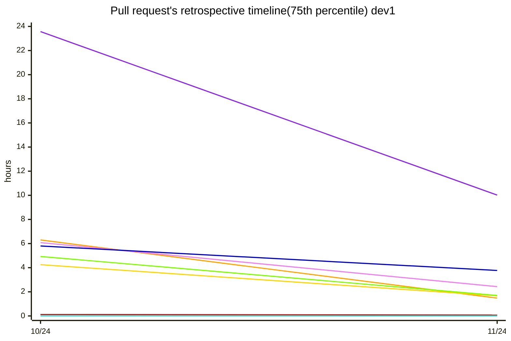

`#8A2BE2`Discussions Conducted, `#00008B`Discussions Received, `#DC143C`Changes Requested Conducted, `#B22222`Changes Requested Received, `#FFD700`Reviews Conducted, `#7FFF00`Merged PRs
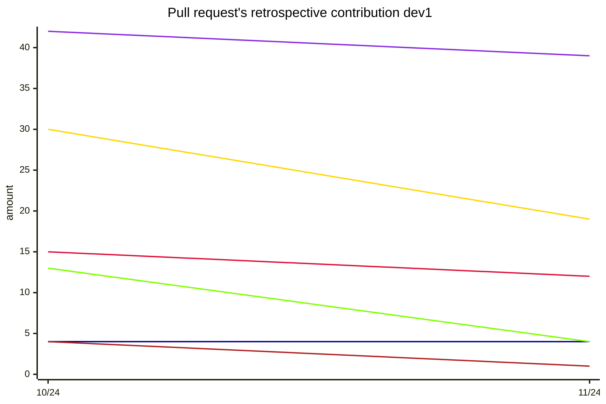

`#FFA500`Time From Initial Request To Response, `#EE82EE`Time From Opening To Response, `#0000CD`Time From Rerequest To Response, `#696969`Time In Draft, `#B22222`Time To Review Request, `#FFD700`Time To Review, `#40E0D0`Time To Review After Rerequest, `#7FFF00`Time To Approve, `#8A2BE2`Time To Merge
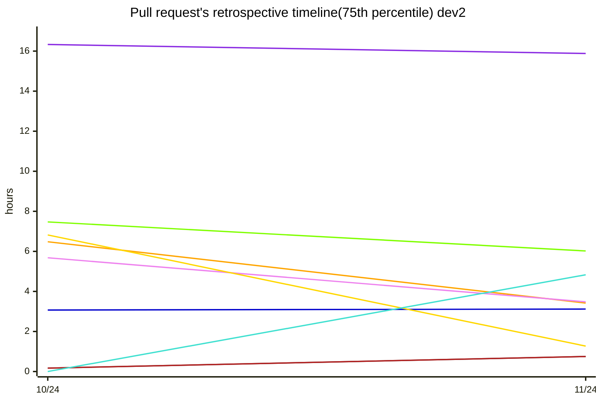

`#8A2BE2`Discussions Conducted, `#00008B`Discussions Received, `#DC143C`Changes Requested Conducted, `#B22222`Changes Requested Received, `#FFD700`Reviews Conducted, `#7FFF00`Merged PRs
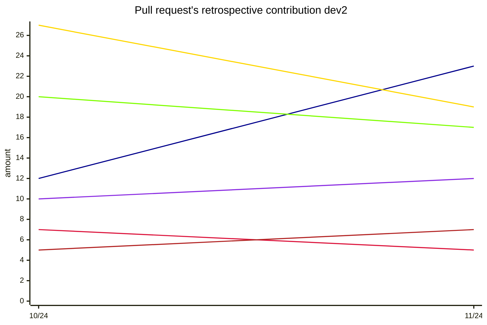

`#FFA500`Time From Initial Request To Response, `#EE82EE`Time From Opening To Response, `#0000CD`Time From Rerequest To Response, `#696969`Time In Draft, `#B22222`Time To Review Request, `#FFD700`Time To Review, `#40E0D0`Time To Review After Rerequest, `#7FFF00`Time To Approve, `#8A2BE2`Time To Merge
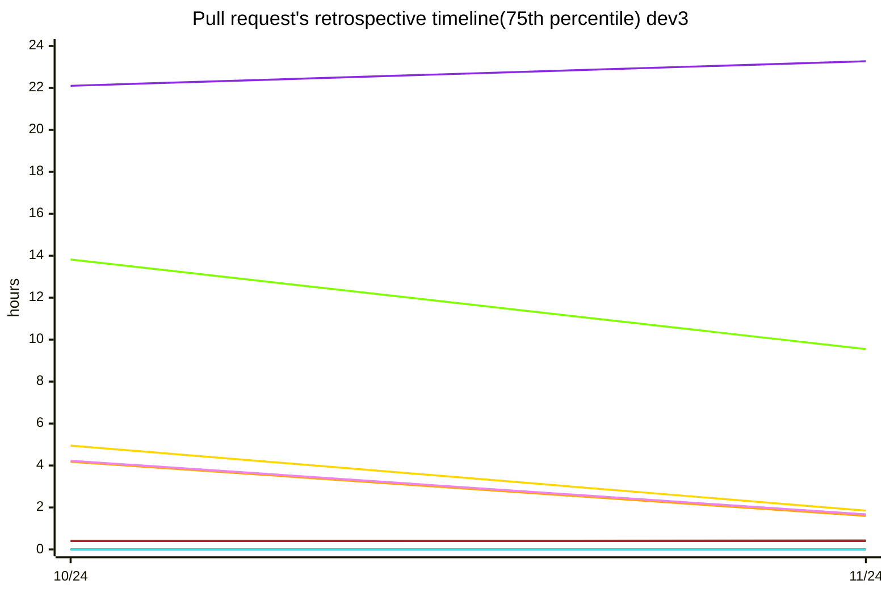

`#8A2BE2`Discussions Conducted, `#00008B`Discussions Received, `#DC143C`Changes Requested Conducted, `#B22222`Changes Requested Received, `#FFD700`Reviews Conducted, `#7FFF00`Merged PRs
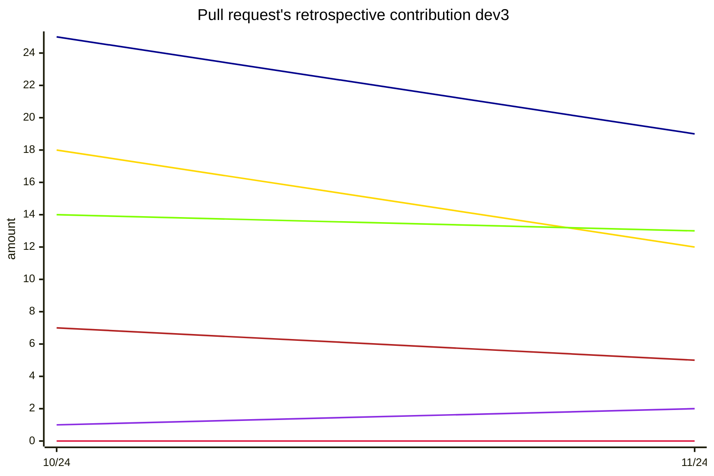

`#FFA500`Time From Initial Request To Response, `#EE82EE`Time From Opening To Response, `#0000CD`Time From Rerequest To Response, `#696969`Time In Draft, `#B22222`Time To Review Request, `#FFD700`Time To Review, `#40E0D0`Time To Review After Rerequest, `#7FFF00`Time To Approve, `#8A2BE2`Time To Merge
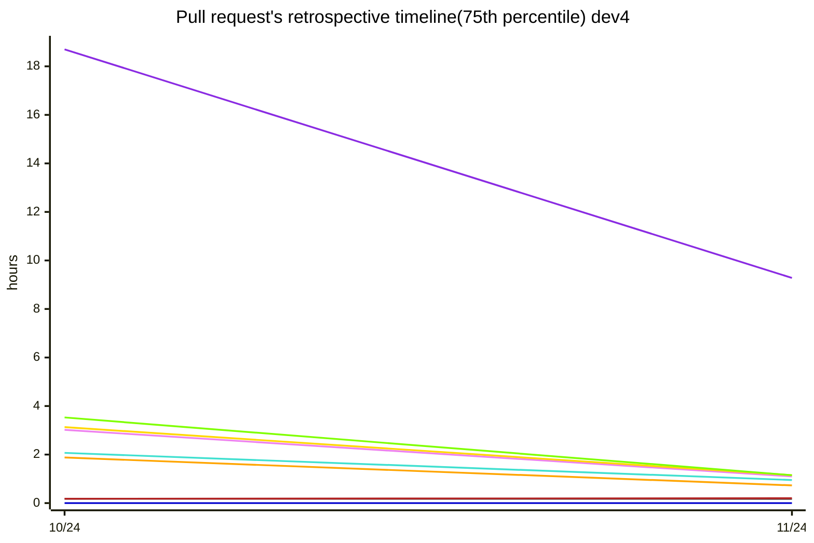

`#8A2BE2`Discussions Conducted, `#00008B`Discussions Received, `#DC143C`Changes Requested Conducted, `#B22222`Changes Requested Received, `#FFD700`Reviews Conducted, `#7FFF00`Merged PRs
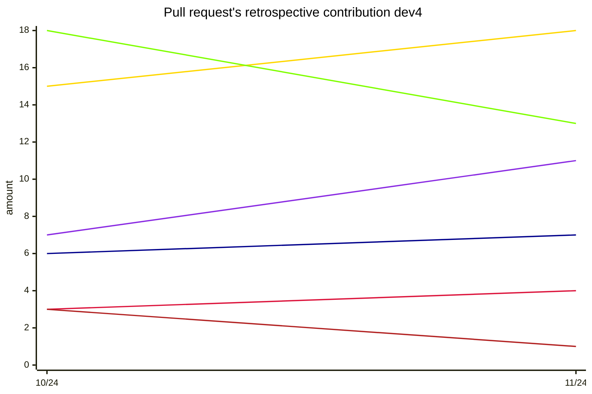

`#FFA500`Time From Initial Request To Response, `#EE82EE`Time From Opening To Response, `#0000CD`Time From Rerequest To Response, `#696969`Time In Draft, `#B22222`Time To Review Request, `#FFD700`Time To Review, `#40E0D0`Time To Review After Rerequest, `#7FFF00`Time To Approve, `#8A2BE2`Time To Merge
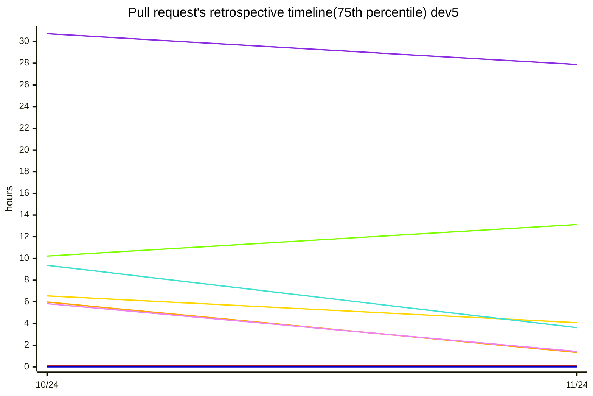

`#8A2BE2`Discussions Conducted, `#00008B`Discussions Received, `#DC143C`Changes Requested Conducted, `#B22222`Changes Requested Received, `#FFD700`Reviews Conducted, `#7FFF00`Merged PRs
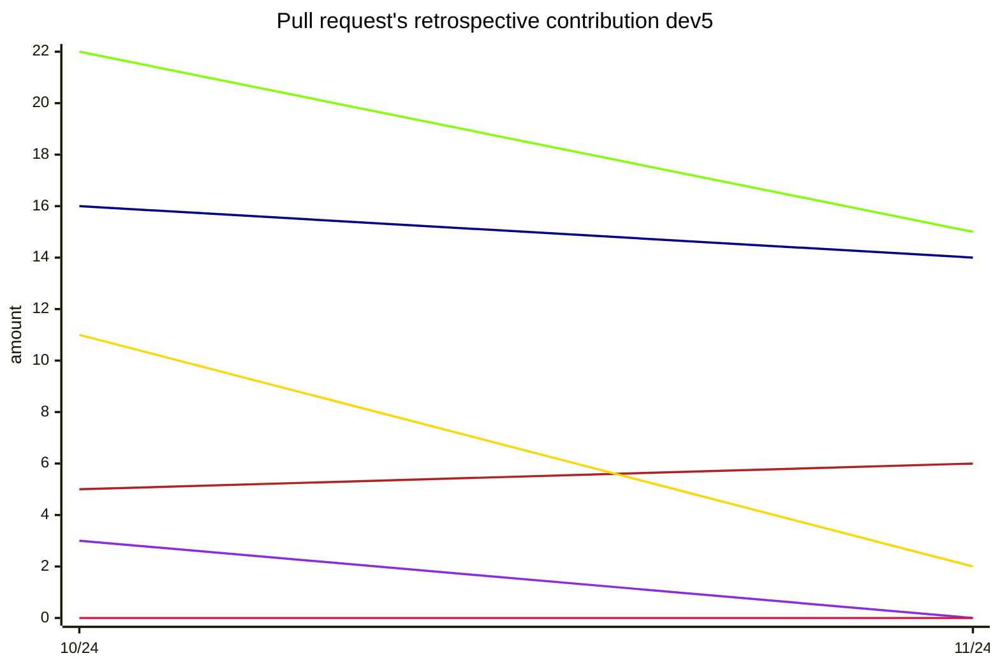

`#FFA500`Time From Initial Request To Response, `#EE82EE`Time From Opening To Response, `#0000CD`Time From Rerequest To Response, `#696969`Time In Draft, `#B22222`Time To Review Request, `#FFD700`Time To Review, `#40E0D0`Time To Review After Rerequest, `#7FFF00`Time To Approve, `#8A2BE2`Time To Merge
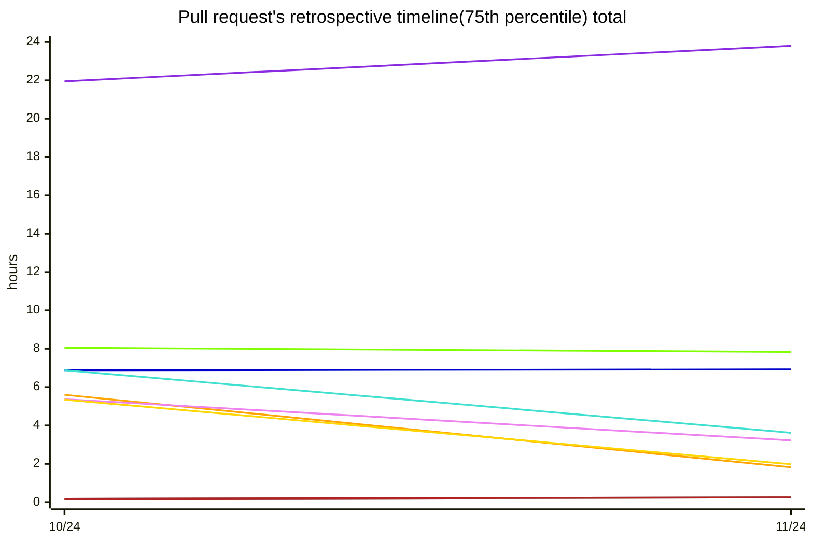

`#8A2BE2`Discussions Conducted, `#00008B`Discussions Received, `#DC143C`Changes Requested Conducted, `#B22222`Changes Requested Received, `#FFD700`Reviews Conducted, `#7FFF00`Merged PRs
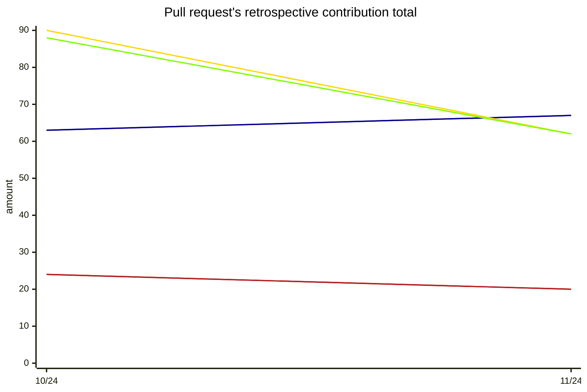