## Pull Request report

This report based on 265 last updated PRs. last updated PRs. To learn more about the project and its configuration, please visit [Pull request analytics action](https://github.com/AlexSim93/pull-request-analytics-action).
Below are the settings applied for this report:
```
GITHUB_OWNERS_REPOS: owner/repository
GITHUB_REPO_FOR_ISSUE: repository-to-create-issue
GITHUB_OWNER_FOR_ISSUE: owner-of-repository-to-create-issue
AMOUNT: 
CORE_HOURS_START: 09:00
CORE_HOURS_END: 20:00
REPORT_DATE_START: 1/09/2023
REPORT_DATE_END: 30/11/2023
PERCENTILE: 75
LABELS: report
ASSIGNEES: AlexSim93
```


### Pull requests timeline(average) 11/2023

**Time to review** - time from PR creation to first review.
**Time to approve** - time from PR creation to first approval without requested changes.
**Time to merge** - time from PR creation to merge.
| user | Time to review | Time to approve | Time to merge | Total merged PRs |
| ------ | ------ | ------ | ------ | ------ |
| **Developer1** | 1 hour 33 minutes | 4 hours 11 minutes | 15 hours 33 minutes | 13 |
| **AlexSim93** | 5 hours 15 minutes | 5 hours 20 minutes | 8 hours 14 minutes | 22 |
| **Developer2** | 5 hours 53 minutes | 15 hours 25 minutes | 35 hours 58 minutes | 11 |
| **Developer3** | 1 hour 13 minutes | 2 hours 20 minutes | 27 hours 33 minutes | 17 |
| **Developer4** | 1 hour 7 minutes | 3 hours 8 minutes | 10 hours 45 minutes | 6 |
| **total** | 5 hours 47 minutes | 8 hours 12 minutes | 18 hours 47 minutes | 69 |

```mermaid
gantt
title Pull requests timeline(average) 11/2023 / minutes
dateFormat X
axisFormat %s
section Developer1
                Time to review :  0, 93
Time to approve :  0, 251
Time to merge :  0, 933

section AlexSim93
                Time to review :  0, 315
Time to approve :  0, 320
Time to merge :  0, 494

section Developer2
                Time to review :  0, 353
Time to approve :  0, 925
Time to merge :  0, 2158

section Developer3
                Time to review :  0, 73
Time to approve :  0, 140
Time to merge :  0, 1653

section Developer4
                Time to review :  0, 67
Time to approve :  0, 188
Time to merge :  0, 645

section total
                Time to review :  0, 347
Time to approve :  0, 492
Time to merge :  0, 1127

```

### Pull requests timeline(median) 11/2023

**Time to review** - time from PR creation to first review.
**Time to approve** - time from PR creation to first approval without requested changes.
**Time to merge** - time from PR creation to merge.
| user | Time to review | Time to approve | Time to merge | Total merged PRs |
| ------ | ------ | ------ | ------ | ------ |
| **Developer1** | 1 hour 7 minutes | 1 hour 29 minutes | 14 hours 21 minutes | 13 |
| **AlexSim93** | 18 minutes | 22 minutes | 40 minutes | 22 |
| **Developer2** | 6 hours 59 minutes | 6 hours 59 minutes | 26 hours 42 minutes | 11 |
| **Developer3** | 1 hour 8 minutes | 1 hour 8 minutes | 29 hours 2 minutes | 17 |
| **Developer4** | 37 minutes | 1 hour 22 minutes | 16 hours 51 minutes | 6 |
| **total** | 41 minutes | 54 minutes | 11 hours 38 minutes | 69 |

```mermaid
gantt
title Pull requests timeline(median) 11/2023 / minutes
dateFormat X
axisFormat %s
section Developer1
                Time to review :  0, 67
Time to approve :  0, 89
Time to merge :  0, 861

section AlexSim93
                Time to review :  0, 18
Time to approve :  0, 22
Time to merge :  0, 40

section Developer2
                Time to review :  0, 419
Time to approve :  0, 419
Time to merge :  0, 1602

section Developer3
                Time to review :  0, 68
Time to approve :  0, 68
Time to merge :  0, 1742

section Developer4
                Time to review :  0, 37
Time to approve :  0, 82
Time to merge :  0, 1011

section total
                Time to review :  0, 41
Time to approve :  0, 54
Time to merge :  0, 698

```

### Pull requests timeline(percentile75) 11/2023

**Time to review** - time from PR creation to first review.
**Time to approve** - time from PR creation to first approval without requested changes.
**Time to merge** - time from PR creation to merge.
| user | Time to review | Time to approve | Time to merge | Total merged PRs |
| ------ | ------ | ------ | ------ | ------ |
| **Developer1** | 1 hour 11 minutes | 3 hours 20 minutes | 24 hours 26 minutes | 13 |
| **AlexSim93** | 41 minutes | 41 minutes | 2 hours 18 minutes | 22 |
| **Developer2** | 8 hours 2 minutes | 8 hours 6 minutes | 36 hours 27 minutes | 11 |
| **Developer3** | 1 hour 52 minutes | 2 hours 9 minutes | 37 hours 46 minutes | 17 |
| **Developer4** | 1 hour 7 minutes | 1 hour 58 minutes | 16 hours 51 minutes | 6 |
| **total** | 2 hours 9 minutes | 3 hours 12 minutes | 26 hours 42 minutes | 69 |

```mermaid
gantt
title Pull requests timeline(percentile75) 11/2023 / minutes
dateFormat X
axisFormat %s
section Developer1
                Time to review :  0, 71
Time to approve :  0, 200
Time to merge :  0, 1466

section AlexSim93
                Time to review :  0, 41
Time to approve :  0, 41
Time to merge :  0, 138

section Developer2
                Time to review :  0, 482
Time to approve :  0, 486
Time to merge :  0, 2187

section Developer3
                Time to review :  0, 112
Time to approve :  0, 129
Time to merge :  0, 2266

section Developer4
                Time to review :  0, 67
Time to approve :  0, 118
Time to merge :  0, 1011

section total
                Time to review :  0, 129
Time to approve :  0, 192
Time to merge :  0, 1602

```

### Pull requests stats 11/2023

**Reviews conducted** - number of Reviews conducted. 1 PR may have only single review.
| user | Total merged PRs | Additions/Deletions | Comments on PRs | Reviews conducted |
| ------ | ------ | ------ | ------ | ------ |
| **Developer1** | 13 | +1568/-800 | 70 | 8 |
| **AlexSim93** | 22 | +2534/-2377 | 5 | 21 |
| **Developer2** | 11 | +1281/-626 | 10 | 24 |
| **Developer3** | 17 | +2294/-1668 | 42 | 20 |
| **Developer4** | 6 | +959/-160 | 23 | 10 |
| **total** | 69 | +16837/-5690 | 155 | 0 |


### Pull requests timeline(average) 10/2023

**Time to review** - time from PR creation to first review.
**Time to approve** - time from PR creation to first approval without requested changes.
**Time to merge** - time from PR creation to merge.
| user | Time to review | Time to approve | Time to merge | Total merged PRs |
| ------ | ------ | ------ | ------ | ------ |
| **Developer1** | 4 hours 4 minutes | 10 hours 54 minutes | 20 hours 59 minutes | 13 |
| **AlexSim93** | 2 hours 42 minutes | 3 hours 48 minutes | 6 hours 6 minutes | 21 |
| **Developer2** | 4 hours 10 minutes | 4 hours 10 minutes | 20 hours 16 minutes | 15 |
| **Developer3** | 2 hours 3 minutes | 2 hours 3 minutes | 14 hours 6 minutes | 16 |
| **Developer4** | 1 hour 37 minutes | 7 hours 29 minutes | 12 hours 5 minutes | 14 |
| **total** | 2 hours 52 minutes | 5 hours 21 minutes | 14 hours 1 minute | 79 |

```mermaid
gantt
title Pull requests timeline(average) 10/2023 / minutes
dateFormat X
axisFormat %s
section Developer1
                Time to review :  0, 244
Time to approve :  0, 654
Time to merge :  0, 1259

section AlexSim93
                Time to review :  0, 162
Time to approve :  0, 228
Time to merge :  0, 366

section Developer2
                Time to review :  0, 250
Time to approve :  0, 250
Time to merge :  0, 1216

section Developer3
                Time to review :  0, 123
Time to approve :  0, 123
Time to merge :  0, 846

section Developer4
                Time to review :  0, 97
Time to approve :  0, 449
Time to merge :  0, 725

section total
                Time to review :  0, 172
Time to approve :  0, 321
Time to merge :  0, 841

```

### Pull requests timeline(median) 10/2023

**Time to review** - time from PR creation to first review.
**Time to approve** - time from PR creation to first approval without requested changes.
**Time to merge** - time from PR creation to merge.
| user | Time to review | Time to approve | Time to merge | Total merged PRs |
| ------ | ------ | ------ | ------ | ------ |
| **Developer1** | 2 hours 18 minutes | 6 hours 37 minutes | 13 hours 57 minutes | 13 |
| **AlexSim93** | 1 hour 28 minutes | 2 hours 29 minutes | 4 hours 31 minutes | 21 |
| **Developer2** | 1 hour 17 minutes | 1 hour 17 minutes | 8 hours 23 minutes | 15 |
| **Developer3** | 1 hour 17 minutes | 1 hour 17 minutes | 13 hours 18 minutes | 16 |
| **Developer4** | 43 minutes | 6 hours 24 minutes | 7 hours 34 minutes | 14 |
| **total** | 1 hour 13 minutes | 1 hour 49 minutes | 7 hours 35 minutes | 79 |

```mermaid
gantt
title Pull requests timeline(median) 10/2023 / minutes
dateFormat X
axisFormat %s
section Developer1
                Time to review :  0, 138
Time to approve :  0, 397
Time to merge :  0, 837

section AlexSim93
                Time to review :  0, 88
Time to approve :  0, 149
Time to merge :  0, 271

section Developer2
                Time to review :  0, 77
Time to approve :  0, 77
Time to merge :  0, 503

section Developer3
                Time to review :  0, 77
Time to approve :  0, 77
Time to merge :  0, 798

section Developer4
                Time to review :  0, 43
Time to approve :  0, 384
Time to merge :  0, 454

section total
                Time to review :  0, 73
Time to approve :  0, 109
Time to merge :  0, 455

```

### Pull requests timeline(percentile75) 10/2023

**Time to review** - time from PR creation to first review.
**Time to approve** - time from PR creation to first approval without requested changes.
**Time to merge** - time from PR creation to merge.
| user | Time to review | Time to approve | Time to merge | Total merged PRs |
| ------ | ------ | ------ | ------ | ------ |
| **Developer1** | 6 hours 37 minutes | 15 hours 21 minutes | 33 hours 38 minutes | 13 |
| **AlexSim93** | 2 hours 32 minutes | 3 hours 24 minutes | 6 hours 58 minutes | 21 |
| **Developer2** | 5 hours 1 minute | 5 hours 1 minute | 30 hours 14 minutes | 15 |
| **Developer3** | 2 hours 13 minutes | 2 hours 13 minutes | 18 hours 1 minute | 16 |
| **Developer4** | 2 hours 17 minutes | 10 hours 22 minutes | 15 hours 59 minutes | 14 |
| **total** | 3 hours 9 minutes | 6 hours 37 minutes | 18 hours 36 minutes | 79 |

```mermaid
gantt
title Pull requests timeline(percentile75) 10/2023 / minutes
dateFormat X
axisFormat %s
section Developer1
                Time to review :  0, 397
Time to approve :  0, 921
Time to merge :  0, 2018

section AlexSim93
                Time to review :  0, 152
Time to approve :  0, 204
Time to merge :  0, 418

section Developer2
                Time to review :  0, 301
Time to approve :  0, 301
Time to merge :  0, 1814

section Developer3
                Time to review :  0, 133
Time to approve :  0, 133
Time to merge :  0, 1081

section Developer4
                Time to review :  0, 137
Time to approve :  0, 622
Time to merge :  0, 959

section total
                Time to review :  0, 189
Time to approve :  0, 397
Time to merge :  0, 1116

```

### Pull requests stats 10/2023

**Reviews conducted** - number of Reviews conducted. 1 PR may have only single review.
| user | Total merged PRs | Additions/Deletions | Comments on PRs | Reviews conducted |
| ------ | ------ | ------ | ------ | ------ |
| **Developer1** | 13 | +1113/-247 | 70 | 7 |
| **AlexSim93** | 21 | +2007/-1135 | 24 | 29 |
| **Developer2** | 15 | +1250/-742 | 5 | 17 |
| **Developer3** | 16 | +1964/-1443 | 15 | 22 |
| **Developer4** | 14 | +3501/-583 | 261 | 18 |
| **total** | 79 | +9835/-4150 | 375 | 0 |


### Pull requests timeline(average) 9/2023

**Time to review** - time from PR creation to first review.
**Time to approve** - time from PR creation to first approval without requested changes.
**Time to merge** - time from PR creation to merge.
| user | Time to review | Time to approve | Time to merge | Total merged PRs |
| ------ | ------ | ------ | ------ | ------ |
| **Developer1** | 3 hours 21 minutes | 4 hours 23 minutes | 19 hours 54 minutes | 18 |
| **AlexSim93** | 2 hours 17 minutes | 2 hours 52 minutes | 8 hours 9 minutes | 25 |
| **Developer2** | 1 hour 30 minutes | 4 hours 37 minutes | 20 hours 53 minutes | 13 |
| **Developer3** | 2 hours 32 minutes | 3 hours 14 minutes | 23 hours 29 minutes | 9 |
| **Developer4** | 1 hour 23 minutes | 16 hours 30 minutes | 23 hours 21 minutes | 26 |
| **Developer5** | 1 hour 28 minutes | 1 hour 28 minutes | 47 hours 43 minutes | 2 |
| **total** | 2 hours 11 minutes | 7 hours 7 minutes | 18 hours 54 minutes | 93 |

```mermaid
gantt
title Pull requests timeline(average) 9/2023 / minutes
dateFormat X
axisFormat %s
section Developer1
                Time to review :  0, 201
Time to approve :  0, 263
Time to merge :  0, 1194

section AlexSim93
                Time to review :  0, 137
Time to approve :  0, 172
Time to merge :  0, 489

section Developer2
                Time to review :  0, 90
Time to approve :  0, 277
Time to merge :  0, 1253

section Developer3
                Time to review :  0, 152
Time to approve :  0, 194
Time to merge :  0, 1409

section Developer4
                Time to review :  0, 83
Time to approve :  0, 990
Time to merge :  0, 1401

section Developer5
                Time to review :  0, 88
Time to approve :  0, 88
Time to merge :  0, 2863

section total
                Time to review :  0, 131
Time to approve :  0, 427
Time to merge :  0, 1134

```

### Pull requests timeline(median) 9/2023

**Time to review** - time from PR creation to first review.
**Time to approve** - time from PR creation to first approval without requested changes.
**Time to merge** - time from PR creation to merge.
| user | Time to review | Time to approve | Time to merge | Total merged PRs |
| ------ | ------ | ------ | ------ | ------ |
| **Developer1** | 1 hour 7 minutes | 2 hours 28 minutes | 4 hours 58 minutes | 18 |
| **AlexSim93** | 41 minutes | 1 hour 38 minutes | 4 hours 23 minutes | 25 |
| **Developer2** | 26 minutes | 1 hour 1 minute | 14 hours 53 minutes | 13 |
| **Developer3** | 1 hour 48 minutes | 1 hour 48 minutes | 15 hours 9 minutes | 9 |
| **Developer4** | 10 minutes | 22 minutes | 7 hours 54 minutes | 26 |
| **Developer5** | 2 hours 31 minutes | 2 hours 31 minutes | 77 hours 27 minutes | 2 |
| **total** | 35 minutes | 1 hour 19 minutes | 9 hours 9 minutes | 93 |

```mermaid
gantt
title Pull requests timeline(median) 9/2023 / minutes
dateFormat X
axisFormat %s
section Developer1
                Time to review :  0, 67
Time to approve :  0, 148
Time to merge :  0, 298

section AlexSim93
                Time to review :  0, 41
Time to approve :  0, 98
Time to merge :  0, 263

section Developer2
                Time to review :  0, 26
Time to approve :  0, 61
Time to merge :  0, 893

section Developer3
                Time to review :  0, 108
Time to approve :  0, 108
Time to merge :  0, 909

section Developer4
                Time to review :  0, 10
Time to approve :  0, 22
Time to merge :  0, 474

section Developer5
                Time to review :  0, 151
Time to approve :  0, 151
Time to merge :  0, 4647

section total
                Time to review :  0, 35
Time to approve :  0, 79
Time to merge :  0, 549

```

### Pull requests timeline(percentile75) 9/2023

**Time to review** - time from PR creation to first review.
**Time to approve** - time from PR creation to first approval without requested changes.
**Time to merge** - time from PR creation to merge.
| user | Time to review | Time to approve | Time to merge | Total merged PRs |
| ------ | ------ | ------ | ------ | ------ |
| **Developer1** | 3 hours 39 minutes | 4 hours 51 minutes | 29 hours 1 minute | 18 |
| **AlexSim93** | 1 hour 38 minutes | 2 hours 7 minutes | 9 hours 17 minutes | 25 |
| **Developer2** | 1 hour 5 minutes | 1 hour 30 minutes | 17 hours 2 minutes | 13 |
| **Developer3** | 1 hour 51 minutes | 1 hour 51 minutes | 22 hours 11 minutes | 9 |
| **Developer4** | 22 minutes | 1 hour 23 minutes | 20 hours 10 minutes | 26 |
| **Developer5** | 24 minutes | 24 minutes | 17 hours 59 minutes | 2 |
| **total** | 2 hours 13 minutes | 3 hours 26 minutes | 22 hours 11 minutes | 93 |

```mermaid
gantt
title Pull requests timeline(percentile75) 9/2023 / minutes
dateFormat X
axisFormat %s
section Developer1
                Time to review :  0, 219
Time to approve :  0, 291
Time to merge :  0, 1741

section AlexSim93
                Time to review :  0, 98
Time to approve :  0, 127
Time to merge :  0, 557

section Developer2
                Time to review :  0, 65
Time to approve :  0, 90
Time to merge :  0, 1022

section Developer3
                Time to review :  0, 111
Time to approve :  0, 111
Time to merge :  0, 1331

section Developer4
                Time to review :  0, 22
Time to approve :  0, 83
Time to merge :  0, 1210

section Developer5
                Time to review :  0, 24
Time to approve :  0, 24
Time to merge :  0, 1079

section total
                Time to review :  0, 133
Time to approve :  0, 206
Time to merge :  0, 1331

```

### Pull requests stats 9/2023

**Reviews conducted** - number of Reviews conducted. 1 PR may have only single review.
| user | Total merged PRs | Additions/Deletions | Comments on PRs | Reviews conducted |
| ------ | ------ | ------ | ------ | ------ |
| **Developer1** | 18 | +3659/-1374 | 22 | 16 |
| **AlexSim93** | 25 | +1683/-1431 | 38 | 25 |
| **Developer2** | 13 | +928/-697 | 20 | 19 |
| **Developer3** | 9 | +1240/-206 | 7 | 19 |
| **Developer4** | 26 | +2635/-2731 | 67 | 21 |
| **Developer5** | 2 | +31/-72 | 0 | 0 |
| **total** | 93 | +10176/-6511 | 154 | 0 |


### Pull requests timeline(average) total

**Time to review** - time from PR creation to first review.
**Time to approve** - time from PR creation to first approval without requested changes.
**Time to merge** - time from PR creation to merge.
| user | Time to review | Time to approve | Time to merge | Total merged PRs |
| ------ | ------ | ------ | ------ | ------ |
| **Developer1** | 3 hours 1 minute | 6 hours 11 minutes | 18 hours 56 minutes | 44 |
| **AlexSim93** | 3 hours 29 minutes | 4 hours 5 minutes | 7 hours 33 minutes | 68 |
| **Developer2** | 3 hours 42 minutes | 7 hours 22 minutes | 24 hours 37 minutes | 39 |
| **Developer3** | 1 hour 51 minutes | 2 hours 26 minutes | 21 hours 35 minutes | 42 |
| **Developer4** | 1 hour 25 minutes | 11 hours 16 minutes | 18 hours 16 minutes | 46 |
| **Developer5** | 1 hour 28 minutes | 1 hour 28 minutes | 47 hours 43 minutes | 2 |
| **total** | 3 hours 29 minutes | 6 hours 50 minutes | 17 hours 16 minutes | 241 |

```mermaid
gantt
title Pull requests timeline(average) total / minutes
dateFormat X
axisFormat %s
section Developer1
                Time to review :  0, 181
Time to approve :  0, 371
Time to merge :  0, 1136

section AlexSim93
                Time to review :  0, 209
Time to approve :  0, 245
Time to merge :  0, 453

section Developer2
                Time to review :  0, 222
Time to approve :  0, 442
Time to merge :  0, 1477

section Developer3
                Time to review :  0, 111
Time to approve :  0, 146
Time to merge :  0, 1295

section Developer4
                Time to review :  0, 85
Time to approve :  0, 676
Time to merge :  0, 1096

section Developer5
                Time to review :  0, 88
Time to approve :  0, 88
Time to merge :  0, 2863

section total
                Time to review :  0, 209
Time to approve :  0, 410
Time to merge :  0, 1036

```

### Pull requests timeline(median) total

**Time to review** - time from PR creation to first review.
**Time to approve** - time from PR creation to first approval without requested changes.
**Time to merge** - time from PR creation to merge.
| user | Time to review | Time to approve | Time to merge | Total merged PRs |
| ------ | ------ | ------ | ------ | ------ |
| **Developer1** | 1 hour 7 minutes | 2 hours 50 minutes | 13 hours 25 minutes | 44 |
| **AlexSim93** | 41 minutes | 54 minutes | 2 hours 23 minutes | 68 |
| **Developer2** | 43 minutes | 1 hour 5 minutes | 16 hours 59 minutes | 39 |
| **Developer3** | 1 hour 17 minutes | 1 hour 38 minutes | 17 hours 6 minutes | 42 |
| **Developer4** | 22 minutes | 43 minutes | 7 hours 34 minutes | 46 |
| **Developer5** | 2 hours 31 minutes | 2 hours 31 minutes | 77 hours 27 minutes | 2 |
| **total** | 43 minutes | 1 hour 17 minutes | 9 hours 9 minutes | 241 |

```mermaid
gantt
title Pull requests timeline(median) total / minutes
dateFormat X
axisFormat %s
section Developer1
                Time to review :  0, 67
Time to approve :  0, 170
Time to merge :  0, 805

section AlexSim93
                Time to review :  0, 41
Time to approve :  0, 54
Time to merge :  0, 143

section Developer2
                Time to review :  0, 43
Time to approve :  0, 65
Time to merge :  0, 1019

section Developer3
                Time to review :  0, 77
Time to approve :  0, 98
Time to merge :  0, 1026

section Developer4
                Time to review :  0, 22
Time to approve :  0, 43
Time to merge :  0, 454

section Developer5
                Time to review :  0, 151
Time to approve :  0, 151
Time to merge :  0, 4647

section total
                Time to review :  0, 43
Time to approve :  0, 77
Time to merge :  0, 549

```

### Pull requests timeline(percentile75) total

**Time to review** - time from PR creation to first review.
**Time to approve** - time from PR creation to first approval without requested changes.
**Time to merge** - time from PR creation to merge.
| user | Time to review | Time to approve | Time to merge | Total merged PRs |
| ------ | ------ | ------ | ------ | ------ |
| **Developer1** | 3 hours 39 minutes | 8 hours | 29 hours 44 minutes | 44 |
| **AlexSim93** | 1 hour 42 minutes | 2 hours 32 minutes | 8 hours 51 minutes | 68 |
| **Developer2** | 5 hours 23 minutes | 5 hours 23 minutes | 30 hours 33 minutes | 39 |
| **Developer3** | 2 hours 9 minutes | 2 hours 19 minutes | 29 hours 2 minutes | 42 |
| **Developer4** | 1 hour 19 minutes | 6 hours 24 minutes | 20 hours 10 minutes | 46 |
| **Developer5** | 24 minutes | 24 minutes | 17 hours 59 minutes | 2 |
| **total** | 2 hours 31 minutes | 4 hours 34 minutes | 23 hours 10 minutes | 241 |

```mermaid
gantt
title Pull requests timeline(percentile75) total / minutes
dateFormat X
axisFormat %s
section Developer1
                Time to review :  0, 219
Time to approve :  0, 480
Time to merge :  0, 1784

section AlexSim93
                Time to review :  0, 102
Time to approve :  0, 152
Time to merge :  0, 531

section Developer2
                Time to review :  0, 323
Time to approve :  0, 323
Time to merge :  0, 1833

section Developer3
                Time to review :  0, 129
Time to approve :  0, 139
Time to merge :  0, 1742

section Developer4
                Time to review :  0, 79
Time to approve :  0, 384
Time to merge :  0, 1210

section Developer5
                Time to review :  0, 24
Time to approve :  0, 24
Time to merge :  0, 1079

section total
                Time to review :  0, 151
Time to approve :  0, 274
Time to merge :  0, 1390

```

### Pull requests stats total

**Reviews conducted** - number of Reviews conducted. 1 PR may have only single review.
| user | Total merged PRs | Additions/Deletions | Comments on PRs | Reviews conducted |
| ------ | ------ | ------ | ------ | ------ |
| **Developer1** | 44 | +6340/-2421 | 162 | 31 |
| **AlexSim93** | 68 | +6224/-4943 | 67 | 75 |
| **Developer2** | 39 | +3459/-2065 | 35 | 60 |
| **Developer3** | 42 | +5498/-3317 | 64 | 61 |
| **Developer4** | 46 | +7095/-3474 | 351 | 49 |
| **Developer5** | 2 | +32/-78 | 0 | 0 |
| **total** | 241 | +36848/-16351 | 684 | 0 |
